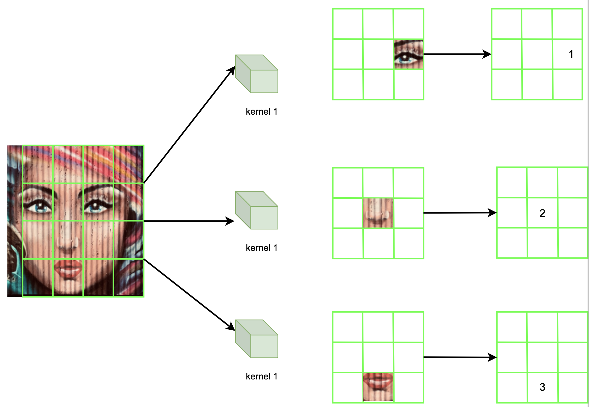

# Convolution neural network (CNN)


## 1. CNN VS MLP

1. 由于MLP的**全连接性**， 对于图像这类高维数据，它会产生大量的参数。CNN 通过使用**局部连接**和**权重共享**，显著减少参数数量，提高效率。

* 通过一个例子展示参数量的区别：

  * 输入数据为：32*32像素的RGB (3 channels) 图像

  $$
  total\,pixel=32*32*3=3072
  $$

  

  * MLP模型结构：
    * 输入层，3072个节点
    * 隐藏层，100个节点
      * 参数量：$$(3072 + 1) \times 100 = 307300$$
    * 输出层，10个节点，代表10种分类($+1$表示bias项)
      * 参数量：$(100 + 1) \times 10 = 1010$
    * 总参数量为：
      * $307300 + 1010 = 308310$

  

  
  
  
  
  * CNN模型结构：
    * 尽管CNN的输入层的输出和MLP有所不同，并不需要将输入的数据平铺成一个一维向量，但是输入层的节点个数还是根据输入层的输入数据的数量决定的。
    * 输入层：因此，同样为3072个节点
    * 卷积层：10个 $3*3$​ 的卷积核，步长（stride）设置为1，不使用填充（padding）。
      * 卷积核参数：每个核 $3 \times 3 \times 3 = 27$​ 个参数
      * 10个核的总参数量：$27 \times 10 = 270$
    * 汇聚层：$2*2$​ 最大pooling，步长 设置为2:
      * 没有参数
      * 输出大小：输入的 $32 \times 32 \to 16 \times 16$，即$16\times16$大小的10个特征图
    * 全联接层,100个节点：
      * 输入大小 $16 \times 16 \times 10 = 2560$
      * 参数量：$(2560 + 1) \times 100 = 256100$
    * **输出层**,10个节点:
      * 参数量：$(100 + 1) \times 10 = 1010$​
    * 总参数量为：
      * $270 + 256100 + 1010 = 257380$


## 2. 不同层

* 输入层 （input layer）
* 卷积层（convolutional layer）
* 批量归一化层（batch normalization layer）
* 激活层（activation layer）
* 汇聚层（pooling layer）
* 展平层 （flatten layer）
* 全联接层（fully connected layer | dense layer）
* 输出层 （output layer）


## 输入层（input layer）

CNN的输入层和MLP一样，都包含了大量的神经元，神经元的个数和输入层接收的总的特征数量相同。

* 例如，如果我们的输入是一张RGB图片，且这张图片的像素密度为32*32. 那么一张图片所拥有的特征个数就等于总的像素数：

$$
total\,pixel=32*32*3=3072
$$

* 输入层的节点个数即为3072个。每个节点对应图像中的一个像素点。

* 如果我们输入的是一个batch，一个batch包含3张图片。假设我们想查看对应一张图片中红色通道的第一个像素位的神经元接收的输入数据：

  * 对于第一张图片，这个神经元接收的是tensor中$[0,0,0,0]$位置的值，表示为$R_{0,0,0}$。（关于tensor，请参考**张量（tensor）**）
  * 对于第二张图片，这个神经元接收的是tensor中$[1,0,0,0]$位置的值，表示为$R_{1,0,0}$​。

  * 对于第三张图片，这个神经元接收的是tensor中$[2,0,0,0]$位置的值，表示为$R_{2,0,0}$​。
  * 这个神经元对应接收的输入就是这三个值。

CNN虽然和MLP一样，输入层的节点个数和特征总数相等，但是MLP架构要求每一层的节点和后面一层的各个节点进行全联接，所以在MLP中的输入层，我们是将输入和输出全都变换成了一维向量。

但是一维向量会存在一个**不能传递空间信息**的问题 （关于为什么需要空间信息的描述会在**卷积层**里面说明），所以在CNN中，我们需要将输入层的输出变成多个矩阵（基于有多少通道数，每个通道对应一个输出矩阵）。

MLP原本的输入为一维向量，但是在CNN中的输入要求变成了tensor。

简而言之，我们可以在这里忽略节点的概念（或者认为是将节点布局成矩阵的形式），而把tensor里面的每一个矩阵看成单独的个体，作为输入层的输出。


如同这张图片，左边是原始图像的输入，经过输入层，将图像分成三个通道，对应3个矩阵输出。


### 张量（tensor）

矩阵是二维的，有宽度和高度属性，一个矩阵的形状可以表示为：
$$
maxtrix\,shape=[width,height]
$$
**Tensor 可以被认为是N维矩阵**。因为四维矩阵没有一个比较形象的例子，就用3维矩阵来举例：

* 如果是一张像素密度为32 * 32的灰色图像，那么可以认为它就是一个32 * 32的矩阵，矩阵中每一个值代表的对应位置的像素灰度值。
* 如果是一张像素密度为32 * 32的彩色图像，那么他就不是一个矩阵了，因为是3个矩阵堆叠起来的。每一个矩阵里面的数值分别代表了R，G，B三色通道的每个像素位的不同亮度。所以这是一个tensor，形状表示为：

$$
tensor\,shape(3D)=[width,height,channel\, num]
$$

* 另外补充，我们在进行神经网络学习的时候，都会选择批量学习（batch），那么在对于一个批量，对应的输入tensor为：

$$
tensor=[batch\,size,width,height,channel\, num]
$$


## 卷积核 （kernel）

卷积核是卷积层和核心架构。

每一个卷积核通常是一个3维的**权重矩阵**。

卷积核有两个空间维度：高度和宽度，和一个**深度**维度：输入数据的通道数。

为了方便理解，我们使用一张彩色图片作为输入进行解释：

我们已经知道一张彩色图片可以看作是3个相同形状的矩阵输入，为了能够体现上面所说的**本地性**，我们要对图片的局部进行特征提取。我们会对于每一个图片通道对应的矩阵输入（假设这里输入的是一个$4*4*3$的图像，即是RGB图片，并且像素宽和高都是4）：
$$
image\_red\_channel=\begin{bmatrix} r_{11}&r_{12}&r_{13}&r_{14}\\r_{21}&r_{22}&r_{23}&r_{24}\\r_{31}&r_{32}&r_{33}&r_{34}\\r_{41}&r_{42}&r_{43}&r_{44} \end{bmatrix}
\\
image\_green\_channel=\begin{bmatrix} g_{11}&g_{12}&g_{13}&g_{14}\\g_{21}&g_{22}&g_{23}&g_{24}\\g_{31}&g_{32}&g_{33}&g_{34}\\g_{41}&g_{42}&g_{43}&g_{44} \end{bmatrix}
\\
image\_blue\_channel=\begin{bmatrix} b_{11}&b_{12}&b_{13}&b_{14}\\b_{21}&b_{22}&b_{23}&b_{24}\\b_{31}&b_{32}&b_{33}&b_{34}\\b_{41}&b_{42}&b_{43}&b_{44} \end{bmatrix}
$$


生成一个固定形状的矩阵(假设这里选择的是一个形状为$3*3$的矩阵)：
$$
kernal\_red\_channel=\begin{bmatrix} kr_{11}&kr_{12}&kr_{13}\\kr_{21}&kr_{22}&kr_{23}\\kr_{31}&kr_{32}&kr_{33} \end{bmatrix}
\\
kernal\_green\_channel=\begin{bmatrix} kg_{11}&kg_{12}&kg_{13}\\kg_{21}&kg_{22}&kg_{23}\\kg_{31}&kg_{32}&kg_{33} \end{bmatrix}
\\
kernal\_blue\_channel=\begin{bmatrix} kb_{11}&kb_{12}&kb_{13}\\kb_{21}&kb_{22}&kb_{23}\\kb_{31}&kb_{32}&kb_{33} \end{bmatrix}
$$


将生成的矩阵和输入**矩阵进行的局部**连接计算输入矩阵**局部**的特征。

因为这两个矩阵要进行的是Hadamard product，所以这两个矩阵的必须具备相同的形状：


从图中可以看到（1. 红色代表生成的矩阵，2. 黑色包含虚线部分代表图像的红色通道矩阵，3. 黑色不包含虚线部分代表了红色通道矩阵的局部矩阵）生成的矩阵每一个位置都和图像局部矩阵的对应位置一一连接。

这就是CNN里面提及的**局部连接**。

为了和MLP里面的全联接（dense layer）做比较，下面画出了两者的对比图。


这幅图表示了如果用卷积，生成两个特征，每个特征只需要连接9个节点（9个权重值）（具体节点的个数根据卷积核的大小确定），并且两个特征的权重值是**共享**的。


这幅图表示了如果用全联接，生成两个特征的话，每个特征需要和所有节点连接（16个权重值），但是两个特征的权重值并不共享，所以所用到的权重个数为32。

这同时说明了CNN的**本地性**：只关注于局部的像素以及周围像素信息。

因为我们选择的生成的矩阵维度是$3*3$，可以看到，映射到图像矩阵的局部矩阵的维度也是$3*3$​.


接下来我们会手动计算这个步骤：

给出假设值方便计算：
$$
image\_red\_channel=\begin{bmatrix} r_{11}&r_{12}&r_{13}&r_{14}\\r_{21}&r_{22}&r_{23}&r_{24}\\r_{31}&r_{32}&r_{33}&r_{34}\\r_{41}&r_{42}&r_{43}&r_{44} \end{bmatrix}=\begin{bmatrix} 0&50&0&29\\0&80&31&2\\33&90&0&75\\0&9&0&95 \end{bmatrix}
\\
kernal\_red\_channel=\begin{bmatrix} kr_{11}&kr_{12}&kr_{13}\\kr_{21}&kr_{22}&kr_{23}\\kr_{31}&kr_{32}&kr_{33} \end{bmatrix}=\begin{bmatrix} -1&0&1\\-2&0&2\\-1&0&1 \end{bmatrix}
$$


选择图像红色通道矩阵的局部矩阵为：
$$
image\_red\_channel\_local=\begin{bmatrix} 0&50&0\\0&80&31\\33&90&0 \end{bmatrix}
$$
计算两个矩阵的逐项乘积（阿达玛乘积（Hadamard product））为：
$$
image\_red\_channel\_local \circ kernal\_red\_channel=\begin{bmatrix} 0&50&0\\0&80&31\\33&90&0 \end{bmatrix} \circ \begin{bmatrix} -1&0&1\\-2&0&2\\-1&0&1 \end{bmatrix}=\begin{bmatrix} 0*-1&50*0&0*1\\0*-2&80*0&31*2\\33*-1&90*0&0*1 \end{bmatrix}
$$
最后将所有元素相加，就是这一个生成的矩阵（在这里就是**卷积核的红色通道的矩阵**）对于图像红色通道的输入矩阵的局部卷积所得到的特征值：
$$
local\_feature=\sum \begin{bmatrix} 0*-1&50*0&0*1\\0*-2&80*0&31*2\\33*-1&90*0&0*1 \end{bmatrix}=(0*-1)+(50*0)+(0*1)+(0*-2)+(80*0)+(31*2)+(33*-1)+(90*0)+(0*-1)=29
$$


那么关于CNN的**本地性**，上述步骤已经表示完全。但是我们会发现，这不是动态过程，意思就是说我们从头到尾只有关注了一个局部所表示的内容，图像矩阵的其余部分并没有得到关注。这里就需要用到CNN的**平移不变性**（translation invariance）。

平移不变性通过上面的例子中能够理解为，一个物体在一张图片中的一处地方能够被识别，那么相同或类似的物体在同一张图片的另外一处同样能够被识别。

这也就意味着，我们能够使用**同一个生成矩阵，对图像不得不同部位进行局部连接计算**。

这就大大**减少**了CNN所需要的权重数量。

为了更容易进行解释，我们假定这个生成矩阵（就是卷积核中的其中一个通道代表的矩阵）拥有以下参数：

步长（stride）为1，并且图像矩阵不需要填充。关于这两个参数的详细解释，请参考**步长**和**填充**。


通过下图可以看到，我们只需要改变生成矩阵映射在图像矩阵上的位置，重新进行上述的计算，就能获得不同的特征值，得到的特征值能够组成一个新的图像矩阵，也称为**特征图**（feature map）或者**激活图**。


经过卷积过后的特征图大小可以通过公式计算：
$$
对于宽度W：
\\
W_{\text{out}} = \left\lfloor \frac{W_{\text{in}} - F_W + 2P_W}{S_W} + 1 \right\rfloor
\\
对于高度H：
\\
H_{\text{out}} = \left\lfloor \frac{H_{\text{in}} - F_H + 2P_H}{S_H} + 1 \right\rfloor 
\\
W_{\text{out}} 是输出特征图的宽度
\\
H_{\text{out}} 是输出特征图的高度
\\
W_{\text{in}} 是输入特征图的宽度
\\
H_{\text{in}} 是输入特征图的高度
\\
F_W和 F_H 分别是卷积核的宽度和高度
\\
P_W 和P_H分别是水平方向和垂直方向的填充量。
\\
S_W和 S_H分别是水平方向和垂直方向的步长。
$$

$$
W=H=\left\lfloor \frac{W_{\text{in}} - F_W + 2P_W}{S_W} + 1 \right\rfloor=\left\lfloor \frac{4-3+2*0}{1}+1 \right\rfloor=2
$$

所以计算得到的新的特征图的大小为$2*2$。


根据上述内容，我们输入的是一张彩色图片，拥有RGB三个通道，但是在例子中，我们只用了单个通道作为演示。

那么实际情况是，我们需要对三个通道分别进行上述的步骤，计算出每个通道新的特征图。

所以我们需要随机生成3个矩阵分别对三个通道的输入进行卷积。


**将这3个生成的矩阵堆叠起来，就是我们所说的卷积核**。

卷积核有两个空间维度：高度和宽度，和一个深度维度：输入数据的通道数。

卷积核中每一个矩阵只对应一个通道，不能用在其他通道上。

在这里卷积核的形状就是$[3*3*3]$.


卷积核中所有包含的数值，都代表了这个神经网络中的部分**权重值（参数）**。


下面我们通过图像演示输入数据怎么通过**单个**完整的卷积核中进行传输的：


可以看到，卷积核中的每一层矩阵同时应用在对应的输入通道上，每一个通道都会计算生成一个特征图。

在每个通道中的步骤以及输入输出的矩阵维度如图示：


每个卷积核会连接所有的输入通道，如上述内容所示。但是一个卷积核只会有**一个输出（输出通道）**。但是在图示中，我们发现每一个卷积层通道的矩阵都对应了一个特征图。

我们需要做的是将这些特征图进行叠加（按像素位置对应相加），同时加入**偏置**，生成单个的特征图：


### 步长（stride）

步长是卷积核在进行卷积操作时沿着输入数据的行和列移动的间隔数。

步长通常表示为两个数字：

步长高（stride height）：对应垂直方向上的移动间隔。

步长宽（stride width）：对应水平方向上的移动间隔。


选择的步长对卷积的计算影响很大：

步长直接影响卷积层输出特征图的尺寸。

步长较大时，卷积核覆盖的区域更加分散。

较大的步长减少了卷积操作的次数，从而减少了计算量。

如果需要，增加步长可以减小特征图的空间维度。


这张图表示了一个$3*3$的卷积通道映射到输入图像上，步长为1的动态图。


这张图表示了一个$3*3$的卷积通道映射到输入图像上，步长为2的动态图（在此暂时将虚线部分看作输入数据的一部分）。


### 填充（padding）

填充指的是在输入数据（如图像）的边缘添加额外的像素点（通常是零值，即零填充）。

这样做可以保证卷积层的输出特征图在空间维度上与输入数据保持一致，或者符合特定的尺寸要求。

有以下几种类型：

**无填充（Valid Padding）**：

不会向输入数据添加任何额外的边缘（即不进行填充）

卷积核只在输入数据的有效区域内进行操作。

这通常导致输出特征图的空间尺寸小于输入尺寸。

**相同填充（Same Padding）**：

这种填充方式确保输出特征图的空间尺寸与输入数据相同。

为了实现这一点，输入数据的边缘会被适当数量的零填充。

卷积核可以覆盖到输入数据的边缘，使得边缘信息能够得到更好的处理。

**完全填充（Full Padding）**：

这种填充方式不常用，但在某些特定情况下可能会看到。

在完全填充中，添加的填充量使得输出特征图的尺寸大于输入尺寸。

它有助于捕捉更多的上下文信息，但会增加计算量。

**自定义填充（Custom Padding）**：

除了上述标准的填充方式，还可以定义自己的填充方式，例如在输入的某些边缘添加不同数量的填充。

这种方法在特殊应用中可能会有用，比如在处理具有特定方向性的图像数据时。

**反射填充和复制填充**：

这些是在某些图像处理任务中使用的特殊类型的填充。而不是添加零值，它们通过反射或复制输入数据的边缘来进行填充。


填充的影响：

**控制尺寸**：填充允许卷积层更灵活地调整其输出尺寸，特别是在深层网络中，可以避免特征图尺寸过快减小。

**保留信息**：在图像处理中，重要信息往往位于图像边缘。使用填充可以帮助网络捕捉这些边缘信息。


这张图的虚线部分代表了填充的部分，通常用0来表示。卷积核对填充后的输入矩阵进行正常计算。


### 卷积核正则化（regularisation）

因为每个卷积核会包含大量的权重，为了**避免过拟合**，我们会选择会卷积核进行正则化。

我们通常会选择L1/L2正则化方法对卷积核进行正则化。


假设我们的CNN模型中有两层卷积层。第一层卷积层使用L1正则化技术。第二层使用L2正则化技术。在这里忽略其他层的正则化。

L1和L2正则化实际上就是需要在CNN模型最后的**损失函数中**加入对应的正则项：
$$
L_1reg= \lambda_1 \sum^{layer1\_weights\_num}_m |w_m|
$$

$$
L_2reg= \lambda_2 \sum^{layer2\_weights\_num}_n w_n^2
$$

如果我们选择的损失函数为**交叉熵损失**：
$$
Loss=- \sum(ylog(\hat y))
$$
那么卷积层使用了正则化技术后，CNN模型最后的总损失为：
$$
total\_loss=- \sum(ylog(\hat y))+\lambda_1 \sum^{layer1\_weights\_num}_m |w_m|+\lambda_2 \sum^{layer2\_weights\_num}_n w_n^2
$$
虽然应用在卷积核上的正则项会通过传播最终加入到总的损失函数中，但是这些正则项并**不会对该正则项相关的层以外的其他层产生直接影响**。接下来我们会解释为什么：

当我们进行反向传播时，我们需要用总损失函数对权重进行梯度求导：
$$
\frac{\partial total\_loss}{\partial w_i}=\frac{\partial (- \sum(ylog(\hat y))+\lambda_1 \sum^{layer1\_weights\_num}_m |w_m|+\lambda_2 \sum^{layer2\_weights\_num}_n w_n^2)}{\partial w_i}=\frac{\partial (- \sum(ylog(\hat y)))}{\partial w_i}+\frac{\lambda_1 \sum^{layer1\_weights\_num}_m}{\partial w_i}+\frac{\lambda_2 \sum^{layer2\_weights\_num}_n w_n^2}{\partial w_i}
\\
y在这里可以看作是所有权重的线性组合。
\\
在这里是对单个w_i求偏导，并不是对权重矩阵同时求偏导，所以是对w_i求偏导而不是对W矩阵。
$$
当这一步操作是反向传播进入CNN的全连接层时，那么$w_i$只存在在全联接层里面。

那么:
$$
\frac{\partial (- \sum(ylog(\hat y)))}{\partial w_i}仍然存在
$$
但是
$$
\frac{\lambda_1 \sum^{layer1\_weights\_num}_m}{\partial w_i} \; and \frac{\lambda_2 \; \sum^{layer2\_weights\_num}_n w_n^2}{\partial w_i} 会变成0.
$$
这是因为在这两项中被导的项和需要被求导的变量没有关系（这两项中存在的常数只在第一层卷积层和第二层卷积层中被使用，而在这里，需要被求导的权重$w_i$存在于全脸层里面），所以这两项可以被忽略。

综上所述，这两个正则项并不会对全连接层的梯度更新产生直接的影响。

如果反向传播进入到使用L2正则化的卷积层,那么梯度就会变成：
$$
\frac{\partial total\_loss}{\partial w_n}=\frac{\partial (- \sum(ylog(\hat y)))}{\partial w_n}+\frac{\lambda_2 \; \sum^{layer2\_weights\_num}_n w_n^2}{\partial w_n}+0
$$
**神经网络模型中每一层的更新与原损失函数都直接相关。**

综上所述，**如果在训练CNN时只将L1/L2正则化应用于卷积层的权重（kernel）上，而不是全连接层的权重，那么在反向传播时对应的损失函数正则项将只影响到你选择应用正则化的那些层的权重.**


因为这种特性，我们可以在神经网络中对正则化进行局部应用，即在神经网络模型中选择性地对特定层应用正则化技术，而不是对整个神经网络统一使用。

这样允许模型可以根据每一层的特性来调整正则化的影响。


### 1*1 卷积核（kernal）

1*1 kernal是**不会去识别空间信息**。因为这个核每一次都只关注一个像素，不会关心这个像素周围。

1*1 kernel 会帮助我们**融合来自不同通道的信息**。

在构建**注意力块**，**特征变换**，或者**改变通道维度**的时候，我们常常会使用到这个卷积核。

在1D卷积中，kernel_size=1 表示卷积核的大小为1，这意味着卷积操作**只会作用在每个时间步的单个位置上**，不会在相邻时间步之间进行跨度。

假设输入的形状为 (batch_size, n_features, n_time)，使用 kernel_size=1 的卷积操作时，卷积核只会在**特征维度**上进行操作，而不会对时间步进行跨步卷积。每个时间步的特征会独立被处理，而不会影响相邻的时间步。

1. **特征维度上的线性变换**：

​	•	**1x1卷积核的本质是对特征维度进行线性变换**。在注意力机制中，我们经常需要对输入的每个时间步进行特征变换，例如，将输入特征从 in_features 映射到 out_features。通过 kernel_size=1 的卷积，你可以有效地对每个时间步的特征进行投影，而不会影响时间序列的其他位置。

2. **保持时间维度的独立性**：

​	•	因为卷积核大小是 1，它不会跨多个时间步进行计算。这对于一些需要保持输入时间步独立的任务（比如你现在的这个注意力块）非常有用。**时间步之间不会被卷积混合**，这保持了时间序列的结构完整性，只是对每个时间步的特征进行变化。

3. **低计算成本**：

​	•	**1x1卷积核的计算开销很小**，因为它只作用在特征维度上，没有大范围的卷积操作，因此特别适合用于改变特征维度，且不会引入额外的计算复杂性。**它可以用来减少或增加通道数（特征维度）**，同时不会引入大量额外的参数。

4. **投影空间的映射**：

​	•	使用 kernel_size=1 可以看作是通过一个小型的线性映射矩阵将输入特征投影到不同的空间。在注意力块中，我们常常需要通过不同的权重矩阵（卷积核）将输入特征投影到新的空间，以便计算注意力权重或其他特征表示。


## 偏置（bias）

无论在MLP还是在CNN中，用权重对输入计算完成后，会在输出结果前对计算的加权结果加上一个偏置项。

在CNN的卷积层里面，每个卷积核都有一个**单独**的偏置值，不管这个卷积核输出的特征图包含了多少个单元，每个单元都会被加上一个**相同**的偏置值。


让我们举一个极端的例子，来说明偏置在神经网络中的用处：

假设我们构建一个简单的模型来预测房屋的价格，这个模型只有一个房屋大小作为输入特征。

如果模型没有包含偏置，则公式为：价格=权重*大小。

在这种情况下，无论权重如何调整，只要房屋大小足够小（在理论情况下），预测价格总是会接近于0，表示这个房子的价格是0或者接近于0.

如果模型包含偏置，则公式为：价格=权重*大小+偏置。

在这种情况下，即使房屋大小特别小，但是加上了偏置项，这个房屋就仍然存在价值。

在这里，偏置项可以代表房屋的其它一些市场价值，如地理位置的价值，设施价值等等。

这个例子可以解释偏置可以**表示哪些不能通过输入特征解释的部分**，如果没有偏置，这种价值是没有办法捕捉的。


让我举一个关于CNN图像识别的例子：

假设CNN模型处理图像中的物体边缘的检测。

现在假设我们的输入是一张图像的局部像素块：
$$
local\_pixels=\begin{bmatrix} 10&10&10&10\\10&10&10&10\\10&10&10&10\\9&9&9&9 \end{bmatrix}
$$
这是一个暗像素块，亮度较低，边缘模糊。

如果我们使用一个卷积块对该局部像素进行计算：
$$
kernel=\begin{bmatrix} -1&-1\\-1&-1 \end{bmatrix}
$$
经过卷积核计算：
$$
feature\_image\_wtout\_bias=\begin{bmatrix} -40&-40&-40\\-39&-39&-39\\-38&-36&-36 \end{bmatrix}
$$
可以看到计算得到每个像素值均为负值，但是像素之间并无明显差异。

在这基础之上加上**偏置**（假设偏置值为39）为：
$$
feature\_image\_wt\_bias=\begin{bmatrix} -40+39&-40+39&-40+39\\-39+39&-39+39&-39+39\\-38+39&-36+39&-36+39 \end{bmatrix}=\begin{bmatrix} -1&-1&-1\\0&0&0\\1&3&3 \end{bmatrix}
$$
如果对图片加上激活函数（在这里选择ReLU）：
$$
feature\_image\_wt\_bias\_relu=max(0,\begin{bmatrix} -1&-1&-1\\0&0&0\\1&3&3 \end{bmatrix})=\begin{bmatrix} 0&0&0\\0&0&0\\1&3&3 \end{bmatrix}
\\
feature\_image\_wtout\_bias\_relu=max(0,\begin{bmatrix} -40&-40&-40\\-39&-39&-39\\-38&-36&-36 \end{bmatrix})=\begin{bmatrix} 0&0&0\\0&0&0\\0&0&0 \end{bmatrix}
$$
可以看到加上了偏置之后，图像的边缘特性被凸显了出来，而没有加上偏置的结果输出全部为0，损失了边缘信息。

**这是一个极端的例子，在实际计算中并不按照这样计算，但是可以通过这个例子来了解偏置对于CNN模型的重要性。**


在神经网络中加入偏差，有几个用处：

1. **提供灵活性**：偏差允许每个输出特征图进行偏移调整。即使所有输入特征的加权和为零，偏差项也可以激活某些神经元。这增加了模型的灵活性，使其能够更好地拟合训练数据。
2. **增强表达能力**：偏差项可以改变激活函数的阈值。例如，在使用ReLU激活函数时，偏差可以决定一个神经元何时被激活。这样，它允许卷积层学习更复杂的特征。
3. **独立于输入数据**：偏差项不依赖于输入数据，它是网络的可学习参数之一。这意味着，即使输入数据完全为零，网络依然可以通过调整偏差项来输出非零的响应。
4. **防止过拟合**：虽然偏差增加了模型的参数数量，但相比于权重，它的数量较少，因此不太可能导致过拟合。同时，偏差确实提供了额外的调整空间来优化模型性能。


## 卷积层（convolutional layer）

卷积层是卷积神经网络的核心架构。

我们之前已经对比了MLP和CNN，那么在这里，我们提出一个问题:

​	为什么要在神经网络的中间阶段（因为CNN在最后还是会使用全联接层，所以在这里特指去除CNN最后部分的中间层）用卷积层来替换dense层呢？

* 我们先看一张图片，这张图片是一片涂鸦墙，墙上画了一张脸和一个海龟。


* 如果我们想看图上海龟，那么我们只需要看这整张图的一部分，其余部分是不用看的。
  * 这就是**本地性**（locality）：通常我们想在图像上找一个物体，不需要看距离这个物体特别远的像素。这个物体的像素和**周围像素**的相关性是比较高的，和距离很远的像素，相关性就很低了。

* 如果我们观察到了图片中的人脸，观察到了眼睛部位，那么自然也会观察到另一只眼睛。
  * 这就是所谓的**平移不变性**（translation invariance）：如果我们在这张图里检测到了一个物体，那么我们自然也会在这张图像里面检测到在这张图片中不同地方类似的物体。就像我们如果观察到了一只眼睛，自然而然就观察到另一只眼睛。
* 卷积神经网络就是根据这两个思想而发展的。
* 因此，我们通过对图像的各个局部位置进行特征提取，如对图中的两个框，进行特征提取，那么我们就需要考虑图片的**空间信息**，但是如果像MLP的全联接层，就会损失数据的空间性，另外，计算量够大。所以我们需要使用卷积层来替代全联接层。


卷积层会包含**多个卷积核**。

通过上述内容，我们知道每个卷积核只会有一个输出通道。

如果一个卷积层只包含一个卷积核，那么如果想要加深CNN模型，在这一层之后的所有层，都是基于这单个输出进行计算，局限性太大。

包含多个卷积核的好处是：

**捕捉多种特征**：不同的卷积核可以学习到数据中不同的特征。这样，网络就能够更全面地理解和表示输入数据。

**增加网络的深度和复杂性**：通过使用多个卷积核，网络能够学习更复杂的特征表示。这是因为每个卷积核的输出可以被视为输入数据的一个新的“视角”，多个视角结合在一起，为后续的层提供了更丰富的信息。

**改善模型的泛化能力**：当网络能够从不同的角度捕捉输入数据的特征时，它通常能够更好地泛化到新的、未见过的数据上。这是因为多样的特征表示提高了模型对于输入变化的适应性。

多个卷积核的设计使得卷积层能够从多个维度捕捉和理解输入数据，这对于构建强大的特征提取器和高效的深度学习模型至关重要。


上图显示了在一层卷积层中设置了10个卷积核，得到了十个特征图（也代表了**对于下一层将会有10个输入通道**）。


### 单通道和多通道（single-channel and multi-channel）

reference[1]: https://www.youtube.com/watch?v=RL-K-64fy9g&list=PLBGvQkBc2Hq_xInrqZ5Vang22P0ceqpNY&index=24

reference[2]: https://www.youtube.com/watch?v=zfiSAzpy9NM

通道数是在CNN模型中重要的**超参数**。

假设我们的最开始的输入是一张灰度图片，那么这个图片就可以看作是一个二维矩阵，那么这个神经网络的**输入通道**数量为1.

假设我们的输入是一张彩色图片，那么可以看作这个图片是三个二维矩阵的堆叠，那么这个神经网络的**输入通道**数量为3.

假设我们的输入是一个来自多光谱成像的数据，它可以在多个光谱波段下捕获图像，那么这个神经网络的输入通道数量就等于波段数量。


这段计算演示了一个卷积核对于一个三通道输入的计算过程：

我们的输入为3个矩阵，代表3个输入通道。

卷积核是一个2*2，且深度为3的矩阵块。

卷积核每一层矩阵分别对应一个输入通道进行计算。

计算得到的三个中间结果进行叠加，最终得到单个特征图输出，即为单输出通道。


在上述卷积层中提及的**每一层卷积层包含多个卷积核**，核心思想就是为了增加输出通道数。

在卷积层中，你可能有多个这样的三维卷积核，每个卷积核都能够提取不同类型的特征。

卷积层的输出，即特征图（feature map），特征图的数量将有**与卷积层中卷积核数量相同的通道数**。

每个特征图是**多通道输入数据与一个卷积核卷积操作的结果**。


我们之前阐述过添加多个卷积核的好处，接下来我们会具体的描述一下为什么需要加入多个卷积核。

我们可以认为每一个输出通道就是在识别某一个特定的模式。

通过设置不同的卷积核，可以检测图像内容的边缘或者锐化或模糊等效果。

卷积核可以不断调整内部的参数来匹配某一个特定的模式。

每一个卷积核都能够识别一个特定的模式并进行输出。

然后在下一层卷积层中，每一个卷积核都会接收来自上一层卷积核的所有输出（特征图）然后进行新一轮的卷积计算。

下面举出一个理想情况下的例子：

假设我们想要识别图像中的头像，



这幅图展示了我们在一层卷积层里面设置了3个卷积核，每个模式识别了图片中一个特定的模式。

如第一个卷积核是对眼睛部分的识别。第二个卷积核是对鼻子的识别。第三个卷积核是对嘴部的识别。


在卷积核的输出中，会用数值表示，在这里只是简单演示，相同或类似的的图片部分在输出矩阵中的对应位置会有类似的值。在我们的例子中用1来表示。


这一幅图演示了经过前面几层卷积层的计算，获得的特征，最后一层卷积层某一项输出对于前面所得到的特征图进行计算得到的特征图，就对应了对脸部的识别。其余项输出可能有对应手臂的识别，对应腿部的识别等等。

**在实际应用中，计算过程远比这个举例复杂。这个举例只是为了说明每一层卷积层设置多个卷积层来对图像个部分的特征分别进行识别。但是有可能识别的不是具体部位，可能是对于纹理的识别，可能是对边缘轮廓的识别**。


### 单层卷积层参数数量

卷积层的参数由**权重**和**偏差**构成。

参数数量可以计算为：
$$
param\_num=(kernel\_height*kernel\_width*channel\_num+1)*kernel\_num
$$


在介绍卷积核的时候，我们已经知道了，卷积核其实是由多个矩阵堆叠而成，其中每个矩阵包含了数值就是权重值。

在我们例子中，一个卷积核有3个通道，即有3个矩阵堆叠而成。

每个矩阵都的大小都是$3*3$​，所以一个矩阵包含的权重数量为9. 一个卷积核包含3个矩阵，所以一个卷积核包含的权重数量就是27.

每个卷积核都会对一单个偏差值。如果一个卷积层有10个卷积核，那么就会有十个偏置值。

所以一层卷积层所具备的参数为：
$$
param\_num=(3*3*3+1)*10=280
$$


## 批量归一化层（batch normalization layer）

为什么要在深度模型中使用批量归一化？

假设我们有一个深层的神经网络模型。

当我们进行反向传播计算梯度时，我们会发现在最开始进行梯度下降的几个层（对应神经网络中的深层网络），会接收到相对比较大的梯度，意味着这几层的权重更新会比较明显。

反向传播经过多层之后，梯度通常会变得很小，导致最后的几个层接收不到明显的权重更新（请注意这是反向传播，最后的几个层代表的是离输入数据更近的那一些层，即浅层网络）。

这样的话，离输出层更近的层有能力很快进行收敛，而离输入层近的一些层收敛很慢，导致离输入层近的层需要重新学习很多次。

因此，在feedforward propagation过程中，因为经过了backward propagation，浅层网络的参数已经被更新了，那么导致每次开始新一轮的学习，深层网络那部分参数也需要跟着变化，导致最后的那些层需要重新学习很多次，导致**收敛很慢**。因为每一层的输入都会受到所有前一层的参数的影响 - 因此随着网络变得更深，网络参数的细小变化会被放大。

那么就需要使用一种方法，能够使得浅层网络发生一些变化的时候，深层网络能够避免不断的重新训练。从而引申出批量归一化的方法。


如果我们能够让数据总是能够符合某一个分布，那么相对来说训练会相对稳定，更容易学习网络中的细微变化。


批量归一化在每一层的计算中，首先对输入进行标准化，调整到均值为 0、方差为 1 的标准正态分布。

对于给定的小批次数据 ${x_1, x_2, \dots, x_m}$，计算该批次的均值:

$\mu_B = \frac{1}{m} \sum_{i=1}^m x_i$

基于小批次中的数据，计算该批次的方差：

$\sigma_B^2 = \frac{1}{m} \sum_{i=1}^m (x_i - \mu_B)^2$​​

使用均值 $\mu_B$ 和方差 $\sigma_B^2$ 对小批次数据进行标准化，将数据的均值调整为0，方差调整为1:

$\hat{x}_i = \frac{x_i - \mu_B}{\sqrt{\sigma_B^2 + \epsilon}}$​

其中，$\epsilon$ 是一个小的正数，用于避免除零问题，通常取值如 $10^{-5}$。

这种归一化虽然能有效地加速收敛并缓解梯度消失问题，但也会对激活函数的输入带来过度限制，可能导致如下问题：

* **输入集中在特定的范围**：如果归一化后的数据始终在特定的范围内（如 -1 到 1），对于激活函数（如 sigmoid 或 tanh）来说，可能会限制在其线性区域，减少了激活函数的非线性特性。
* **丢失数据原本的尺度信息**：归一化的操作会统一所有输入数据的尺度，使它们丧失原本的不同特性，这可能会影响模型的表达能力。

为了克服上述问题，批量归一化引入了 $γ$ 和 $β$ 两个**可训练参数**，用来调整归一化后的输出：

$y_i = \gamma \hat{x}_i + \beta$

* **γ**：缩放参数，用于调整数据的分布范围。通过控制数据的扩展或压缩来适应不同的输入分布

* **β**：偏移参数，用于调整数据的均值，使归一化后的数据分布能够平移到不同的位置。

**为什么使用 γ 和 β?**:

1. **恢复激活函数的非线性特性**：γ 和 β 参数使得标准化后的数据可以根据需求适当地扩展或平移，确保数据在激活函数的整个范围内分布，从而充分利用非线性特性，而不仅仅是限制在其线性区域。

2. **适应不同输入分布**：γ 和 β 的引入使批量归一化后的输出不再严格局限于标准正态分布，而是允许每一层的输出重新获得一定的自由度，适应不同的数据分布。

3. **保留模型的表达能力**：通过这两个可调参数，模型不仅得到了归一化带来的收敛速度和稳定性，还保留了灵活的表达能力，能够适应不同层的需求。


## 激活函数

和MLP中一样，我们选择在CNN的每一层之后加入激活函数，引入非线性。这种非线性是深度学习模型能够捕捉复杂和抽象特征的基础。

如果没有加入激活函数，无论网络有多少层，最终输出都可以被表示为输入的线性函数。这限制了学习复杂模式的能力。

激活函数在一定程度上也能够解决一些梯度问题，如梯度消失。

在CNN中，激活函数通常在以下情况使用：

1. 卷积层之后，每个卷积层的输出是通过卷积元算得到的一个线性组合。如果不引入非线性，模型的表达能力会受到限制，因此通常在每个卷积层之后都会添加激活函数。
2. 全连接层之后，和MLP一样，在每个全连接层之后，也需要使用激活函数，增强模型的非线性表达能力。
3. 输出层，对于分类任务或者回归任务，选择使用不同的激活函数返回需要的结果形式。


## 汇聚层（pooling layer）

在介绍pooling layer之前，首先要知道卷积层对于位置是非常敏感的。

为了更好地说明卷积层对位置的敏感性，以下是一个具体的数值计算流程的例子：

输入是一个 $4 \times 4$ 的二维图像。使用一个大小为 $2 \times 2$ 的卷积核，步长为1，填充为0（不进行填充）。
$$
input=\begin{bmatrix} 1&2&3&4\\5&6&7&8\\9&10&11&12\\13&14&15&16 \end{bmatrix}
$$

$$
kernel=\begin{bmatrix} 1&0\\0&-1\end{bmatrix}
$$

经过卷积操作后的输出矩阵是一个 $$3 \times 3$$ 的矩阵：
$$
output=\begin{bmatrix} -5&-5&-5 \\-5&-5&-5\\-5&-5&-5 \end{bmatrix}
$$
**位置敏感性解释：**

如果我们稍微平移输入矩阵中的元素，卷积操作的结果就会不同。例如，如果我们将整个输入矩阵向右平移一位，则输入矩阵变为：
$$
shifted\_input=\begin{bmatrix} 0&1&2&3\\0&5&6&7\\0&9&10&11\\0&13&14&15\end{bmatrix}
$$

$$
output=\begin{bmatrix}-5&-5&-5\\-9&-5&-5\\-13&-5&-5 \end{bmatrix}
$$

这样卷积后的输出结果会明显不同。因此，卷积层对图像中特定位置的特征是敏感的，它会根据输入的空间位置信息来进行特征提取。

这种对位置的敏感性在图像分类任务中有时可能是有利的，但对于需要处理平移不变性的任务（例如物体检测或语义分割），这种敏感性可能会带来挑战，这也是为什么诸如池化层（Pooling）和卷积神经网络中的其他操作被引入来帮助缓解这种对位置的过度敏感。

池化层（Pooling Layer）的重要性可以理解为它**帮助缓解卷积层对输入位置的过度敏感性**，增加模型的**平移不变性**和**特征的鲁棒性**。我们可以通过以下几点详细说明池化层在卷积神经网络（CNN）中的重要性：

**1. 减少卷积对位置的敏感性**

正如在卷积层的计算示例中展示的那样，卷积操作对图像的空间位置非常敏感。即使图像中物体的位置发生少量平移，卷积操作的结果也会显著变化。池化层的主要作用之一就是通过在局部区域内进行**下采样**来减少这种位置敏感性。通过池化操作，**即使输入图像中的某些像素略微移动，池化后的特征依然能够保持一致**。

假设我们在上例的输出矩阵上进行 $2 \times 2$ 最大池化（Max Pooling）操作。

执行 $2 \times 2$ 的最大池化（步长为2），池化层会在每个 $2 \times 2$ 的区域内选取最大值，因此计算如下：
$$
output\_1\_maxpooling=\begin{bmatrix} -5&-5\\-5&-5\end{bmatrix}
$$

$$
output\_2\_maxpooling=\begin{bmatrix} -5&-5\\-5&-5\end{bmatrix}
$$

在这种情况下，即使输入图像的某些像素轻微移动，由于池化操作的降采样特性，模型对这些微小变化不再过于敏感。这就是池化层缓解卷积层对位置敏感性的具体体现。

**2. 减少计算量**

池化层通过降低特征图的尺寸来减少模型的计算量。下采样会缩小特征图的空间维度，从而减少后续卷积层或全连接层的输入大小，进而降低模型的复杂性和训练时间。

假设输入是一个 32 \times 32 的图像，经过多次卷积后得到 28 \times 28 的特征图。如果我们使用 2 \times 2 的池化层，特征图会缩小到 14 \times 14，而计算量减少为原来的四分之一。这对深度卷积神经网络来说尤为重要，因为在深层模型中，特征图的尺寸通常较大，计算量会非常庞大。

**3. 提高特征的鲁棒性**

池化层（尤其是最大池化）有助于**选择特征图中最显著的特征**，从而提高模型对噪声和不重要信息的鲁棒性。通过最大池化层，网络可以选择每个局部区域中的最强特征，忽略局部细节的微小变化，使得整体特征提取更加稳定。

在最大池化操作中，对于一个局部区域，池化层会保留该区域内的最大值。这种机制确保了网络关注的是每个局部区域中最强的激活，而不是平均或所有细节，这让模型更具鲁棒性。例如，卷积输出的某些区域可能受噪声影响而出现低值，而最大池化只会保留最高的激活值，使得噪声的影响最小化。

**4. 减少过拟合**

池化层通过降采样降低特征图的复杂性，从而减少模型的自由度和对噪声的敏感性。这有助于减少模型的过拟合，因为它使模型不会过于依赖特定的局部信息，而是更加关注全局结构。


pooling layer 和卷积层同样拥有stride和padding，但是**没有需要学习的超参数**。并且pooling layer是针对多输入通道的每一个通道都做一次池化，和卷积层不同的是**不需要对多个输入通道进行融合**。意味着pooling layer的**输入通道数等于输出通道数**。


## 展平层（flatten layer）

**展平层的作用：**

​	1.	**连接卷积层与全连接层**：卷积层提取特征的过程中，输出通常是三维的，而全连接层的输入需要是一维的向量。展平层将三维的特征图转换为一维向量，使得它们可以被全连接层处理。

​	2.	**保持特征信息**：展平过程只是简单地将维度展开，**不会对数据进行任何处理**，所以它不会丢失从卷积层中提取到的特征信息。

假设卷积层的输出是一个 3D 张量，形状为 (5, 5, 16)，表示 16 个 5x5 的特征图。经过展平层后，这个张量会被转换为一个形状为 (1, 400) 的向量，即将所有的特征值按顺序排列在一维数组中，400 = 5 * 5 * 16。


展平层将卷积神经网络中三维特征图展平成一维向量，但它**不会丢失空间信息**的原因在于，卷积网络之前的操作（卷积层和池化层）已经完成了空间信息的处理和提取。展平层的作用只是将提取到的特征进行格式转换，并不会对这些特征本身做任何改变。


## 全连接层（fully connected layer）

全连接层不会考虑空间信息，只考虑特征信息。

CNN 的卷积层和池化层通过一系列卷积核提取出局部和全局的特征，并且这些特征在每个通道和位置上编码了图像中的模式。全连接层的作用就是将这些不同位置和通道上的特征组合起来，形成对整个图像的**全局理解**。

通过一维向量形式输入的特征，全连接层通过其权重矩阵对输入特征进行线性变换，并在分类任务中将结果映射到输出的类别标签。例如，如果有 10 个类别，全连接层将输出一个长度为 10 的向量，每个值表示该图像属于某个类别的概率。

卷积层主要关注局部区域的特征，逐层将局部特征组合成更高级的抽象特征。全连接层通过将这些局部特征全部连接在一起，使得网络能够对整个图像形成全局的理解。这一步非常关键，尤其是在图像分类等任务中。

全连接层的每一个神经元都与上一层的每个神经元相连接，形成密集的连接网络，这使得全连接层有能力组合卷积层输出的所有特征。

由于全连接层中每个神经元与上一层所有神经元连接，这导致它的参数量通常非常大。对于较大的输入，展平后的向量可能会非常长，因此全连接层的权重矩阵也会变得庞大。

虽然全连接层可以组合所有特征，但它会丢失特征图中的空间关系（如特征之间的空间邻近性）。因此，有时在网络设计中，研究者可能会选择减少全连接层的数量，甚至完全移除全连接层，使用全局平均池化（Global Average Pooling）作为替代。


## ResNet

* 在这里提出ResNet模型有两方面的因素，一方面是因为ResNet模型本身就是CNN中最具代表性的模型之一，第二个方面是想在这里介绍ResNet中所用到的残差连接的方法。残差连接会在之后的transformers起到重要作用。

* ResNet的提出来源于一个思想：我们想要不断地尝试加深神经网络来尝试获得更好的结果，但是加深神经好处不一定会带来好的结果。**ResNet的提出就是帮助我们能够添加更多的层，并且模型总体而言是能变更好的。**


**更深的网络通常更难训练**。在深度神经网络中，随着网络深度的增加，网络的表现往往不是持续改善，反而会出现“退化现象（Degradation Problem）”。具体表现为，网络变得越深，**训练误差并没有显著降低，甚至可能增加**。造成这个现象有一部分是因为梯度消失、梯度爆炸，但是这一部分通过normalization能得到优化，所以在这里探讨的不是这方面的性能。

另外会观察到的一个现象是随着层数的增加，模型准确率反而会降低，这并**不是过拟合**导致的，因为训练准确率和测试准确率都降低了。理论上来说，如果一个浅层网络效果不错，那么扩展成一个深层网络应当不会比浅层的网络更差，意味着在浅层网络达到了一个不错的结果之后，后续的层会变成一个identity mapping （identity mapping/恒等映射，可以看作一个层的输入为x，输出为$H(x)$，那么$H(x)=x$​）传递前面得到的optimal solution。但是实际上，仅仅使用original layers（使用梯度下降优化）找不到这么一个solution。

深度神经网络依赖的核心思想之一是**万能逼近定理**，但是由于出现Degradation Problem，这体现了使用多个非线性层很难逼近identity mapping。

那么我们根据这个理念，想要另外构造一个类似的identity mapping，使得深层网络不会比浅层网络效果更差的条件下增加更多的层。这也就引出了这里的残差学习：**如果恒等映射是最优的，则求解器可以简单地将多个非线性层的权重驱动至零以接近恒等映射**。


### 残差块

```
Input (x) ------
    ↓           |
  Conv1         |
    ↓           |  -> F(x)
  Conv2         |
    ↓           |
ReLU <-- (x) ---+
    ↓
 Output (y)
```


**shortcut connection**: 我们构建一个残差块。残差块的输入和输出之间存在一个**shortcut connection/skip connection** ，指的是将网络中某一层的输入直接跳过几层，连接到后面某一层的输出上面，而不是仅仅依赖层层堆叠的卷积或其他操作进行信息传递，可以帮助深层网络**在梯度回传的时候能够保持有效的梯度流动**，从而提升模型的可训练性。

残差块包含了：

1. 卷积层（或者其他类型的线性变换层）
2. shortcut connection
3. 激活函数

下面会介绍残差连接的数学计算：

- 假设我们已经构建了一个浅层网络，这个网络得到的输出记作$x$. 这是接下来残差块的输入。

- 然后引入残差块，在这个残差块中，会添加若干层进行非线性计算。在残差块中，经过所有设置的非线性层的计算后，可以得到residual mapping $F(x)$. $F(x)$ 表示新添加的层（在残差块中）在输入$x$ 的基础上学习到的**调整量或者残差**。这个的目标是通过学习调整输入$x$ 以达到目标输出。

- 残差块通过**跳跃连接（skip connection）**将原始输入  $x$  直接传递到输出，与  $F(x)$  相加: $$ H(x) = F(x) + x $$

- 这个  $H(x)$  表示该残差块内部经过若干层计算后的结果，并且通过跳跃连接将输入  $x$  和残差映射  $F(x)$  相加得到。每个残差块都可以看作一个独立的模块，其输出  $H(x)$  是该块的输出，并非整个网络的输出。经过多个残差块后，最后一个残差块的输出（即最后一层的  $H(x)$​ ）才会作为整个网络的最终输出。$H(x)$  仅指代当前残差块的计算结果，不是从输入到最终输出的完整网络映射。

  每个残差块的  $H(x)$  为整个网络贡献了一个中间结果，逐层堆叠，使得网络整体上可以达到深度更深、性能更好的效果。

- 通过跳跃连接，网络可以更容易地保留和利用输入的特征，同时引入更多层学习复杂映射。跳跃连接确保了深层网络中梯度可以顺利传播，避免梯度消失问题。

- 通过以上步骤，残差连接通过跳跃连接确保输入  x  的信息得以保留，即使网络深度增加，训练也不会影响原有的网络表现，反而可以进一步提升网络的表达能力。


```
shallower layers 1
    ↓   
shallower layers 2
    ↓   
shallower layers 3
    ↓  
output(x)  ------
    ↓           |
  Conv1         |
    ↓           |  -> F(x)（res block）
   rule         ｜
    ↓           |
  Conv2         |
    ↓           |
ReLU <-- (x) ---+
    ↓ -> original output as H(x)
 Output (y) -> y= F(x,{wi})+x
```


与其让网络去学习复杂的映射  H(x) ，残差学习将任务转化为学习  $H(x) - x$  的差异，这通常比直接学习映射更容易，因为它更贴近优化问题的自然表示。

$ y = F(x, {W_i}) + x $

其中：

•	 x 是残差块的输入，
•	 $F(x, \{W_i\})$  是经过卷积、激活等操作后的输出，
•	 y  是残差块的最终输出。

跳跃连接的作用是将输入  x  直接传递到输出，与经过卷积操作的  $F(x, \{W_i\})$  相加。这种结构使得网络可以直接学习输入和输出之间的残差（Residual），而不是学习一个完全独立的映射。


直接学习从输入  x  到输出  y  的映射函数  $H(x)$  可能比较困难。**如果网络能够渐近逼近复杂的  $H(x)$ ，它同样可以逼近残差函数  $F(x) := H(x) - x$ 。网络只需要学习输入和输出之间的差异  $F(x)$ ，并通过  $H(x) = F(x) + x$  来得到最终的映射函数。这就是残差学习的核心思想。通过逐步逼近残差函数，网络能够以更快的速度、更稳定的方式学到  $H(x)$​ 。**

•	如果网络学到的  $F(x)$  是 0，意味着目标映射  $H(x)$  等于输入  x ，即网络的输出没有变化，网络可以不需要进一步调整输入。
•	如果  $F(x)$  不为 0，表示网络需要学习一些额外的信息，将输入  x  转变为目标输出  $H(x)$ 。


**残差学习中的shortcut connection 使得输入  x  直接传递到更深层，而网络的主要任务变成了学习残差  $F(x)$ 。这种方式使得深度网络更容易训练，并且能够避免梯度消失。**


### 万能逼近定理 （Universal approximation theorem）

万能逼近定理证明了**具有一个隐藏层的前馈神经网络，如果隐藏层神经元足够多，并且使用非线性激活函数，那么他可以逼近任何连续的函数，任意精度逼近输入到输出的映射**。

在机器学习中，神经网络的目标就是学习一个映射函数  $f$ ，将输入数据  $x$  映射到输出  $y$ ，这个映射关系可以是任意复杂的。通常，这个映射函数是高度复杂的，因为输入和输出的关系并不是简单的线性关系。

具体来说：

•	设  $f(x)$  是一个复杂的函数，它定义了从输入  $x$  到输出的某种关系。
•	该定理表明，只要神经网络的层数和神经元数量足够，并且使用非线性激活函数，网络就可以近似地学习这个复杂函数  $f(x)$ 。

这个定理为神经网络的强大功能提供了理论支持。它说明，**通过足够的层数和神经元，网络可以近似任何复杂的映射函数，而不仅仅是线性或简单的函数。**

1. **每一个神经元**是在学习一个**逼近函数**，它通过weights和bias对输入进行线性变换，然后通过激活函数引入非线性，从而构成一个**非线性逼近函数**。

2. **全连接层**通过多个神经元的**线性组合**，将这些单独神经元学到的逼近函数组合成一个更加复杂的逼近函数。

在神经网络中的**每个神经元**，其作用就是通过**线性变换**和**非线性激活函数**来对输入进行处理，学习一个复杂的映射。每个神经元学习到的映射不是简单的线性变换，而是一个**非线性逼近函数**。

在**全连接层**中，多个神经元各自学习一个非线性逼近函数。这些神经元的输出会作为下一层的输入，或者用作最终输出。而整个全连接层的作用，就是将这些神经元学到的逼近函数进行**线性组合**，形成一个更加复杂的逼近函数。整个全连接层的输出实际上是多个神经元输出的线性组合。每一个神经元学到的是一个特定的非线性变换（逼近函数），而全连接层将这些函数组合在一起，形成一个新的、更复杂的逼近函数。

当多个全连接层叠加时，网络逐层进行逼近，每一层都会学习到越来越复杂的特征。

* **第一层全连接层**：每个神经元学习输入特征的简单非线性组合。输出是多个简单的非线性逼近函数的线性组合。

* **第二层全连接层**：将第一层的输出（即多个简单逼近函数）作为输入，并再次通过线性组合和非线性激活，学习更复杂的特征映射。这种逐层逼近的方式，让网络能够逐渐逼近目标函数。

你可以把神经网络中的全连接层类比为在学习**多个局部函数**，然后通过这些局部函数组合成一个更加复杂的全局函数：

* 每个神经元就像是一个“局部专家”，它学习到输入中的某个局部特征（通过非线性激活）。

* 全连接层则将这些“局部专家”的观点组合在一起，形成一个更加复杂的全局映射函数。这是通过线性组合来完成的。

这种**逐层组合逼近函数**的机制，使得神经网络能够学习复杂的输入-输出映射，特别是深层网络能够通过逐步学习和组合不同层次的特征，从而具备逼近任意复杂函数的能力。这就是**万能逼近定理**的核心思想在神经网络中的实际应用。


**渐近逼近（Asymptotic Approximation）**指的是随着网络层数的增加和复杂度的提高，神经网络能够逐步逼近复杂的目标函数  $H(x)$ ，即：$H(x) \approx \hat{H}(x)$,其中  $\hat{H}(x)$  是网络通过学习后得到的近似函数。

为什么渐进逼近很重要？随着网络的深度增加，网络可以学习到越来越复杂的特征表示，并且更好地拟合输入和输出之间的关系。这意味着：

•	深度网络可以通过堆叠足够多的层，在复杂度上逐步接近目标函数  $H(x)$ 。
•	通过逐层逼近，网络能够渐近地学习到输入数据的复杂模式，并生成一个近似的输出。

深度神经网络（即具有多层的神经网络）成功的关键在于它能够通过多层非线性变换渐近地逼近复杂的函数。这正是为什么深度学习在诸如图像分类、自然语言处理、语音识别等复杂任务中如此成功的原因。

可以把神经网络逐层逼近复杂函数的过程类比为一个人在学习一项复杂技能。假设你要学习弹钢琴：

•	第一步：你可能只学会了简单的音符和节奏，这是浅层的“特征”。
•	第二步：随着学习的深入，你开始理解复杂的和弦和旋律，这相当于逐层提取特征。
•	最终：通过足够的练习（更多的层），你能够弹奏出一首完整而复杂的乐曲，这就好比神经网络渐近地逼近复杂的函数  $H(x)$ 。

每一个学习阶段都为你掌握更复杂的技能奠定了基础，类似于神经网络通过逐层非线性变换逐步逼近目标函数。


### 残差连接在反向传播中的影响

最后，这里用一个数学计算演示加入了残差连接是如何影响梯度流动，从而允许网络拥有更多层的：

假设：

•	我们有一个三层网络（共三个全连接层），每层的输入和输出维度为2 。
•	各层的权重矩阵  $W_i$  为  $2 \times 2$  矩阵，激活函数为恒等函数（即  f(x) = x ，因此  $f{\prime}(x) = 1$​​ ），使得计算更简单。

• 	这里为了更加简单，也不将bias考虑在内。

设定权重矩阵为：

$$
W_1 = \begin{bmatrix} 0.5 & 0.3 \\ 0.2 & 0.4 \end{bmatrix} 
\\
W_2 = \begin{bmatrix} 0.6 & 0.1 \\ 0.4 & 0.2 \end{bmatrix} 
\\
W_3 = \begin{bmatrix} 0.7 & 0.3 \\ 0.5 & 0.9 \end{bmatrix}
$$
假设损失函数对第三层输出的梯度是：
$$
\frac{\partial {L}}{\partial a_3} = \begin{bmatrix} 1 & 0.5 \end{bmatrix}
$$
我们将展示没有残差连接和有残差连接的梯度传递过程。

**场景 1：没有残差连接**

我们从第三层向前传播梯度（详细的反向传播计算步骤查看[model_framework_types(1)_MLP-CN](./model_framework_types(1)_MLP-CN.pdf)）：

1. **第二层梯度**：

$$
\frac{\partial {L}}{\partial a_2} = \frac{\partial {L}}{\partial a_3} W_3 = \begin{bmatrix} 1 & 0.5 \end{bmatrix} \begin{bmatrix} 0.7 & 0.3 \\ 0.5 & 0.9 \end{bmatrix} = \begin{bmatrix} 1 \times 0.7 + 0.5 \times 0.5 & 1 \times 0.3 + 0.5 \times 0.9 \end{bmatrix} = \begin{bmatrix} 0.95 & 0.75 \end{bmatrix}
$$

2. **第一层梯度**：

$$
\frac{\partial {L}}{\partial a_1} = \frac{\partial {L}}{\partial a_2} W_2 = \begin{bmatrix} 0.95 & 0.75 \end{bmatrix} \begin{bmatrix} 0.6 & 0.1 \\ 0.4 & 0.2 \end{bmatrix} = \begin{bmatrix} 0.95 \times 0.6 + 0.75 \times 0.4 & 0.95 \times 0.1 + 0.75 \times 0.2 \end{bmatrix} = \begin{bmatrix} 0.885 & 0.245 \end{bmatrix}
$$

在没有残差连接的情况下，梯度在传递过程中逐渐衰减。

**场景 2：有残差连接**

在每层加入残差连接，表示每一层的输入直接相加到输出。梯度在这种情况下变为：

1.**第二层梯度**：
$$
\frac{\partial {L}}{\partial a_2} = \frac{\partial {L}}{\partial a_3} \left( W_3 + I \right) = \begin{bmatrix} 1 & 0.5 \end{bmatrix} \begin{bmatrix} 0.7 + 1 & 0.3 \\ 0.5 & 0.9 + 1 \end{bmatrix} = \begin{bmatrix} 1 \times 1.7 + 0.5 \times 0.5 & 1 \times 0.3 + 0.5 \times 1.9 \end{bmatrix} = \begin{bmatrix} 1.95 & 1.25 \end{bmatrix}
$$

2. **第一层梯度**：

$$
\frac{\partial {L}}{\partial a_1} = \frac{\partial {L}}{\partial a_2} \left( W_2 + I \right) = \begin{bmatrix} 1.95 & 1.25 \end{bmatrix} \begin{bmatrix} 0.6 + 1 & 0.1 \\ 0.4 & 0.2 + 1 \end{bmatrix} = \begin{bmatrix} 1.95 \times 1.6 + 1.25 \times 0.4 & 1.95 \times 0.1 + 1.25 \times 1.2 \end{bmatrix} = \begin{bmatrix} 3.56 & 1.715 \end{bmatrix}
$$

在加入残差连接后，梯度不仅没有衰减，反而随着层数的增加而逐步放大，保持甚至增强了梯度流动。通过这个具体矩阵计算，我们可以看到残差连接的确在深层网络中有助于梯度的有效传递。


## Acknowledgements

This project makes use of the CNN Explainer library by Zijie J. Wang and his team, which greatly facilitated our understanding and implementation of convolutional neural networks. We are thankful for their contribution to the community. Reference: Wang, Z. J., et al. (2020). CNN Explainer: Learning Convolutional Neural Networks with Interactive Visualization.


## Reference

1. Resnet https://arxiv.org/pdf/1512.03385
1. pooling layer https://www.youtube.com/watch?v=lGbrbZoscHY&list=PLBGvQkBc2Hq_xInrqZ5Vang22P0ceqpNY&index=26
1. resnet paper explained https://www.youtube.com/watch?v=dHtkJ0hJ-kI
1. resnet paper explained https://www.youtube.com/watch?v=NsgWIoo7z6M&t=20s
1. resent paper explained https://www.youtube.com/watch?v=eAks0xrekRc
1. universal approximation theorem https://www.youtube.com/watch?v=Ijqkc7OLenI
1. conv layer https://www.youtube.com/watch?v=2roftzp2Lmo&list=PLBGvQkBc2Hq_xInrqZ5Vang22P0ceqpNY&index=22
1. Multi channels: https://www.youtube.com/watch?v=RL-K-64fy9g&list=PLBGvQkBc2Hq_xInrqZ5Vang22P0ceqpNY&index=24
1. CNN explain: https://www.youtube.com/watch?v=zfiSAzpy9NM
