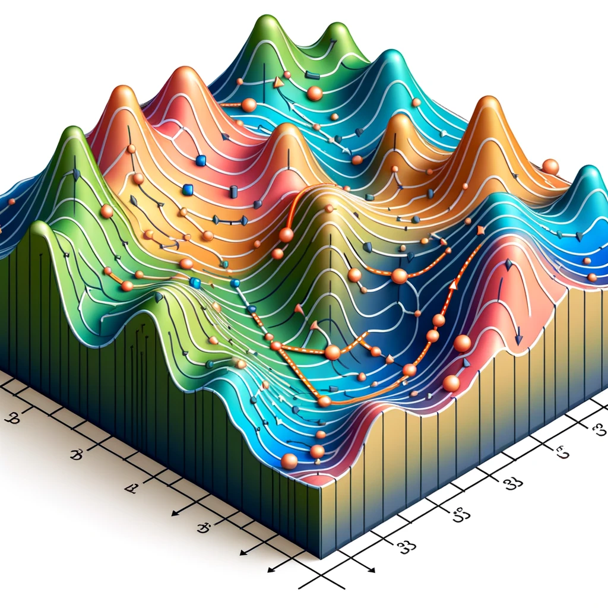
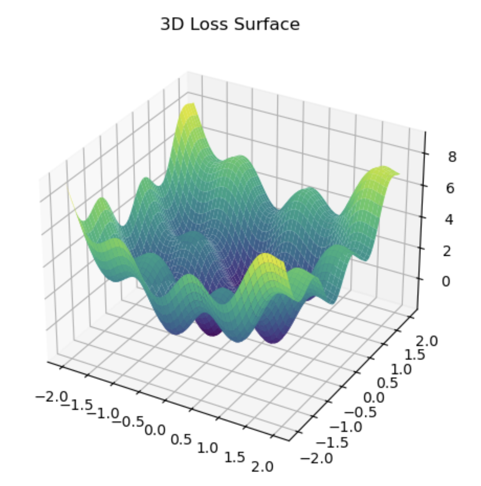
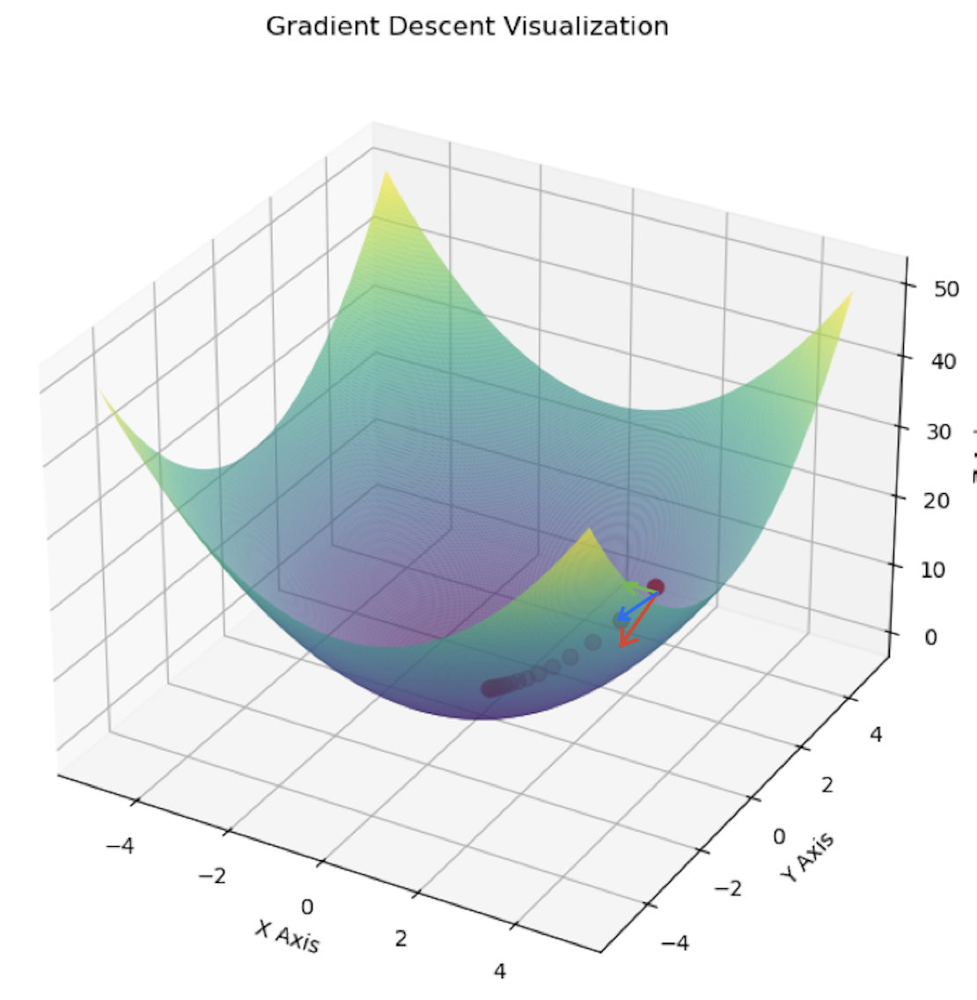

# 神经网络四大类（1）- MLP

## 多层感知机 （MLP）

MLP是一种很基础的神经网络模型，之后我们熟知的CNN，RNN以及transformer都包含MLP的概念。MLP能够对数据进行非线性建模。

* 层次结构：MLP由多个层次构成，包括一个输入层，一个或多个隐藏层，以及一个输出层。
* ***全连接***：**这是MLP和CNN最大的不同点之一，MLP中每个节点（神经元）都要接收来自上一层所有节点的输入，即每个节点都是上一层每个节点的加权和**。
* 多功能性：可以用于分类，多分类，回归等学习任务，取决于怎么定义输出层和激活函数。

这三个特性比较重要，其余特性不在这里全部叙述。

### 1. 各个层

* 输入层（input layer）
* 隐藏层 （hidden layer ｜ fully connected layer ｜ dense layer）
* 输出层 （output layer）

### 2. 输入层

2.1 输入层负责接收原始输入数据。

2.2 输入数据通常为**一维向量**。

2.3 每一个输入特征对应输入层的一个神经元（neurons）：

	* 例如， 如果数据集由28x28像素的图像组成，您将有784个输入神经元，每个像素对应一个神经元。
	* 对于彩色图像，每个像素会有三通道（RGB），因此神经元个数为 32 * 32 * 3。
	* 对于音频数据， 假如有一个一秒长的音频片段，采样率为44.1Hz，那么将会有共计44100个样本，那么需要44100个神经元。
	* 对于文本数据，如果有100个不同字符，每个字符将通过一个长度为100的独热向量表示，输入层将需要100个神经元。
	* 对于表格数据，通常每一列代表一个特征。如果有30个不同列，则需要30个神经元。

2.4 通常在讲数据传输进入输入层之前，会对数据进行预处理，如归一化，标准化等。

2.5 输入层 不对数据执行任何激活函数或者其他计算操作，仅仅是讲数据传递到圣经网络的下一层的通道。

### 3. 隐藏层 ｜ 全联接层

3.1 隐藏层是MLP的核心， 他负责进行数据的**非线性转换**和**特征提取**。

3.2 每个隐藏层有多个神经元组成，这些神经元通过激活函数引入非线性，使得神经网络能够学习和表示复杂的数据关系。

3.3 对于 `每个隐藏层有多个神经元组成`的理解，请参考 **5.神经元**。

3.4 对于给定的隐藏层，其数学操作可以分为两个步骤：**线性变换**和**非线性激活**。

* **线性变换**：
  * 线性变换是通过权重矩阵将输入数据转换为中间表示的过程。对于隐藏层 `l`，这一过程可以表示为

$$
\mathbf{z}^{[l]} = \mathbf{W}^{[l]} \mathbf{a}^{[l-1]} + \mathbf{b}^{[l]}
$$

其中：
$$
\mathbf{z}^{[l]}是第 l 层的线性变换输出
$$

$$
\mathbf{W}^{[l]} 是第 l 层的权重矩阵
$$

$$
\mathbf{a}^{[l-1]} 是第 l-1 层的激活输出，对于第一个隐藏层来说，它是输入层的输出。
$$

$$
\mathbf{b}^{[l]} 是第 l 层的偏置向量。
$$

* **非线性激活**
  * 通过线性变换可以看到，虽然引用了矩阵，但从公式上了解，根本上还是一个线性代数，如果我们需要做非线性的模型，就需要在线性模型的输出结果之上使用特定函数对数据进行转换。
  * 转换过后的数据输出和原本的结果不再是线性关系，因此，叫做非线性激活。
  * 举一个例子，如果我们用线性变换来计算多个参数，最终的结果总是权重和偏差的表达式，可能是多个值，也可能是多个值（由输出层的节点个数决定），如果我们做的是分类，想要的结果只有0或1，那么我们可以对原本的输出结果添加一个激活函数，例如如果结果低于某个值，激活函数返回0，如果高于某个特定值，激活函数返回1。

* **房价预测的神经网络示例**

在这个示例中，我们将建立一个简单的神经网络来预测房价。这个网络将包括一个输入层、一个隐藏层和一个输出层。

**a. 前向传播**

前向传播是神经网络的训练过程的第一步。在这一步骤中，输入数据逐层通过网络，进行线性变换和激活函数处理，直到得到最终的输出。

假设我们的输入向量（表示房屋特征，如大小、卧室数量、房龄）为：

$$
\mathbf{a}^{[0]} = \begin{bmatrix} 1200 \\ 3 \\ 10 \end{bmatrix}
$$

对于第一层隐藏层的线性变换，假设初始权重和偏置为：

$$
\mathbf{W}^{[1]} = \begin{bmatrix} 0.01 & -0.02 & 0.03 \\ 0.04 & 0.05 & -0.06 \end{bmatrix}, \quad \mathbf{b}^{[1]} = \begin{bmatrix} 0.001 \\ -0.001 \end{bmatrix}
$$

线性变换后，我们应用激活函数（例如ReLU）：

$$
\mathbf{z}^{[1]} = \mathbf{W}^{[1]} \mathbf{a}^{[0]} + \mathbf{b}^{[1]}
= \begin{bmatrix} 0.01 & -0.02 & 0.03 \\ 0.04 & 0.05 & -0.06 \end{bmatrix} * \begin{bmatrix} 1200 \\ 3 \\ 10 \end{bmatrix} + \begin{bmatrix} 0.001 \\ -0.001 \end{bmatrix}
= \begin{bmatrix} 12.241 \\ 47.549 \end{bmatrix}
$$

$$
\mathbf{a}^{[1]} = \text{ReLU}(\mathbf{z}^{[1]}) = max(0,\begin{bmatrix} 12.241 \\ 47.549 \end{bmatrix})=\begin{bmatrix} 12.241 \\ 47.549 \end{bmatrix}
$$

然后进行第二层隐藏层的线性变换，假设第二层的初始权重和偏置为（初始值的定义可以通过不同的方法定义，在这里为了演示只进行随机定义）：
$$
\mathbf{W}^{[2]} = \begin{bmatrix} 0.1 & -0.1 \\ 0.1 & 0.1 \end{bmatrix}, \quad \mathbf{b}^{[2]} = \begin{bmatrix} 0.01 \\ 0.01 \end{bmatrix}
$$
线性变换后，应用激活函数：
$$
\mathbf{z}^{[2]} = \mathbf{W}^{[2]} \mathbf{a}^{[1]} + \mathbf{b}^{[2]}
=\begin{bmatrix} 0.1 & -0.1 \\ 0.1 & 0.1 \end{bmatrix}
*\begin{bmatrix} 12.241 \\ 47.549 \end{bmatrix}
+\begin{bmatrix} 0.01 \\ 0.01 \end{bmatrix}
=\begin{bmatrix} -3.5308 \\ 5.979 \end{bmatrix}
$$

$$
\mathbf{a}^{[2]} = \text{ReLU}(\mathbf{z}^{[2]}) = max(0,\begin{bmatrix} -3.5308 \\ 5.979 \end{bmatrix})=\begin{bmatrix} 0 \\ 5.979 \end{bmatrix}
$$

输出层的权重和偏置：
$$
\mathbf{W}^{[3]} = \begin{bmatrix} 0.1, 0.1 \end{bmatrix}, \quad \mathbf{b}^{[3]} = 0.01
$$
计算输出层值：
$$
\mathbf{z}^{[3]}=\mathbf{W}^{[3]}\mathbf{a}^{[2]}+\mathbf{b}^{[3]}
=\begin{bmatrix} 0.1, 0.1 \end{bmatrix} * \begin{bmatrix} 0 \\ 5.979 \end{bmatrix} + 0.01
= 0.6079
$$
应用Relu 激活函数：
$$
\mathbf{a}^{[3]} = \text{ReLU}(\mathbf{z}^{[3]})=max(0,0.6079)=0.6079
$$
每一层的权重矩阵的行数代表了该层神经元的数量.

第一层隐藏层 $\mathbf{w}^{[1]}$: 权重矩阵是一个 $2*3$ 的矩阵，意味着第一隐藏层有2个神经元

第一层隐藏层的第一行$\mathbf{w}_{11}, \mathbf{w}_{12}, \mathbf{w}_{13}$ 是第一个节点的权重，分别连接着来着输入层的3个神经元。

第一层隐藏层的第二行$\mathbf{w}_{21}, \mathbf{w}_{22}, \mathbf{w}_{23}$ 是第二个节点的权重，分别连接着来着输入层的3个神经元。

第二层隐藏层$\mathbf{w}^{[2]}$：权重矩阵是一个 $2*2$​ 的矩阵，意味着第二隐藏层有2个神经元。

输出层$\mathbf{w}^{[3]}$：权重举证是一个 $1*2$ 的矩阵，意味着输出层的输出为单个值，单个神经元。

在这个例子里面，我们设置的dense layer是两层，输出层输出值为-8.2357，因为在这里的例子，关于价格，所以会在输出层之后再跟一个激活函数，来保证价格的非负性 （输出层是否需要添加激活函数取决于问题类型，例如回归模型，可能不用添加激活函数，二分类模型通常会使用sigmoid，多分类任务可能选择softmax）。

**b. 损失函数**

在得到了最后的预测值$\mathbf{a}^{[3]}$之后，需要使用损失函数计算预测值与真实值之间的误差, 为了方便演示，选择**均方误差**作为损失函数 （假设真实值为1）：
$$
\mathbf{L}=\frac{1}{2}(\mathbf{y}-\mathbf{a}^{[3]})^2
=\frac{1}{2}(1-0.6079)^2
=0.0762
$$
**c. 反向传播**

得到损失函数之后，开始计算各层的梯度。

计算输出层梯度：

输出层$\mathbf{a}^{[3]}$的梯度，即损失函数 $L$ 对于$\mathbf{a}^{[3]}$的偏导数，因为我们在这里使用的是Relu激活函数，**为了演示简单，我们可以看做这是损失函数 $L$ 对于 $\mathbf{z}^{[3]}$ 的偏导，不再对导数进行分段计算，即忽略激活函数部分，假设$\mathbf{a}^{[3]}=\mathbf{z}^{[3]}$。**

*这一步只是为了计算 $\mathbf{w}$ 和 $\mathbf{b}$ 的梯度更方便*
$$
\frac{\partial \mathbf{L}}{\partial \mathbf{z}^{[3]}}
=\frac{\partial \mathbf{L}}{\partial \mathbf{a}^{[3]}}
=\frac{\partial \frac{1}{2}(\mathbf{y}-\mathbf{a}^{[3]})^2}{\partial \mathbf{a}^{[3]}}
=\frac{\partial \frac{1}{2}(\mathbf{y}-\mathbf{a}^{[3]})^2}{\partial \mathbf{a}^{[3]}}
=(\mathbf{y}-\mathbf{a}^{[3]})\frac{\partial (\mathbf{y}-\mathbf{a}^{[3]})}{\partial \mathbf{a}^{[3]}}
=-(\mathbf{y}-\mathbf{a}^{[3]})
=-(1-0.6079)
=-0.3921
$$
接下来，我们使用这个梯度来计算权重 $\mathbf{w}^{[3]}$ 的梯度，为了对$\mathbf{w}^{[3]}$进行梯度下降的更新，我们需要计算损失函数 $L$ 对$\mathbf{w}^{[3]}$ 的偏导（梯度），梯度是损失随着权重变化的速率，指出了损失减少最快的方向：

$$
\frac{\partial \mathbf{L}}{\partial \mathbf{w}^{[3]}}
=\frac{\partial \mathbf{L}}{\partial \mathbf{a}^{[3]}}
\frac{\partial \mathbf{a}^{[3]}}{\partial \mathbf{w}^{[3]}}
=\frac{\partial \mathbf{L}}{\partial \mathbf{a}^{[3]}}
(
\frac{\partial (\mathbf{w}^{[3]}\mathbf{a}^{[2]}+\mathbf{b}^{[3]})}
{\partial \mathbf{w}^{[3]}}
)
=\frac{\partial \mathbf{L}}{\partial \mathbf{a}^{[3]}}
\mathbf{a}^{[2]}
$$
因为我们在进行梯度下降的同时需要进行反向传播，所以我们需要保证计算梯度时需要遵循矩阵乘法规则，所以我们选择对$\mathbf{a}^{[2]}$进行转置$\mathbf{a}^{[2]T}$，保证矩阵维度一致，梯度能够在神经网络中正确流动：
$$
\frac{\partial \mathbf{L}}{\partial \mathbf{w}^{[3]}}
=
\frac{\partial \mathbf{L}}{\partial \mathbf{a}^{[3]}}
\mathbf{a}^{[2]T}
\\
=-0.3921*\begin{bmatrix} 0 \\ 5.979 \end{bmatrix}^T
=\begin{bmatrix} 0 & -2.3443 \end{bmatrix}
$$
对于偏置$\mathbf{b}^{[3]}$,计算损失函数 $L$ 对$\mathbf{b}^{[3]}$ 的偏导（梯度）：
$$
\frac{\partial \mathbf{L}}{\partial \mathbf{b}^{[3]}}
=\frac{\partial \mathbf{L}}{\partial \mathbf{a}^{[3]}}
\frac{\partial \mathbf{a}^{[3]}}{\partial \mathbf{b}^{[3]}}
=-(\mathbf{y}-\mathbf{a}^{[3]})
=-0.3921
$$
计算出两者的梯度后，需要对原有的权重和偏置进行更新：
$$
\mathbf{w}^{[3][new]}
=\mathbf{w}^{[3]}-\alpha \frac{\partial \mathbf{L}}{\partial \mathbf{w}^{[3]}}
=\begin{bmatrix} 0.1, 0.1 \end{bmatrix}-0.1\begin{bmatrix} 0, -2.3443 \end{bmatrix}
=\begin{bmatrix} 0.1, 0.3344 \end{bmatrix}

\\
\mathbf{b}^{[3][new]}
=\mathbf{b}^{[3]}-\alpha \frac{\partial \mathbf{L}}{\partial \mathbf{b}^{[3]}}
=0.01-0.1*(-0.3921)=0.04921

\\
\alpha 是learning rate，是一个超参数，控制我们在梯度下降中更新权重的偏置的步长
$$
反向传播到**第二层**隐藏层：

计算损失函数$\mathbf{L}$对于$\mathbf{a}^{[2]}$的偏导数：
$$
\frac{\partial \mathbf{L}}{\partial \mathbf{a}^{[2]}}
=\frac{\partial \mathbf{L}}{\partial \mathbf{a}^{[3]}}
\frac{\partial \mathbf{a}^{[3]}}{\partial \mathbf{a}^{[2]}}
=
\frac{\partial \mathbf{L}}{\partial \mathbf{a}^{[3]}}
\frac{\partial (\mathbf{w}^{[3]}\mathbf{a}^{[2]}+\mathbf{b}^{[3]})}{\partial \mathbf{a}^{[2]}}
=
\frac{\partial \mathbf{L}}{\partial \mathbf{a}^{[3]}}
\mathbf{w}^{[3]}
$$
在计算反向传播的过程中，涉及到梯度传播，通常需要转置权重矩阵，因为梯度的传播方向与前向传播中的数据流动方向相反，我们需要确保计算出的结果，其维度能够与上一层所需维度相匹配，并且保证链式法则适用。因此，我们需要将$\mathbf{w}^{[3]}$进行转置$\mathbf{w}^{[3]T}$ 并左乘。
$$
\frac{\partial \mathbf{L}}{\partial \mathbf{a}^{[2]}}
=
\mathbf{w}^{[3]T}
\frac{\partial \mathbf{L}}{\partial \mathbf{a}^{[3]}}
\\
=
\begin{bmatrix} 0.1\\ 0.1 \end{bmatrix}
*
-0.3921
=
\begin{bmatrix} -0.03921\\ -0.03921 \end{bmatrix}
$$
接下来计算损失函数$\mathbf{L}$对于第二层权重矩阵$\mathbf{w}^{[2]}$的偏导：
$$
\frac{\partial \mathbf{L}}{\partial \mathbf{w}^{[2]}}
=\frac{\partial \mathbf{L}}{\partial \mathbf{a}^{[2]}}
\frac{\partial \mathbf{a}^{[2]}}{\partial \mathbf{w}^{[2]}}
=\begin{bmatrix} -0.03921\\ -0.03921 \end{bmatrix}
(
\frac{\partial (\mathbf{w}^{[2]} \mathbf{a}^{[1]} + \mathbf{b}^{[2]})}
{\partial \mathbf{w}^{[2]}}
)
=\begin{bmatrix} -0.03921\\ -0.03921 \end{bmatrix} 
\mathbf{a}^{[1]T}
\\
\\
=\begin{bmatrix} -0.03921\\ -0.03921 \end{bmatrix}
*\begin{bmatrix} 12.241 & 47.549 \end{bmatrix}
=\begin{bmatrix} -0.4799 &  -1.8643 \\-0.4799 & -1.8643 \end{bmatrix}
$$
计算损失函数$\mathbf{L}$对于第二层权重矩阵$\mathbf{b}^{[2]}$的偏导：
$$
\frac{\partial \mathbf{L}}{\partial \mathbf{b}^{[2]}}
=\frac{\partial \mathbf{L}}{\partial \mathbf{a}^{[2]}}
\frac{\partial \mathbf{a}^{[2]}}{\partial \mathbf{b}^{[2]}}
=\begin{bmatrix} -0.03921\\ -0.03921 \end{bmatrix}
(
\frac{\partial (\mathbf{W}^{[2]} \mathbf{a}^{[1]} + \mathbf{b}^{[2]})}
{\partial \mathbf{b}^{[2]}}
)
=\begin{bmatrix} -0.03921\\ -0.03921 \end{bmatrix}
$$
计算出两者的梯度后，需要对原有的权重和偏置进行更新：
$$
\mathbf{w}^{[2][new]}
=\mathbf{w}^{[2]}-\alpha \frac{\partial \mathbf{L}}{\partial \mathbf{w}^{[2]}}
=\begin{bmatrix} 0.1 & -0.1 \\ 0.1 & 0.1 \end{bmatrix}
-
0.1
\begin{bmatrix} -0.4799 &  -1.8643 \\-0.4799 & -1.8643 \end{bmatrix}
=\begin{bmatrix} 0.1479& 0.0864\\0.1479& 0.2864\end{bmatrix}
\\
\\
\mathbf{b}^{[2][new]}
=\mathbf{b}^{[2]}-\alpha \frac{\partial \mathbf{L}}{\partial \mathbf{b}^{[2]}}
=\begin{bmatrix} 0.01 \\ 0.01 \end{bmatrix}
-0.1\begin{bmatrix} -0.03921\\ -0.03921 \end{bmatrix}
=\begin{bmatrix} 0.01392 \\ 0.01392 \end{bmatrix}
$$
反向传播到**第一层**隐藏层：

计算损失函数$\mathbf{L}$对于$\mathbf{a}^{[1]}$的偏导数：
$$
\frac{\partial \mathbf{L}}{\partial \mathbf{a}^{[1]}}
=\frac{\partial \mathbf{L}}{\partial \mathbf{a}^{[2]}}
\frac{\partial \mathbf{a}^{[2]}}{\partial \mathbf{a}^{[1]}}
=
\frac{\partial \mathbf{L}}{\partial \mathbf{a}^{[2]}}
\frac{\partial (\mathbf{W}^{[2]} \mathbf{a}^{[1]} + \mathbf{b}^{[2]})}{\partial \mathbf{a}^{[1]}}
=
\mathbf{W}^{[2]T}
\frac{\partial \mathbf{L}}{\partial \mathbf{a}^{[2]}}
=
\begin{bmatrix} 0.1 & 0.1 \\ -0.1 & 0.1 \end{bmatrix}
\begin{bmatrix} -0.03921\\ -0.03921 \end{bmatrix}
=
\begin{bmatrix} -0.0078\\ 0 \end{bmatrix}
$$
接下来计算损失函数$\mathbf{L}$对于第二层权重矩阵$\mathbf{w}^{[1]}$的偏导：
$$
\frac{\partial \mathbf{L}}{\partial \mathbf{w}^{[1]}}
=\frac{\partial \mathbf{L}}{\partial \mathbf{a}^{[1]}}
\frac{\partial \mathbf{a}^{[1]}}{\partial \mathbf{w}^{[1]}}
=
\frac{\partial \mathbf{L}}{\partial \mathbf{a}^{[1]}}
(
\frac{\partial (\mathbf{w}^{[1]} \mathbf{a}^{[0]} + \mathbf{b}^{[1]})}
{\partial \mathbf{w}^{[1]}}
)
=
\frac{\partial \mathbf{L}}{\partial \mathbf{a}^{[1]}}
\mathbf{a}^{[0]T}
\\
\\
=
\begin{bmatrix} -0.0078\\ 0 \end{bmatrix}
\begin{bmatrix} 1200 & 3 & 10 \end{bmatrix}
=
\begin{bmatrix} -9.36 & -0.0234 & -0.078 \\0 & 0 & 0 \end{bmatrix}
$$
计算损失函数$\mathbf{L}$对于第二层权重矩阵$\mathbf{b}^{[1]}$的偏导：
$$
\frac{\partial \mathbf{L}}{\partial \mathbf{b}^{[1]}}
=\frac{\partial \mathbf{L}}{\partial \mathbf{a}^{[1]}}
\frac{\partial \mathbf{a}^{[1]}}{\partial \mathbf{b}^{[1]}}
=
\begin{bmatrix} -0.0078\\ 0 \end{bmatrix}
(
\frac{\partial (\mathbf{W}^{[1]} \mathbf{a}^{[0]} + \mathbf{b}^{[1]})}
{\partial \mathbf{b}^{[1]}}
)
=\begin{bmatrix} -0.0078\\ 0 \end{bmatrix}
$$
计算出两者的梯度后，需要对原有的权重和偏置进行更新：
$$
\mathbf{w}^{[1][new]}
=\mathbf{w}^{[1]}-\alpha \frac{\partial \mathbf{L}}{\partial \mathbf{w}^{[1]}}
=\begin{bmatrix} 0.01 & -0.02 & 0.03 \\ 0.04 & 0.05 & -0.06 \end{bmatrix}
-0.1
\begin{bmatrix} -9.36 & -0.0234 & -0.078 \\0 & 0 & 0 \end{bmatrix}
=
\begin{bmatrix} 0.946 & -0.01766 & 0.0378\\0.04 & 0.05 & -0.06\end{bmatrix}

\\
\\
\mathbf{b}^{[1][new]}
=\mathbf{b}^{[1]}-\alpha \frac{\partial \mathbf{L}}{\partial \mathbf{b}^{[1]}}
=\begin{bmatrix} 0.001 \\ -0.001 \end{bmatrix}
-0.1
\begin{bmatrix} -0.0078\\ 0 \end{bmatrix}
=\begin{bmatrix} 0.00178 \\ -0.001 \end{bmatrix}
$$
**d.综上所述：**

我们为每一层更新的对应的权重和偏差$\mathbf{w}^{[1][new]},\mathbf{b}^{[1][new]},\mathbf{w}^{[2][new]},\mathbf{b}^{[2][new]},\mathbf{w}^{[3][new]},\mathbf{b}^{[3][new]}$​。

一次完整的前向传播和反向传播表示了一次训练迭代。

使用更新后的权重和偏差在不同的batch上再次进行前向传播进行新一次的训练迭代。

优化的目标是减少预测输出和实际输出之间的差异，即误差。

### 4. 输出层（output layer）

4.1 输出层是MLP的最后一层，它负责产生网络的最终输出。

4.2 输出层的**节点个数和激活函数通常由特定任务决定**。

4.3 根据我们的例子：

* 输出层应该产生单个值代表了房屋的预期价格。
* 所以这里的节点个数只会是一个，代表了只输出一个值。
* 这其实就是一个回归问题。

4.4 其余还有一些情景：

* **二分类问题**： 如果MLP用于二分类，那么输出层通常只有一个神经元，可以使用sigmoid激活函数来预测属于某个类的概率。
* **多分类问题**： 输出层的神经元个数会等于类别的数量，可以选择使用softmax激活函数。

### 5. 神经元（neurons | nodes）

5.1 这里的图像展示了各个层的节点是怎么互相连接的（只考虑前向传播，忽略反向传播）。 

5.2 **MLP要求每一个节点都与上一层的所有节点连接**。

5.3 在这里的例子中，输入的数据维度为3，即输入是3个变量，所以输入层的节点个数也为3.

5.4 隐藏层的节点个数可以自己定义，在这里，两个隐藏层的节点个数均为2，且每个隐藏层都与上一层的所有节点连接，获取上一层所有节点的信息。

5.5 因为这里演示的是回归问题，预测价格，输出为单个值，所以输出层的节点必然是1个。

5.6 另外，需要注意的是，每个神经元处理的是**整个batch**的数据而不是一个batch里面的单点数据点。

* 在使用批处理时，输入数据会被组织称一个矩阵，这个矩阵的每一行代表一个数据样本，每一列代表一个特征。

  * 假设我们有一个batch，包含4条数据，每条数据都有3个变量，那么输入矩阵将是：

  $$
  input=\begin{bmatrix} 1 & 1 & 1  \\ 2 & 2 &2 \\ 3&3&3 \\4&4&4 \end{bmatrix}
  $$

  * 在输入层，每一组输入特征对应一个神经元（因为有3个特征，所以输入层有3个节点）：

  $$
  neuron 1 = \begin{bmatrix} 1 \\ 2 \\ 3 \\ 4  \end{bmatrix}
  \\
  \\
  neuron 2 = \begin{bmatrix} 1 \\ 2 \\ 3 \\ 4  \end{bmatrix}
  \\
  \\
  neuron 3 = \begin{bmatrix} 1 \\ 2 \\ 3 \\ 4  \end{bmatrix}
  $$

  

  * 在隐藏层，假设有2个节点，那么隐藏层的权重矩阵的行数应该为2，列数与输入值的特征数量相同为3:

  $$
  \mathbf{W}^{[1]} = \begin{bmatrix} 1 & 1 & 1 \\ 2 & 2 & 2 \end{bmatrix}
  $$

  * 输入层的输出即输入层的输入本身：

  $$
  \mathbf{W}^{[1]}*input^{T}=
  =
  \mathbf{W}^{[1]}\mathbf{a}^{[0]}
  =
  \begin{bmatrix} 1 & 1 & 1 \\ 2 & 2 & 2 \end{bmatrix}
  \begin{bmatrix} 1 & 2 & 3 &4  \\ 1 & 2 & 3 &4 \\ 1 & 2 & 3 &4 \end{bmatrix}
  $$

  * **你可能注意到有些公权重矩阵是转置右乘，而在此处是将输入矩阵转置右乘，两种方式均可，在此主要为了说明计算流程，并不作过多探讨**。

### 6. 激活函数

6.1 如果MLP没有非线性激活函数，那么无论神经网络有多少层，最终的输出都只是输入的线性组合，这限制了网络模型的表达能力。

6.2 我们通过上面的公式已经能看出，如果不包含激活函数，那么输出的值总是等于权重的偏差的表达式，但如果想做分类问题，输出值只能是0或1，就会产生问题。

6.3 通过引入非线性，激活函数允许神经网络学习和表达更加复杂的函数映射。

6.4 现实世界的问题总是非线性的，使用非线性激活函数可以帮助神经网络学习哲学问题的复杂模式和结构。

6.5 再次使用我们之前的例子：

* 我们要预测的是房子价格，我们都知道价格是不可能为负数的，但是如果MLP不包含激活函数（在这里我们使用的是ReLU），那么最终得到的结果可能就是负数。
* ReLU会确保我们不会得到负数，如果将ReLU用图像表示，则为：

* 可以看到ReLU函数是非线性的，如果输入值小于0，则输出0，如果大于0，则输出原值。

6.6 我们需要根据不同的情景选择不同的激活函数，如：

* **sigmoid**： 将输入映射到$(0,1)$区间，通常适用于二分类。
* **Tanh**：将输入映射到$(-1,1)$区间，形状和sigmoid类似，但是输出均值为0.
* **Softmax**： 常用于多分类神经网络输出层，将输出值转换为概率分布。

### 7. epoches

7.1 神经网络通过读取输入数据集并对其应用不同的计算来学习输入数据的模式。 但神经网络不会只做到一次，它会使用输入数据集和之前试验的结果一次又一次地学习。

7.2 每一次从数据及输入开始到结束的试验成为一个epoch。

7.3 因此，一个epoch是指整个训练数据集的一个周期。 通常，训练神经网络需要多个时期。 增加epoch数量并不总是意味着网络会给出更好的结果。

7.4 因此，基本上，通过反复试验，我们选择几个epoch，在几个时期后结果仍然相同，那么可以选择结束训练。

### 8. 训练迭代（training iterations）

8.1 每次使用一个batch进行一次完整的前向和反向传播过程被称为一次训练迭代。

8.2 也就是说，训练迭代通常与batch大小有关。在一次迭代中，你只更新一次你的模型参数，不论你的batch大小是多少。

8.3 如果你有$\mathbf{N}$个训练样本，并且你选择了一个大小为$\mathbf{B}$的batch，那么在一个epoch里面，你会有：
$$
训练迭代次数=\lceil \frac{\mathbf{N}}{\mathbf{B}} \rceil (向上取整)
\\
\\
如果你有1050个样本数据
\\
你选择batch size=100
\\
那么在一个epoch里面，你将有\lceil \frac{\mathbf{N}}{\mathbf{B}} \rceil=11 次训练迭代
$$
8.4 一次完整的训练迭代中，神经网络会对单个batch进行一次完整的前向传播和反向传播。

8.5 在进行完一次训练迭代后，我们通常不会立即在同一个batch 上重新计算，而是将更新的参数带入到下一个batch中进行训练：

* 效率考虑：在同一个batch上重复计算前向传播和反向传播会极大地降低训练过程的效率。我门希望在整个数据集上推广我们的模型参数，而不仅仅是在一个batch上。

* 过拟合风险：如果我们不断地在同一个batch上重新计算并更新参数，模型可能会记住这个batch的特定样本，而不是学习泛化特征。这可能导致过拟合，即模型在训练数据上表现很好，但是在未见过的数据上表现不佳。

* 探索**损失曲面**： 在权重空间中，每个batch的梯度指向降低当前batch损失的方向。如果我们不断地对同一个batch重复这个过程，我们就不能探索整个权重空间，这样可能会陷入**局部最小值**。使用多个batch可以帮助我们更好地探索损失曲面，并可能找到更好的全局最小值。

  * 让我们通过图像来说明什么是损失曲面，为了能够清楚显示，我们选择两个水平轴代表两个参数，垂直轴代表损失值。下面的抽象图由GPT生成。

    

  * 下面展示了由两个参数和损失值所画出的一个图像，我们可以看到，两个参数（水平轴）和损失值（垂直轴）构成一个3D图像，我们需要做的就是找到通向3D图像最底部的路径，这个路径通过梯度下降来确认。

  * 整个图像包含了多个波峰和波谷，我们通过梯度下降可能在某一个波谷找到最小值，但是这个最小值可能只是**局部最小值**或者称为**局部最优解**。

  * 使用多个batch进行训练迭代，可以对不同的波谷进行梯度下降，增加找到全局最优解的可能性。

    

  * 我们选择画出单个的波谷图像, 让我们假设位于最上面的红点即**初始点**，即在一次训练中，第一次得到的结果，计算出的损失值和对应参数（权重和偏差）的空间点。

  * 在这之后，我们对各个参数进行偏导，找出损失值变化速率最快的方向，从而进行优化，尝试到达波谷。

  * 在单个波谷的途中，我们画出了多个红点，表示不断对参数进行了优化，使得损失值越来越小。但是在真实的情况中，这个下降路径是曲折的，如上图多个波峰的图像所示，想要达到全局最优解是不简单的。

  * 这也是我们为什么会把数据分成不同的batch和epoch的一个原因。

  

  * 现在让我们画出有三个波谷的图像.
  * 我们可以更直观的看到，红点落在的波谷在局部可能是最优解，但是在全局来看，第二个波谷会获得更好的值。

  

### 9. 前向传播（forward boradcast）

9.1 前向传播，简而言之，就是将输入数据通过神经网络传递并输出的过程。

9.2 在之前的例子中，已经展示了前向传播的具体步骤，通过输入层，隐藏层，最终在输出层得到结果。

9.3 需要注意的是，MLP容易发生过拟合，特别是当网络很深或者数据很少时。为了避免过拟合，可以使用正则化技术，Dropout或者简化网络结构。

### 10. 反向传播（backward propagation）

10.1 反向传播是为了对参数进行调整，从而使损失函数能够降低。

10.2 反向传播的计算路径和前向传播完全相反。

10.3 反向传播需要计算梯度，需要注意**梯度消失**和**梯度爆炸**的问题。

10.4 我没有过多的提及前向传播中涉及到的学习率的知识，学习率决定了在优化过程中权重更新的步长，即学习率能控制模型在尝试减小损失函数值时的速度。过高的学习率可能导致减小损失函数过程的不稳定，但是过小的学习率可能导致学习过程太慢火停滞。

### 11. 梯度下降（gradient descent）

refernce[1]: https://www.khanacademy.org/math/multivariable-calculus/applications-of-multivariable-derivatives/optimizing-multivariable-functions/a/what-is-gradient-descent

reference[2]: https://www.youtube.com/watch?v=UkcUZTe49Pg

reference:[3]: https://www.youtube.com/watch?v=Dhou27Ergkk

11.1 导数是函数值关于自变量的变化率。多元函数当中有多个自变量，关于某个自变量的比变化率就是多元函数对这个自变量的偏导数。11.2 和上面的例子结合，可以理解为损失值关于权重矩阵$\mathbf{w}^{[i]}$的变化率就是损失函数$\mathbf{L}$关于$\mathbf{w}^{[i]}$的偏导。

11.3 梯度可以定义为一个函数的全部偏导数构成的向量。
$$
\nabla f
=
(\frac{\partial{f}}{\partial{x1}},\frac{\partial{f}}{\partial{x2}},...,\frac{\partial{f}}{\partial{xn}})
$$
​	梯度向量的方向是函数值变化率最大的方向，也就是对于函数的某个**特定点**，它的梯度就表示从该点出发，函数值变化最为迅猛的方向（可以参考损失曲面提及的内容）。

* 在我们的例子中，计算的梯度向量由$\frac{\partial \mathbf{L}}{\partial \mathbf{b}^{[i]}}$和$\frac{\partial \mathbf{L}}{\partial \mathbf{w}^{[i]}}$​两个方向构成，这两个方向的组合能构成一个新的方向向量，这个方向向量就是我们需要进行下降的方向（在这里请先忽略正向或者反向）。

11.4 梯度下降有几个特性：

* 它指向函数在某点上**增长最快**的方向。
* 梯度的大小表示在这个方向上函数增长的速率。
* 沿着梯度的负方向移动可以是函数值下降最快，只是梯度下降的基础。

### 12. Dropout

12.1 Dropout在神经网络中的使用往往是防止模型产生**过拟合**的情况，过拟合通常发生在模型学习了训练数据中的噪声和不重要的信息，	从而影响模型在新数据上的泛化能力。

12.2 Dropout 只添加在训练过程中，在实际的预测模型中并不存在。

12.3 dropout主要是为了防止模型过分地依赖于任何单一的节点。

12.4 dropout能够随机阻隔任何神经元不参与到学习过程中，迫使神经网络提升robust，不依赖于特定的信号路径。

12.5 因为在训练过程中，任何节点都可能被排除在学习过程外过，在实际预测过程中，所有的节点都会参与工作，但是每个节点的robust已经得到了提升，能够很好处理各类情况。

12.6 在这里提供一个例子，演示怎么dropout是怎么阻断节点的信息传播的，为了方便理解，这里选择标准dropout：

* 使用之前的例子，第一隐藏层的输出, 有两个单元输出值：

$$
\mathbf{a}^{[1]}=\begin{bmatrix} 12.241 \\ 47.549 \end{bmatrix}
$$

* 在$\mathbf{a}^{[1]}$进入第二隐藏层之前，dropout会生成一个mask掩码，这个mask是随机生成的在$[0,1]$​范围内的数字：

$$
mask^{1}=[0.38298,0.78923]
$$

* 之后需要设置dropout率，在这里选择0.5:

$$
DropoutRate=0.5
$$

* 让dropout率和掩码中每一个数值进行比较，如果小于dropout率则为0，否则为1，因此更新后的掩码为：

$$
mask^{1}=[0,1]
$$

* 将掩码乘以第一隐藏层的输出，得到新的输出：

$$
\mathbf{a}^{[1]new}=\begin{bmatrix} 0 \\ 47.549 \end{bmatrix}
$$

* 接下来要缩放激活输出，可以看到，有一个单元的数值被丢弃，变为0，但是为了保持激活输出的期望不变，我门需要将激活输出除以保持概率：

$$
KeepProb=1-DropoutRate=1-0.5=0.5
\\
\\
\mathbf{a}^{[1]new}=\begin{bmatrix} 0 \\ 47.549 \end{bmatrix}*KeepProb=\begin{bmatrix} 0 \\ 23.775 \end{bmatrix}
$$

* 根据上述操作，我们已经得到了最终需要被传递到下一层的激活输出。

12.7 特定神经元的输出暂时被设置成0之后，表示对应的神经元对下一层的贡献被暂时移除出这一训练迭代。

* 神经元的输出为0意味着这个神经元在当前训练迭代中不会对后续训练产生任何信息。
* 这个节点对应的权重和偏置不会被修改，但是在当前训练迭代中失去了作用。
* 如我们已经计算出了新的输出，将这个输出传送到第二隐藏层进行计算：

$$
\mathbf{W}^{[2]} \mathbf{a}^{[1]new}
=
\begin{bmatrix} 0.1 & -0.1 \\ 0.1 & 0.1 \end{bmatrix}
*\begin{bmatrix} 0 \\ 23.775 \end{bmatrix}
=\begin{bmatrix} 0.1*0+-0.1*23.775 \\ 0.1*0+0.1*23.775 \end{bmatrix}
\\
\\
\mathbf{W}^{[2]} \mathbf{a}^{[1]}
=\begin{bmatrix} 0.1 & -0.1 \\ 0.1 & 0.1 \end{bmatrix}
*\begin{bmatrix} 12.241 \\ 47.549 \end{bmatrix}
=\begin{bmatrix} 0.1*12.241+-0.1*47.549 \\ 0.1*12.241+0.1*47.549 \end{bmatrix}
$$

* 请记住权重矩阵$\mathbf{W}^{[2]}$的第一列连接上一层的第一个神经元，可以看到将神经元的输出为0时，信息将不会被继续传播。

### 13. 梯度消失（gradient vanishing）

13.1 梯度消失时在神经网络中，梯度的值变得非常小，趋近于0，而导致网络权重几乎不更新，使得神经网络停止学习。

13.2 在反向传播的过程中，梯度值会通过连续的矩阵乘法快速变化，如果梯度值太小，通过多重的矩阵乘法，会是的梯度快速降低，直至逼近于0.

13.3 如果梯度值逼近于0，就代表了神经网络很难有重大变化，导致学习停止。

13.4 使用一个具体计算比对来说明梯度消失，我们仍然选择上面提出的例子，选择第二以藏层的反向传播计算：

* 原本的计算内容为：

$$
\frac{\partial \mathbf{L}}{\partial \mathbf{w}^{[3]}}
=
\frac{\partial \mathbf{L}}{\partial \mathbf{a}^{[3]}}
\mathbf{a}^{[2]T}
\\
=-0.3921*\begin{bmatrix} 0 \\ 5.979 \end{bmatrix}^T
=\begin{bmatrix} 0 & -2.3443 \end{bmatrix}
$$

$$
\frac{\partial \mathbf{L}}{\partial \mathbf{b}^{[3]}}
=\frac{\partial \mathbf{L}}{\partial \mathbf{a}^{[3]}}
\frac{\partial \mathbf{a}^{[3]}}{\partial \mathbf{b}^{[3]}}
=-(\mathbf{y}-\mathbf{a}^{[3]})
=-0.3921
$$

$$
\mathbf{w}^{[3][new]}
=\mathbf{w}^{[3]}-\alpha \frac{\partial \mathbf{L}}{\partial \mathbf{w}^{[3]}}
=\begin{bmatrix} 0.1, 0.1 \end{bmatrix}-0.1\begin{bmatrix} 0, -2.3443 \end{bmatrix}
=\begin{bmatrix} 0.1, 0.3344 \end{bmatrix}

\\
\mathbf{b}^{[3][new]}
=\mathbf{b}^{[3]}-\alpha \frac{\partial \mathbf{L}}{\partial \mathbf{b}^{[3]}}
=0.01-0.1*(-0.3921)=0.04921
$$

$$
\mathbf{w}^{[3][old]}=\begin{bmatrix} 0.1, 0.1 \end{bmatrix}
,
\mathbf{b}^{[3][old]}=0.01
\\
\\
\mathbf{w}^{[3][new]}=\begin{bmatrix} 0.1, 0.3344 \end{bmatrix}
,
\mathbf{b}^{[3][new]}=0.0491
$$

* 通过对比原始权重和偏差以及经过梯度优化之后的权重和偏差，可以看出具体的数值还是有明显的变化的。

* 我们修改其中的一些数值，来展示梯度消失,假设$\frac{\partial \mathbf{L}}{\partial \mathbf{a}^{[3]}}=-0.001,\alpha=0.0001$：

$$
\frac{\partial \mathbf{L}}{\partial \mathbf{w}^{[3]}}
=
\frac{\partial \mathbf{L}}{\partial \mathbf{a}^{[3]}}
\mathbf{a}^{[2]T}
\\
=-0.0001*\begin{bmatrix} 0 \\ 5.979 \end{bmatrix}^T
=\begin{bmatrix} 0 & -0.000579 \end{bmatrix}
$$

$$
\frac{\partial \mathbf{L}}{\partial \mathbf{b}^{[3]}}
=\frac{\partial \mathbf{L}}{\partial \mathbf{a}^{[3]}}
\frac{\partial \mathbf{a}^{[3]}}{\partial \mathbf{b}^{[3]}}
=-(\mathbf{y}-\mathbf{a}^{[3]})
=-0.3921
$$

$$
\mathbf{w}^{[3][new]}
=\mathbf{w}^{[3]}-\alpha \frac{\partial \mathbf{L}}{\partial \mathbf{w}^{[3]}}
=\begin{bmatrix} 0.1, 0.1 \end{bmatrix}-0.0001\begin{bmatrix} 0, -0.000579 \end{bmatrix}
=\begin{bmatrix} 0.1, 0.1+0.0001*0.000579 \end{bmatrix}

\\
\mathbf{b}^{[3][new]}
=\mathbf{b}^{[3]}-\alpha \frac{\partial \mathbf{L}}{\partial \mathbf{b}^{[3]}}
=0.01-0.0001*(-0.3921)=0.01+0.0001*0.3921
$$

$$
\mathbf{w}^{[3][old]}=\begin{bmatrix} 0.1, 0.1 \end{bmatrix}
,
\mathbf{b}^{[3][old]}=0.01
\\
\\
\mathbf{w}^{[3][new]}=\begin{bmatrix} 0.1, 0.1000000579 \end{bmatrix}
,
\mathbf{b}^{[3][new]}=0.010003921
$$

* 可以看到更新前后的数值变化非常小，几乎停止变化。
* 随着网络层数的增加，变化会无限趋近于0，这就是梯度消失问题。

13.5 让我们通过图像说明梯度消失：

* 左侧图像显示了每一层的输出值，可以看到，再经过明显的变化后，由于之后的权重和偏差的变化都很小，之后的输出几乎不发生变化，表示这个神经网络已经不能继续学习。
* 右侧图便是了网络中每一层的梯度的大小，可以看到梯度随着层数的增加而迅速减小，梯度会影响权重的偏差的更新，过小的梯度对权重的更新不起作用。这就是梯度消失。

### 14. 梯度爆炸（gradient explosion）

14.1 梯度爆炸是指计算出来的梯度值过大，导致在更新网络权重和偏差的时候网络参数非常不稳定而导致的问题。

14.2 为了能够更形象的表示梯度爆炸，在这里选择不用数学计算来演算，而是选择用图像进行表示。

* 我们使用前面提到的损失曲面来进行演示。
* 假设红点为初始点。
* 计算的梯度沿着亮黄色的线进行优化有可能获得局部最优解。
* 但是如果梯度过大，即每一次的优化步长太长，如图中的橙色虚线，则会超过最优解的空间位置，从而需要映射到损失平面上的另一个点。
* 在图中，亮绿色的点为进行一次权重后获得的空间点。
* 如果想要按照类似的步长进行梯度优化，第二次就会获得黑色的点为输出。
* 可以看到，在这个过程中，整个网络优化过程是很杂乱和不稳定的。

14.3 **可以通过这种抽象的方法来理解梯度爆炸，但是这并不是正确的，只是方便我个人去理解梯度爆炸的不稳定性。**

14.4 使用一个具体计算比对来说明梯度爆炸，我们仍然选择上面提出的例子，选择第二以藏层的反向传播计算：

* 原本的计算内容为：

$$
\frac{\partial \mathbf{L}}{\partial \mathbf{w}^{[3]}}
=
\frac{\partial \mathbf{L}}{\partial \mathbf{a}^{[3]}}
\mathbf{a}^{[2]T}
\\
=-0.3921*\begin{bmatrix} 0 \\ 5.979 \end{bmatrix}^T
=\begin{bmatrix} 0 & -2.3443 \end{bmatrix}
$$

$$
\mathbf{w}^{[3][new]}
=\mathbf{w}^{[3]}-\alpha \frac{\partial \mathbf{L}}{\partial \mathbf{w}^{[3]}}
=\begin{bmatrix} 0.1, 0.1 \end{bmatrix}-0.1\begin{bmatrix} 0, -2.3443 \end{bmatrix}
=\begin{bmatrix} 0.1, 0.3344 \end{bmatrix}
$$

$$
\mathbf{w}^{[3][old]}=\begin{bmatrix} 0.1, 0.1 \end{bmatrix}
\\
\\
\mathbf{w}^{[3][new]}=\begin{bmatrix} 0.1, 0.3344 \end{bmatrix}
$$

* 为了模拟梯度爆炸，假设 $\mathbf{w}^{[3]}=\begin{bmatrix} 10, 10 \end{bmatrix},\mathbf{a}^{[2]T}=\begin{bmatrix} 10\\ 10 \end{bmatrix}$​​

$$
\frac{\partial \mathbf{L}}{\partial \mathbf{w}^{[3]}}
=
\frac{\partial \mathbf{L}}{\partial \mathbf{a}^{[3]}}
\mathbf{a}^{[2]T}
\\
=
-0.3921*\begin{bmatrix} 10\\ 10 \end{bmatrix}
=\begin{bmatrix} -3.921\\ -3.921 \end{bmatrix}
$$

$$
\mathbf{w}^{[3][new]}
=\mathbf{w}^{[3]}-\alpha \frac{\partial \mathbf{L}}{\partial \mathbf{w}^{[3]}}
=\begin{bmatrix} 10, 10 \end{bmatrix}-0.1\begin{bmatrix} -3.921, -3.921 \end{bmatrix}
=\begin{bmatrix} 10.3921, 10.3921 \end{bmatrix}
\\
\\
\mathbf{w}^{[3][old]}=\begin{bmatrix} 10, 10 \end{bmatrix}
$$

* 可以看到相对于初始值，更新后的权重值有一个明显的增加，虽然在这里，接近0.4的增加值可能看起来很小，但是在多层的神经网络中，这样的数值已经非常大了，尤其是在经过多次梯度优化，矩阵不断相乘，数值会疯狂增长。

**本文章内容为个人学习整理，其中不免有错误，请参考其大致含义，帮助学习MLP以及机器学习的概念。**

