# Multi-Layer Perceptron (MLP)

The Multi-Layer Perceptron (MLP) is a fundamental type of neural network model. Subsequent models such as Convolutional Neural Networks (CNNs), Recurrent Neural Networks (RNNs), and Transformers all incorporate concepts from the MLP. MLPs are capable of modeling data nonlinearly.

Key Characteristics of MLP:

1. **Layered Structure**: MLP consists of multiple layers, including an input layer, one or more hidden layers, and an output layer.
2. **Fully Connected: This is one of the main differences between MLPs and CNNs. In MLPs, each node (neuron) receives input from all nodes in the previous layer, meaning each node represents the weighted sum of all nodes from the preceding layer.**
3. **Versatility**: MLPs can be used for various learning tasks such as classification, multi-classification, and regression, depending on how the output layer and activation functions are defined.

These three characteristics are particularly important, although there are other features not fully described here.


## 1. Layers

* input layer
* hidden layer ｜ fully connected layer ｜ dense layer
* output layer

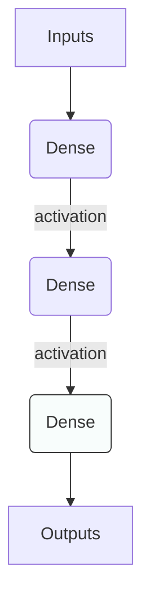

## 2. Input layer

2.1 The input layer is responsible for receiving raw input data.

2.2 The input data is typically in the form of **one-dimensional vectors**.

2.3 Each input feature corresponds to a neuron in the input layer:

```
- For instance, if the dataset consists of 28x28 pixel images, there will be 784 input neurons, with each pixel corresponding to one neuron.
- For color images, each pixel has three channels (RGB), hence the number of neurons would be 32 * 32 * 3.
- For audio data, consider a one-second audio clip with a sample rate of 44.1kHz; this would result in 44100 samples, requiring 44100 neurons.
- For textual data, if there are 100 different characters, each character would be represented by a one-hot vector of length 100, requiring 100 neurons in the input layer.
- For tabular data, each column typically represents a feature. If there are 30 different columns, then 30 neurons are needed.
```

2.4 Typically, data undergoes preprocessing, such as normalization or standardization, before being fed into the input layer.

2.5 The input layer does not perform any activation function or other computational operations on the data; it merely serves as a conduit for transferring data to the next layer of the neural network.


## 3. Hidden layer (fully-connected layer)


3.1 The hidden layers are the core of an MLP, responsible for **non-linear transformation** and **feature extraction**.

3.2 Each hidden layer consists of multiple neurons, which introduce non-linearity through activation functions. This allows the neural network to learn and represent complex data relationships.

3.3 For an understanding of the concept "each hidden layer consists of multiple neurons," refer to **Section 5. Neurons**.

3.4 For a given hidden layer, its mathematical operations can be divided into two steps: **linear transformation** and **non-linear activation**.

- **Linear Transformation**:
  - The linear transformation is the process of converting input data into an intermediate representation using a weight matrix. For hidden layer `l`, this process can be expressed as follows: 

$$
\mathbf{z}^{[l]} = \mathbf{W}^{[l]} \mathbf{a}^{[l-1]} + \mathbf{b}^{[l]}
$$

In this context:
$$
\mathbf{z}^{[l]}\; is \; the \; linear \; transformation \; output\; of\; layer \;l.
$$

$$
\mathbf{W}^{[l]}\;is\; the\; weight\; matrix\; of\; layer\; l.
$$

$$
\mathbf{a}^{[l-1]}\; is\; the \;activation\; output\; of\; layer\; l−1. \;
\\
For \;the\; first\; hidden \;layer,\; this\; corresponds\; to \;the \;output \;of \;the\; input\; layer. 
$$

$$
\mathbf{b}^{[l]} \; is \;\;the\; bias\; vector\; of \;layer \;l.
$$

* **Non-Linear Activation**

  - Although matrix operations are involved, it's evident from the formula that the basis remains linear algebra. To model non-linear phenomena, it's necessary to apply specific functions to the outputs of the linear model, transforming the data.

  - The data, once transformed, no longer maintains a linear relationship with the original results, hence the term "non-linear activation."

  - For instance, if we use linear transformation to calculate multiple parameters, the final outcome will always be a function of the weights and biases. This could represent multiple values, depending on the number of nodes in the output layer. In a classification task where the desired outcome is binary (0 or 1), an activation function can be applied to the original results. For example, if the result is below a certain threshold, the activation function returns 0; if it exceeds a specific value, the activation function returns 1.

* **Neural Network Example for House Price Prediction**

In this example, we will create a simple neural network to predict house prices. This network will include an input layer, a hidden layer, and an output layer.

​	**a. Forward Propagation**

Forward propagation is the first step in the training process of a neural network. In this step, the input data passes through the network layer by layer, undergoing linear transformations and activation function processing, until the final output is obtained.

Suppose our input vector (representing house features such as size, number of bedrooms, age of the house) is: 
$$
\mathbf{a}^{[0]} = \begin{bmatrix} 1200 \\ 3 \\ 10 \end{bmatrix}
$$
For the linear transformation of the first hidden layer, let's assume the initial weights and biases are as follows:
$$
\mathbf{W}^{[1]} = \begin{bmatrix} 0.01 & -0.02 & 0.03 \\ 0.04 & 0.05 & -0.06 \end{bmatrix}, \quad \mathbf{b}^{[1]} = \begin{bmatrix} 0.001 \\ -0.001 \end{bmatrix}
$$
After the linear transformation, we apply an activation function, such as ReLU (Rectified Linear Unit):
$$
\mathbf{z}^{[1]} = \mathbf{W}^{[1]} \mathbf{a}^{[0]} + \mathbf{b}^{[1]}
= \begin{bmatrix} 0.01 & -0.02 & 0.03 \\ 0.04 & 0.05 & -0.06 \end{bmatrix} * \begin{bmatrix} 1200 \\ 3 \\ 10 \end{bmatrix} + \begin{bmatrix} 0.001 \\ -0.001 \end{bmatrix}
= \begin{bmatrix} 12.241 \\ 47.549 \end{bmatrix}
$$

$$
\mathbf{a}^{[1]} = \text{ReLU}(\mathbf{z}^{[1]}) = max(0,\begin{bmatrix} 12.241 \\ 47.549 \end{bmatrix})=\begin{bmatrix} 12.241 \\ 47.549 \end{bmatrix}
$$

Then, the process moves to the linear transformation of the second hidden layer. Let's assume the initial weights and biases for the second layer are defined randomly for demonstration purposes (although in practice, they can be defined through various methods): 
$$
\mathbf{W}^{[2]} = \begin{bmatrix} 0.1 & -0.1 \\ 0.1 & 0.1 \end{bmatrix}, \quad \mathbf{b}^{[2]} = \begin{bmatrix} 0.01 \\ 0.01 \end{bmatrix}
$$
After the linear transformation in the second hidden layer, an activation function is applied: 
$$
\mathbf{z}^{[2]} = \mathbf{W}^{[2]} \mathbf{a}^{[1]} + \mathbf{b}^{[2]}
=\begin{bmatrix} 0.1 & -0.1 \\ 0.1 & 0.1 \end{bmatrix}
*\begin{bmatrix} 12.241 \\ 47.549 \end{bmatrix}
+\begin{bmatrix} 0.01 \\ 0.01 \end{bmatrix}
=\begin{bmatrix} -3.5308 \\ 5.979 \end{bmatrix}
$$

$$
\mathbf{a}^{[2]} = \text{ReLU}(\mathbf{z}^{[2]}) = max(0,\begin{bmatrix} -3.5308 \\ 5.979 \end{bmatrix})=\begin{bmatrix} 0 \\ 5.979 \end{bmatrix}
$$

The weights and biases of the output layer are:
$$
\mathbf{W}^{[3]} = \begin{bmatrix} 0.1, 0.1 \end{bmatrix}, \quad \mathbf{b}^{[3]} = 0.01
$$
To calculate the value at the output layer:
$$
\mathbf{z}^{[3]}=\mathbf{W}^{[3]}\mathbf{a}^{[2]}+\mathbf{b}^{[3]}
=\begin{bmatrix} 0.1, 0.1 \end{bmatrix} * \begin{bmatrix} 0 \\ 5.979 \end{bmatrix} + 0.01
= 0.6079
$$
Apply the ReLU (Rectified Linear Unit) activation function: 
$$
\mathbf{a}^{[3]} = \text{ReLU}(\mathbf{z}^{[3]})=max(0,0.6079)=0.6079
$$
The number of rows in the weight matrix of each layer represents the number of neurons in that layer.

First Hidden Layer $\mathbf{w}^{[1]}$: The weight matrix is a  $2*3$ matrix, indicating that there are 2 neurons in the first hidden layer.

The first row of the first hidden layer $\mathbf{w}_{11}, \mathbf{w}_{12}, \mathbf{w}_{13}$ represents the weights of the first node, each connecting to the 3 neurons in the input layer.

The second row of the first hidden layer $\mathbf{w}_{21}, \mathbf{w}_{22}, \mathbf{w}_{23}$ represents the weights of the second node, also connecting to the 3 neurons in the input layer.

Second Hidden Layer $\mathbf{w}^{[2]}$: The weight matrix is a  $2*2$ matrix, meaning that the second hidden layer has 2 neurons.

Output Layer $\mathbf{w}^{[3]}$: The weight matrix is a  $1*2$ matrix, indicating a single output value from one neuron in the output layer.

In this example, we have set two dense layers. The output value of the output layer is -8.2357. Considering the context of price prediction, an activation function is applied after the output layer to ensure the non-negativity of the price (the necessity of adding an activation function to the output layer depends on the problem type. For instance, regression models might not require an activation function, binary classification models commonly use sigmoid, and multi-classification tasks might choose softmax).

​	**b. Loss function**

After obtaining the final prediction value $\mathbf{a}^{[3]}$, we need to use a loss function to compute the error between the predicted and actual values. For simplicity in this demonstration, we choose the **Mean Squared Error (MSE)** as the loss function (assuming the actual value is 1).
$$
\mathbf{L}=\frac{1}{2}(\mathbf{y}-\mathbf{a}^{[3]})^2
=\frac{1}{2}(1-0.6079)^2
=0.0762
$$
​	**c. Back propagation**

After obtaining the loss function, the next step is to calculate the gradients for each layer.

Calculating the Gradient for the Output Layer:

The gradient of the output layer $\mathbf{a}^{[3]}$ is the partial derivative of the loss function $L$ with respect to $\mathbf{a}^{[3]}$. Since we are using the ReLU activation function in this example, for simplicity's sake, we can consider this as the partial derivative of the loss function $L$ with respect to $\mathbf{z}^{[3]}$. We will not perform segmented calculation for the derivative, effectively ignoring the activation function part, and assume $\mathbf{a}^{[3]}=\mathbf{z}^{[3]}$.

*This step is simplified to facilitate the calculation of gradients for $\mathbf{w}$ and $\mathbf{b}$.*
$$
\frac{\partial \mathbf{L}}{\partial \mathbf{z}^{[3]}}
=\frac{\partial \mathbf{L}}{\partial \mathbf{a}^{[3]}}
=\frac{\partial \frac{1}{2}(\mathbf{y}-\mathbf{a}^{[3]})^2}{\partial \mathbf{a}^{[3]}}
=\frac{\partial \frac{1}{2}(\mathbf{y}-\mathbf{a}^{[3]})^2}{\partial \mathbf{a}^{[3]}}
=(\mathbf{y}-\mathbf{a}^{[3]})\frac{\partial (\mathbf{y}-\mathbf{a}^{[3]})}{\partial \mathbf{a}^{[3]}}
=-(\mathbf{y}-\mathbf{a}^{[3]})
=-(1-0.6079)
=-0.3921
$$
Next, we use this gradient to calculate the gradient of the weights $\mathbf{w}^{[3]}$. To update $\mathbf{w}^{[3]}$ using gradient descent, we need to compute the partial derivative (gradient) of the loss function $L$ with respect to $\mathbf{w}^{[3]}$. The gradient is the rate at which the loss changes as the weights change, indicating the direction in which the loss decreases most rapidly:
$$
\frac{\partial \mathbf{L}}{\partial \mathbf{w}^{[3]}}
=\frac{\partial \mathbf{L}}{\partial \mathbf{a}^{[3]}}
\frac{\partial \mathbf{a}^{[3]}}{\partial \mathbf{w}^{[3]}}
=\frac{\partial \mathbf{L}}{\partial \mathbf{a}^{[3]}}
(
\frac{\partial (\mathbf{w}^{[3]}\mathbf{a}^{[2]}+\mathbf{b}^{[3]})}
{\partial \mathbf{w}^{[3]}}
)
=\frac{\partial \mathbf{L}}{\partial \mathbf{a}^{[3]}}
\mathbf{a}^{[2]}
$$
Since we need to perform backpropagation while executing gradient descent, it's crucial to ensure that gradient calculations follow the rules of matrix multiplication. Therefore, we choose to transpose $\mathbf{a}^{[2]}$ to $\mathbf{a}^{[2]T}$ to maintain consistent matrix dimensions. This ensures that gradients can flow correctly through the neural network:
$$
\frac{\partial \mathbf{L}}{\partial \mathbf{w}^{[3]}}
=
\frac{\partial \mathbf{L}}{\partial \mathbf{a}^{[3]}}
\mathbf{a}^{[2]T}
\\
=-0.3921*\begin{bmatrix} 0 \\ 5.979 \end{bmatrix}^T
=\begin{bmatrix} 0 & -2.3443 \end{bmatrix}
$$
For the bias $\mathbf{b}^{[3]}$, compute the partial derivative (gradient) of the loss function $L$ with respect to $\mathbf{b}^{[3]}$:
$$
\frac{\partial \mathbf{L}}{\partial \mathbf{b}^{[3]}}
=\frac{\partial \mathbf{L}}{\partial \mathbf{a}^{[3]}}
\frac{\partial \mathbf{a}^{[3]}}{\partial \mathbf{b}^{[3]}}
=-(\mathbf{y}-\mathbf{a}^{[3]})
=-0.3921
$$
After calculating the gradients for both, it's necessary to update the original weights and biases:
$$
\mathbf{w}^{[3][new]}
=\mathbf{w}^{[3]}-\alpha \frac{\partial \mathbf{L}}{\partial \mathbf{w}^{[3]}}
=\begin{bmatrix} 0.1, 0.1 \end{bmatrix}-0.1\begin{bmatrix} 0, -2.3443 \end{bmatrix}
=\begin{bmatrix} 0.1, 0.3344 \end{bmatrix}


\\
\mathbf{b}^{[3][new]}
=\mathbf{b}^{[3]}-\alpha \frac{\partial \mathbf{L}}{\partial \mathbf{b}^{[3]}}
=0.01-0.1*(-0.3921)=0.04921

\\
\alpha\; is\; the \;learning \;rate,\; a\; hyperparameter\; that \;controls \;the \;step\; size\; for \;updating\; weights \;and \;biases\; during\; gradient \;descent.
$$
Backpropagation to the **second layer** hidden layer:

Compute the partial derivative of the loss function $\mathbf{L}$ with respect to $\mathbf{a}^{[2]}$:
$$
\frac{\partial \mathbf{L}}{\partial \mathbf{a}^{[2]}}
=\frac{\partial \mathbf{L}}{\partial \mathbf{a}^{[3]}}
\frac{\partial \mathbf{a}^{[3]}}{\partial \mathbf{a}^{[2]}}
=
\frac{\partial \mathbf{L}}{\partial \mathbf{a}^{[3]}}
\frac{\partial (\mathbf{w}^{[3]}\mathbf{a}^{[2]}+\mathbf{b}^{[3]})}{\partial \mathbf{a}^{[2]}}
=
\frac{\partial \mathbf{L}}{\partial \mathbf{a}^{[3]}}
\mathbf{w}^{[3]}
$$
During the computation of backpropagation, which involves gradient propagation, it's common to transpose weight matrices. This is because the direction of gradient propagation is opposite to the flow of data during forward propagation. We need to ensure that the computed results have dimensions matching the requirements of the previous layer and maintain the applicability of the chain rule. Therefore, we need to transpose $\mathbf{w}^{[3]}$ to $\mathbf{w}^{[3]T}$ and perform left multiplication.
$$
\frac{\partial \mathbf{L}}{\partial \mathbf{a}^{[2]}}
=
\mathbf{w}^{[3]T}
\frac{\partial \mathbf{L}}{\partial \mathbf{a}^{[3]}}
\\
=
\begin{bmatrix} 0.1\\ 0.1 \end{bmatrix}
*
-0.3921
=
\begin{bmatrix} -0.03921\\ -0.03921 \end{bmatrix}
$$
Next, compute the partial derivative of the loss function $\mathbf{L}$ with respect to the second layer weight matrix $\mathbf{w}^{[2]}$:
$$
\frac{\partial \mathbf{L}}{\partial \mathbf{w}^{[2]}}
=\frac{\partial \mathbf{L}}{\partial \mathbf{a}^{[2]}}
\frac{\partial \mathbf{a}^{[2]}}{\partial \mathbf{w}^{[2]}}
=\begin{bmatrix} -0.03921\\ -0.03921 \end{bmatrix}
(
\frac{\partial (\mathbf{w}^{[2]} \mathbf{a}^{[1]} + \mathbf{b}^{[2]})}
{\partial \mathbf{w}^{[2]}}
)
=\begin{bmatrix} -0.03921\\ -0.03921 \end{bmatrix} 
\mathbf{a}^{[1]T}
\\
\\
=\begin{bmatrix} -0.03921\\ -0.03921 \end{bmatrix}
*\begin{bmatrix} 12.241 & 47.549 \end{bmatrix}
=\begin{bmatrix} -0.4799 &  -1.8643 \\-0.4799 & -1.8643 \end{bmatrix}
$$
Calculate the partial derivative of the loss function $\mathbf{L}$ with respect to the bias vector $\mathbf{b}^{[2]}$:
$$
\frac{\partial \mathbf{L}}{\partial \mathbf{b}^{[2]}}
=\frac{\partial \mathbf{L}}{\partial \mathbf{a}^{[2]}}
\frac{\partial \mathbf{a}^{[2]}}{\partial \mathbf{b}^{[2]}}
=\begin{bmatrix} -0.03921\\ -0.03921 \end{bmatrix}
(
\frac{\partial (\mathbf{W}^{[2]} \mathbf{a}^{[1]} + \mathbf{b}^{[2]})}
{\partial \mathbf{b}^{[2]}}
)
=\begin{bmatrix} -0.03921\\ -0.03921 \end{bmatrix}
$$
After computing the gradients for both, it's necessary to update the original weights and biases:
$$
\mathbf{w}^{[2][new]}
=\mathbf{w}^{[2]}-\alpha \frac{\partial \mathbf{L}}{\partial \mathbf{w}^{[2]}}
=\begin{bmatrix} 0.1 & -0.1 \\ 0.1 & 0.1 \end{bmatrix}
-
0.1
\begin{bmatrix} -0.4799 &  -1.8643 \\-0.4799 & -1.8643 \end{bmatrix}
=\begin{bmatrix} 0.1479& 0.0864\\0.1479& 0.2864\end{bmatrix}
\\
\\
\mathbf{b}^{[2][new]}
=\mathbf{b}^{[2]}-\alpha \frac{\partial \mathbf{L}}{\partial \mathbf{b}^{[2]}}
=\begin{bmatrix} 0.01 \\ 0.01 \end{bmatrix}
-0.1\begin{bmatrix} -0.03921\\ -0.03921 \end{bmatrix}
=\begin{bmatrix} 0.01392 \\ 0.01392 \end{bmatrix}
$$
Backpropagation to the **first layer** hidden layer:

Compute the partial derivative of the loss function $\mathbf{L}$ with respect to $\mathbf{a}^{[1]}$:
$$
\frac{\partial \mathbf{L}}{\partial \mathbf{a}^{[1]}}
=\frac{\partial \mathbf{L}}{\partial \mathbf{a}^{[2]}}
\frac{\partial \mathbf{a}^{[2]}}{\partial \mathbf{a}^{[1]}}
=
\frac{\partial \mathbf{L}}{\partial \mathbf{a}^{[2]}}
\frac{\partial (\mathbf{W}^{[2]} \mathbf{a}^{[1]} + \mathbf{b}^{[2]})}{\partial \mathbf{a}^{[1]}}
=
\mathbf{W}^{[2]T}
\frac{\partial \mathbf{L}}{\partial \mathbf{a}^{[2]}}
=
\begin{bmatrix} 0.1 & 0.1 \\ -0.1 & 0.1 \end{bmatrix}
\begin{bmatrix} -0.03921\\ -0.03921 \end{bmatrix}
=
\begin{bmatrix} -0.0078\\ 0 \end{bmatrix}
$$
Next, compute the partial derivative of the loss function $\mathbf{L}$ with respect to the second layer weight matrix $\mathbf{w}^{[1]}$:

$$
\frac{\partial \mathbf{L}}{\partial \mathbf{w}^{[1]}}
=\frac{\partial \mathbf{L}}{\partial \mathbf{a}^{[1]}}
\frac{\partial \mathbf{a}^{[1]}}{\partial \mathbf{w}^{[1]}}
=
\frac{\partial \mathbf{L}}{\partial \mathbf{a}^{[1]}}
(
\frac{\partial (\mathbf{w}^{[1]} \mathbf{a}^{[0]} + \mathbf{b}^{[1]})}
{\partial \mathbf{w}^{[1]}}
)
=
\frac{\partial \mathbf{L}}{\partial \mathbf{a}^{[1]}}
\mathbf{a}^{[0]T}
\\
\\
=
\begin{bmatrix} -0.0078\\ 0 \end{bmatrix}
\begin{bmatrix} 1200 & 3 & 10 \end{bmatrix}
=
\begin{bmatrix} -9.36 & -0.0234 & -0.078 \\0 & 0 & 0 \end{bmatrix}
$$
Calculate the partial derivative of the loss function $\mathbf{L}$ with respect to the bias vector $\mathbf{b}^{[1]}$:
$$
\frac{\partial \mathbf{L}}{\partial \mathbf{b}^{[1]}}
=\frac{\partial \mathbf{L}}{\partial \mathbf{a}^{[1]}}
\frac{\partial \mathbf{a}^{[1]}}{\partial \mathbf{b}^{[1]}}
=
\begin{bmatrix} -0.0078\\ 0 \end{bmatrix}
(
\frac{\partial (\mathbf{W}^{[1]} \mathbf{a}^{[0]} + \mathbf{b}^{[1]})}
{\partial \mathbf{b}^{[1]}}
)
=\begin{bmatrix} -0.0078\\ 0 \end{bmatrix}
$$
After computing the gradients for both, it's necessary to update the original weights and biases:
$$
\mathbf{w}^{[1][new]}
=\mathbf{w}^{[1]}-\alpha \frac{\partial \mathbf{L}}{\partial \mathbf{w}^{[1]}}
=\begin{bmatrix} 0.01 & -0.02 & 0.03 \\ 0.04 & 0.05 & -0.06 \end{bmatrix}
-0.1
\begin{bmatrix} -9.36 & -0.0234 & -0.078 \\0 & 0 & 0 \end{bmatrix}
=
\begin{bmatrix} 0.946 & -0.01766 & 0.0378\\0.04 & 0.05 & -0.06\end{bmatrix}

\\
\\
\mathbf{b}^{[1][new]}
=\mathbf{b}^{[1]}-\alpha \frac{\partial \mathbf{L}}{\partial \mathbf{b}^{[1]}}
=\begin{bmatrix} 0.001 \\ -0.001 \end{bmatrix}
-0.1
\begin{bmatrix} -0.0078\\ 0 \end{bmatrix}
=\begin{bmatrix} 0.00178 \\ -0.001 \end{bmatrix}
$$
​	**d. In summary:**

We update the corresponding weights and biases for each layer, denoted as $\mathbf{w}^{[1][new]},\mathbf{b}^{[1][new]},\mathbf{w}^{[2][new]},\mathbf{b}^{[2][new]},\mathbf{w}^{[3][new]},\mathbf{b}^{[3][new]}$.

One complete iteration of forward propagation and backpropagation represents one training iteration.

Using the updated weights and biases, perform another round of forward propagation on different batches to start a new training iteration.

The optimization goal is to minimize the difference between predicted outputs and actual outputs, i.e., the error.


## 4. Output Layer

4.1 The output layer is the final layer of the MLP, responsible for generating the network's final output.

4.2 The number of nodes and the activation function of the output layer are typically determined by the specific task.

4.3 In our example:

- The output layer should produce a single value representing the expected price of a house.
- Therefore, the number of nodes here will be only one, representing a single output value.
- This is essentially a regression problem.

4.4 Other scenarios include:

- **Binary Classification**: If the MLP is used for binary classification, the output layer typically has only one neuron, and a sigmoid activation function can be used to predict the probability of belonging to a certain class.
- **Multi-Class Classification**: The number of neurons in the output layer equals the number of classes, and a softmax activation function can be chosen.


## 5. Neurons (nodes)

5.1 The diagram here illustrates how nodes in each layer are interconnected (considering only forward propagation, disregarding backpropagation).

5.2 **MLP requires that each node be connected to all nodes in the previous layer**.

5.3 In this example, the input data dimension is 3, meaning there are 3 variables in the input. Therefore, the number of nodes in the input layer is also 3.

5.4 The number of nodes in the hidden layers can be defined arbitrarily. Here, both hidden layers have 2 nodes, and each hidden layer is connected to all nodes in the previous layer to gather information from all nodes in the previous layer.

5.5 Because this example demonstrates a regression problem, predicting prices, the output layer must have only one node.

5.6 Additionally, it's important to note that each neuron processes **the entire batch** of data rather than individual data points within a batch.

* When using batch processing, input data is organized into a matrix, where each row represents a data sample and each column represents a feature.

  * Suppose we have a batch containing 4 data points, each with 3 variables. The input matrix would be:
  
  $$
  input=\begin{bmatrix} 1 & 1 & 1  \\ 2 & 2 &2 \\ 3&3&3 \\4&4&4 \end{bmatrix}
  $$
  
  * In the input layer, each set of input features corresponds to one neuron (since there are 3 features, the input layer has 3 nodes):
  
  $$
  neuron 1 = \begin{bmatrix} 1 \\ 2 \\ 3 \\ 4  \end{bmatrix}
  \\
  \\
  neuron 2 = \begin{bmatrix} 1 \\ 2 \\ 3 \\ 4  \end{bmatrix}
  \\
  \\
  neuron 3 = \begin{bmatrix} 1 \\ 2 \\ 3 \\ 4  \end{bmatrix}
  $$
  
  * In the hidden layer, assuming there are 2 nodes, the number of rows in the weight matrix of the hidden layer should be 2, and the number of columns should be the same as the number of input features, which is 3:
  
  $$
  \mathbf{W}^{[1]} = \begin{bmatrix} 1 & 1 & 1 \\ 2 & 2 & 2 \end{bmatrix}
  $$
  
  * The output of the input layer is simply the input itself:
  
  $$
  \mathbf{W}^{[1]}*input^{T}=
  =
  \mathbf{W}^{[1]}\mathbf{a}^{[0]}
  =
  \begin{bmatrix} 1 & 1 & 1 \\ 2 & 2 & 2 \end{bmatrix}
  \begin{bmatrix} 1 & 2 & 3 &4  \\ 1 & 2 & 3 &4 \\ 1 & 2 & 3 &4 \end{bmatrix}
  $$
  
  * **You may notice that some weight matrices are transposed and multiplied on the right, while in this case, the input matrix is transposed and multiplied on the right. Both methods are valid, and the choice here is primarily to illustrate the computational process, without delving into further discussion.**

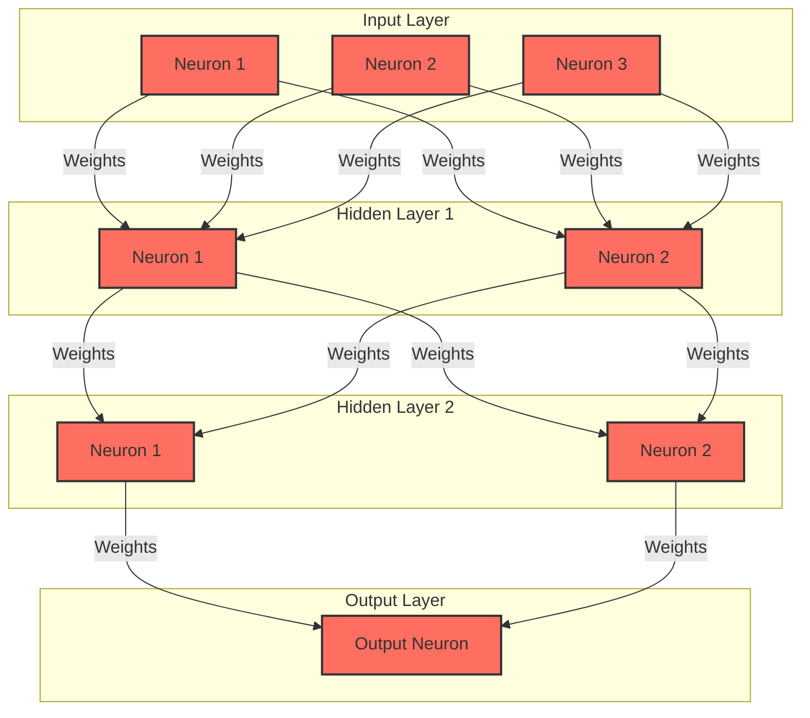


## 6. Activation function

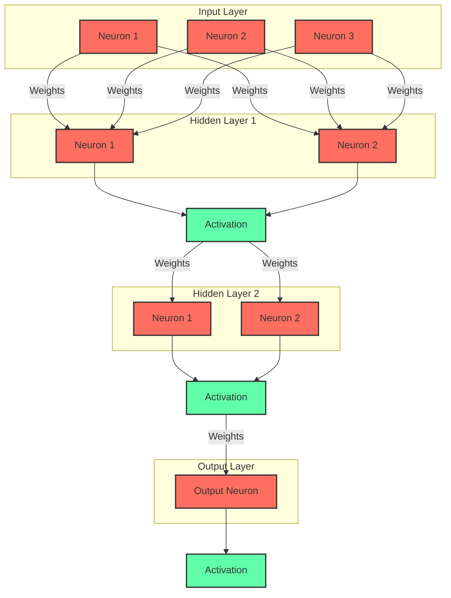

6.1 If an MLP doesn't have a non-linear activation function, regardless of how many layers it has, the final output will be just a linear combination of the inputs. This limits the expressive power of the network model.

6.2 As we can see from the formulas above, if there is no activation function included, the output value will always be equal to the expression of weights plus bias. However, if we want to address a classification problem, where the output value should be either 0 or 1, this will pose a problem.

6.3 By introducing non-linearity, activation functions allow neural networks to learn and express more complex function mappings.

6.4 Real-world problems are inherently non-linear, and using non-linear activation functions helps neural networks learn the intricate patterns and structures of philosophical problems.

6.5 Using our previous example again:

- If we are predicting house prices, we know that prices cannot be negative. However, if the MLP doesn't include an activation function (in this case, we're using ReLU), the final result may be negative.
- ReLU ensures that we don't get negative values. If we were to represent ReLU graphically, it would be:

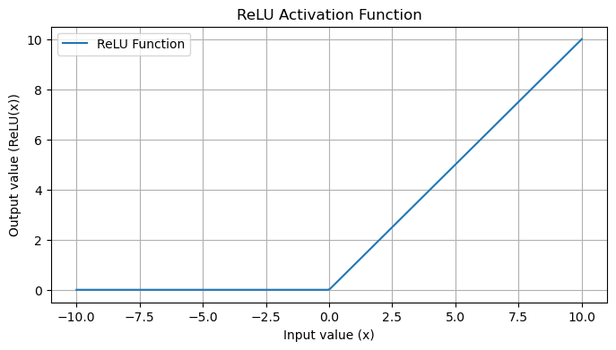

* The ReLU function is nonlinear. If the input value is less than 0, it outputs 0; if it's greater than 0, it outputs the original value.

6.6 We need to choose different activation functions based on different scenarios, such as:

- **Sigmoid**: Maps inputs to the $(0,1)$ interval, commonly used for binary classification.
- **Tanh**: Maps inputs to the $(-1,1)$ interval, similar in shape to sigmoid but with a mean output of 0.
- **Softmax**: Commonly used in the output layer of multi-class neural networks to transform output values into a probability distribution.


## 7. Epochs

7.1 Neural networks learn patterns in input data by repeatedly applying different computations to the input dataset. However, the neural network doesn't do this just once; it learns from the input dataset and previous experiments repeatedly.

7.2 Each complete experiment, starting from the input data and ending with it, is called an epoch.

7.3 Therefore, an epoch refers to one complete cycle through the entire training dataset. Typically, training a neural network requires multiple epochs. Increasing the number of epochs doesn't always mean the network will give better results.

7.4 Essentially, by conducting repeated experiments, we choose several epochs, and if the results remain consistent after several epochs, we may choose to end the training.


## 8. Training Iterations

8.1 Each complete forward and backward propagation process using a single batch is called one training iteration.

8.2 This means that training iterations are typically related to batch size. In one iteration, you update your model parameters once, regardless of the batch size.

8.3 If you have $\mathbf{N}$ training samples and you choose a batch size of $\mathbf{B}$, then in one epoch, you will have:
$$
The\; number \;of \;training \;iterations=
\lceil \frac{\mathbf{N}}{\mathbf{B}} \rceil (rounded up).
\\
If\; you\; have\; 1050\; samples\;and \;you\; choose\; a \;batch\; size \;of \;100,\;
\\
then\; in\; one\; epoch,\; you \;will \;have \;
\lceil \frac{1050}{100} \rceil = 11\; training\; iterations.
$$
8.4 During one complete training iteration, the neural network performs a complete forward and backward propagation on a single batch.

8.5 After completing one training iteration, we typically don't immediately recompute on the same batch but instead carry the updated parameters to the next batch for training:

* **Efficiency Consideration**: Repeating forward and backward propagation on the same batch greatly reduces the efficiency of the training process. We want to generalize our model parameters across the entire dataset, not just on a single batch.

* **Exploring the Loss Surface**: In the weight space, the gradient for each batch points in the direction of reducing the loss for that batch. If we repeatedly perform this process on the same batch, we cannot explore the entire weight space and may get stuck in **local minima**. Using multiple batches helps us better explore the loss surface and may lead to finding a better global minimum.

* **Risk of Overfitting**: Continuously recomputing and updating parameters on the same batch may cause the model to memorize specific samples from that batch rather than learning generalizable features. This can lead to overfitting, where the model performs well on the training data but poorly on unseen data.

  * Let's illustrate what a loss surface is through an image. For clarity, we'll choose two horizontal axes representing two parameters and a vertical axis representing the loss value. The abstract image below is generated by GPT.

  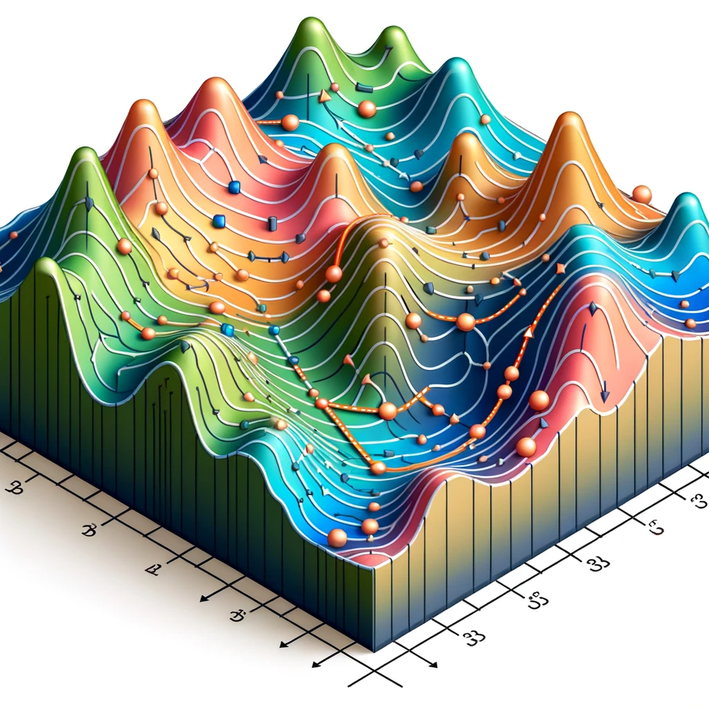

  * The image below depicts a graphical representation of a surface plotted using two parameters and the corresponding loss values. We can observe that the two parameters (horizontal axes) and the loss value (vertical axis) form a 3D plot. Our objective is to find the path leading to the bottom of this 3D plot, which is determined through gradient descent.
  * The entire plot comprises multiple peaks and valleys. Through gradient descent, we may find the minimum value within one of these valleys. However, this minimum value may only be a **local minimum** or **local optimum**.
  * By training iterations using multiple batches, we can perform gradient descent on different valleys, increasing the likelihood of finding the global optimum.

  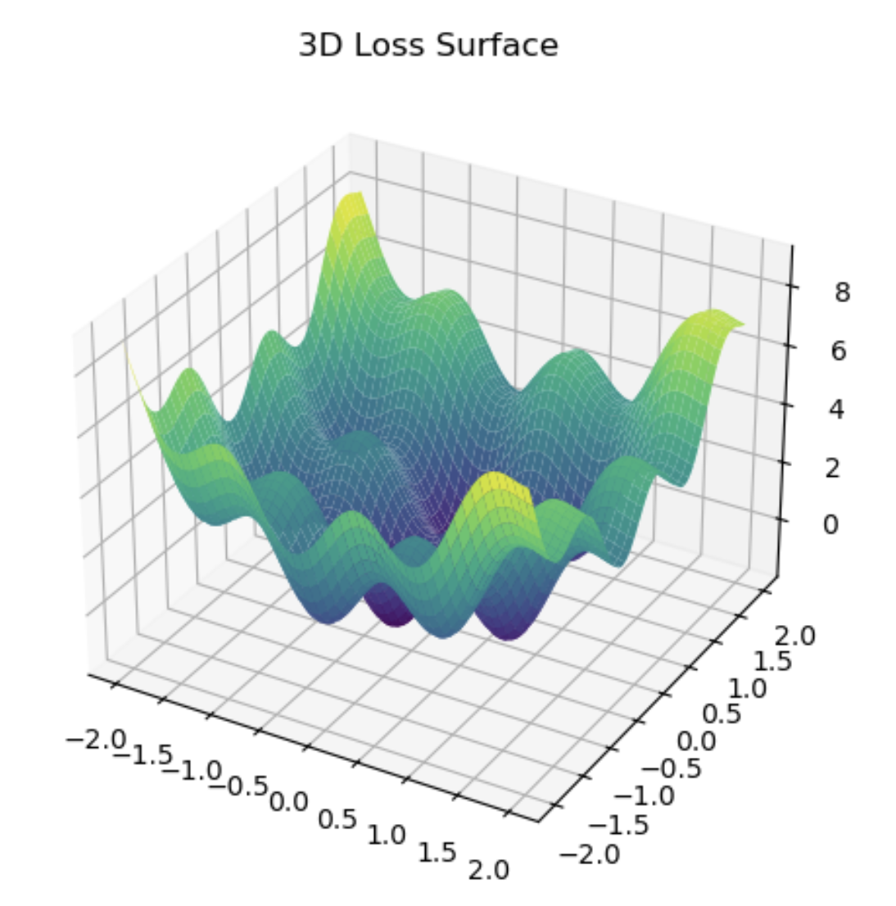

  * We choose to depict a single valley graph, assuming the red dot at the top represents the **initial point**, which is the result obtained in the first training iteration. It denotes the computed loss value and the corresponding parameter values (weights and biases) in the parameter space.
  * Subsequently, we compute the partial derivatives for each parameter to determine the direction in which the loss value changes most rapidly, thereby optimizing and attempting to reach the valley.
  * During the descent towards a single valley, multiple red dots are plotted, indicating continuous optimization of the parameters, resulting in a decreasing loss value. However, in reality, this descent path is convoluted, as depicted in the graph with multiple peaks shown above, making it challenging to achieve the global optimum.
  * This is also one of the reasons why we split the data into different batches and epochs.

  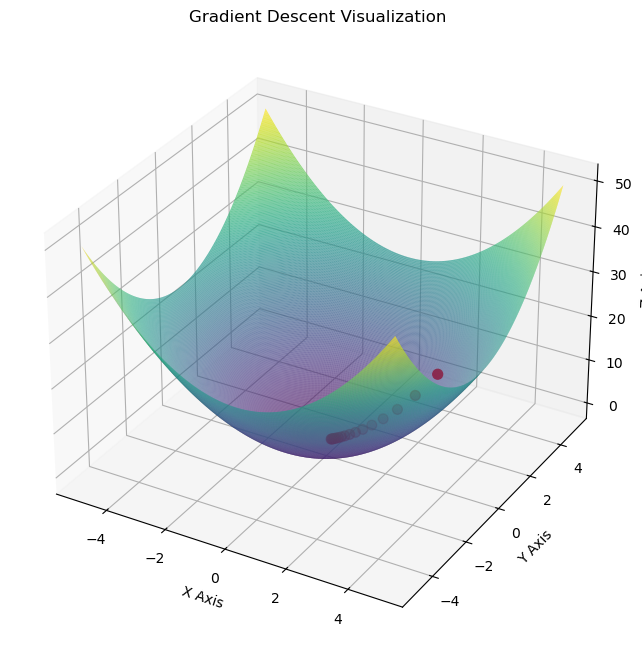

  * Now, let's draw a graph with three valleys.
  * From this visualization, it becomes more apparent that while the valley where the red dot lies may represent a local optimum, the second valley offers a better value in the global context.

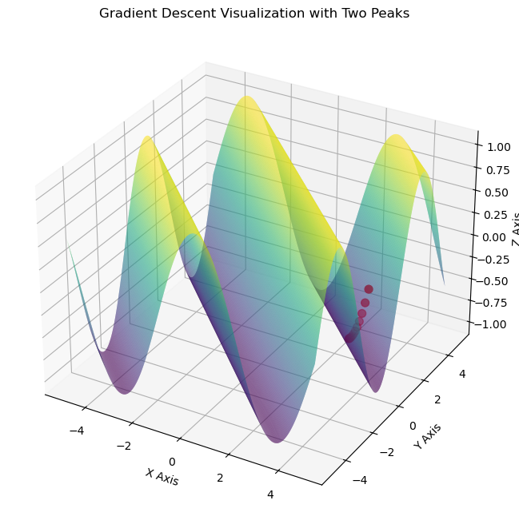


## 9. Forward Propagation

9.1 Forward propagation, simply put, is the process of passing input data through a neural network and obtaining an output.

9.2 In the previous example, the specific steps of forward propagation have been demonstrated, passing through the input layer, hidden layers, and ultimately obtaining results at the output layer.

9.3 It's worth noting that MLPs are prone to overfitting, especially when the network is deep or when there is limited data. To avoid overfitting, regularization techniques, Dropout, or simplifying the network structure can be used.


## 10. Backward Propagation

10.1 Backward propagation is aimed at adjusting parameters to minimize the loss function.

10.2 The computational path of backward propagation is completely opposite to that of forward propagation.

10.3 Backward propagation involves calculating gradients, and attention needs to be paid to the issues of **vanishing gradients** and **exploding gradients**.

10.4 I haven't delved into the knowledge of learning rate involved in forward propagation too much. The learning rate determines the step size of weight updates during optimization, i.e., it controls the speed at which the model attempts to decrease the loss function value. A too high learning rate may lead to instability in the process of decreasing the loss function, while a too small learning rate may result in a slow or stalled learning process.


## 11. Gradient descent

refernce[1]: https://www.khanacademy.org/math/multivariable-calculus/applications-of-multivariable-derivatives/optimizing-multivariable-functions/a/what-is-gradient-descent

reference[2]: https://www.youtube.com/watch?v=UkcUZTe49Pg

reference:[3]: https://www.youtube.com/watch?v=Dhou27Ergkk


11.1 The derivative refers to the rate of change of a function with respect to its independent variable. In the case of multivariable functions, where there are multiple independent variables, the partial derivative of the function with respect to a particular variable represents the rate of change of the function with respect to that variable.

11.2 In conjunction with the example above, we can understand that the rate of change of the loss value with respect to the weight matrix $\mathbf{w}^{[i]}$ is the partial derivative of the loss function $\mathbf{L}$ with respect to $\mathbf{w}^{[i]}$.

11.3 The gradient can be defined as a vector consisting of all the partial derivatives of a function.
$$
\nabla f
=
(\frac{\partial{f}}{\partial{x1}},\frac{\partial{f}}{\partial{x2}},...,\frac{\partial{f}}{\partial{xn}})
$$
The gradient vector points in the direction of the greatest rate of change of the function value, which means that for a specific point of the function, its gradient indicates the direction in which the function value changes most rapidly (as mentioned in the context of the loss surface).

* In our example, the computed gradient vector consists of two directions: $\frac{\partial \mathbf{L}}{\partial \mathbf{b}^{[i]}}$ and $\frac{\partial \mathbf{L}}{\partial \mathbf{w}^{[i]}}$. The combination of these two directions forms a new direction vector, which represents the direction we need to move in (please ignore the notion of forward or backward at this point).

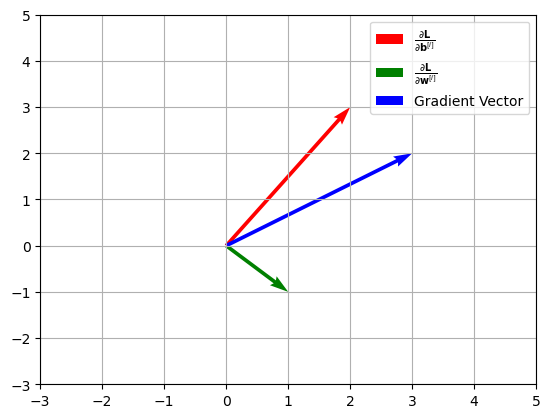

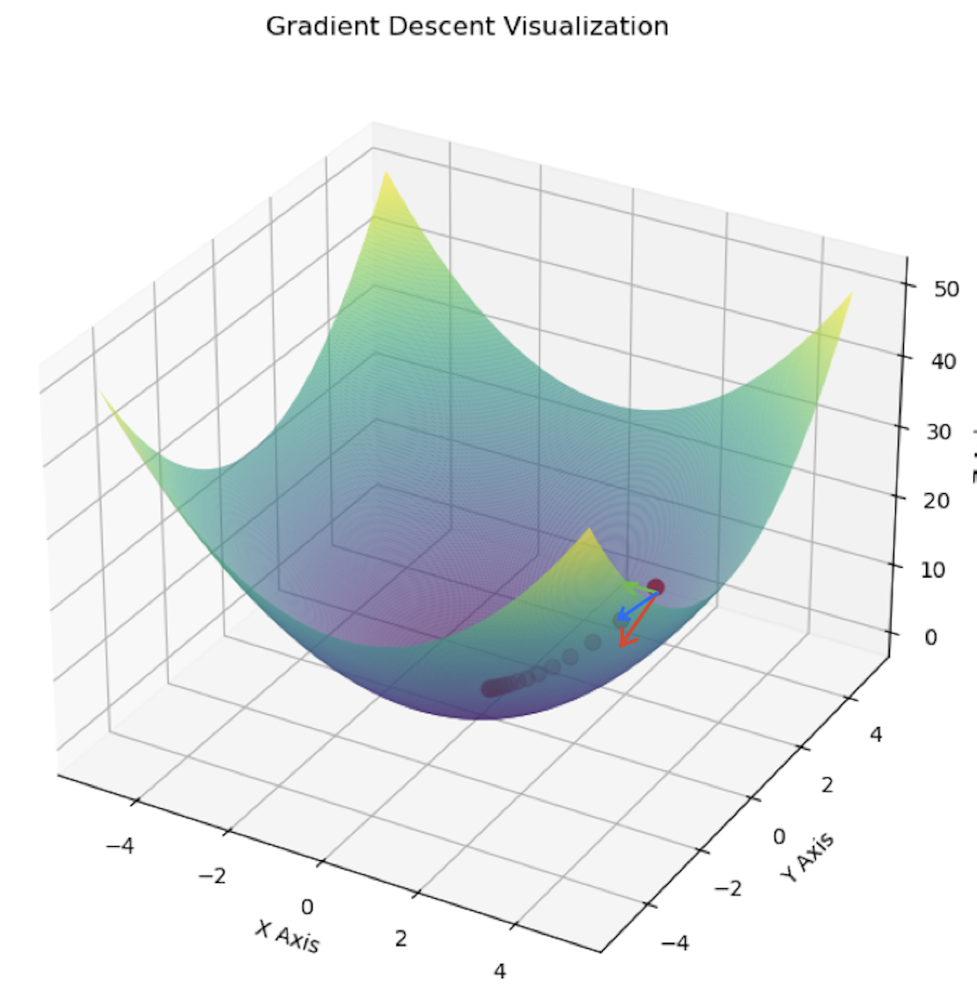

11.4 Gradient descent has several characteristics:

* It points in the direction of the **steepest ascent** of the function at a certain point.
* The magnitude of the gradient represents the rate of increase of the function in that direction.
* Moving in the negative direction of the gradient can make the function value decrease most rapidly, which is the foundation of gradient descent.


## 12. Dropout

12.1 Dropout is often used in neural networks to prevent **overfitting**, which typically occurs when the model learns noise and irrelevant information from the training data, thus affecting its generalization ability to new data.

12.2 Dropout is only applied during the training process and is not present in the actual prediction model.

12.3 The main purpose of dropout is to prevent the model from relying too heavily on any single node.

12.4 Dropout randomly blocks certain neurons from participating in the learning process, forcing the neural network to become more robust and not rely on specific signal pathways.

12.5 During training, any node may be excluded from the learning process, but during actual prediction, all nodes participate in the work, with each node's robustness improved to handle various situations.

12.6 Here's an example demonstrating how dropout interrupts the propagation of node information. For ease of understanding, we'll use standard dropout:

* Using the example provided earlier, the output of the first hidden layer consists of two units.

$$
\mathbf{a}^{[1]}=\begin{bmatrix} 12.241 \\ 47.549 \end{bmatrix}
$$

* Before $\mathbf{a}^{[1]}$ enters the second hidden layer, dropout generates a mask randomly consisting of numbers in the range $[0,1]$:

$$
mask^{1}=[0.38298,0.78923]
$$

* Afterward, a dropout rate needs to be set. Here, let's choose 0.5:

$$
DropoutRate=0.5
$$

* Let's compare the dropout rate with each value in the mask. If a value is less than the dropout rate, it becomes 0; otherwise, it remains 1. Therefore, the updated mask would be:

$$
mask^{1}=[0,1]
$$

* Multiply the mask by the output of the first hidden layer to obtain the new output:

$$
\mathbf{a}^{[1]new}=\begin{bmatrix} 0 \\ 47.549 \end{bmatrix}
$$

* Next, to scale the activation output, you can observe that one unit's value has been dropped to 0. However, to maintain the expected value of the activation output, you need to divide the activation output by the keep probability.

$$
KeepProb=1-DropoutRate=1-0.5=0.5
\\
\\
\mathbf{a}^{[1]new}=\begin{bmatrix} 0 \\ 47.549 \end{bmatrix}*KeepProb=\begin{bmatrix} 0 \\ 23.775 \end{bmatrix}
$$

* Based on the above operations, we have obtained the final activation output that needs to be passed to the next layer.

12.7 After setting the output of specific neurons to 0 temporarily, it means the contribution of corresponding neurons to the next layer is temporarily removed for this training iteration.

* A neuron's output being 0 means that this neuron will not contribute any information to the subsequent training in the current training iteration.
* The weights and biases corresponding to this node will not be modified, but they will be ineffective in the current training iteration.
* As we have already computed the new output, we can now pass this output to the second hidden layer for further computation.

$$
\mathbf{W}^{[2]} \mathbf{a}^{[1]new}
=
\begin{bmatrix} 0.1 & -0.1 \\ 0.1 & 0.1 \end{bmatrix}
*\begin{bmatrix} 0 \\ 23.775 \end{bmatrix}
=\begin{bmatrix} 0.1*0+-0.1*23.775 \\ 0.1*0+0.1*23.775 \end{bmatrix}
\\
\\
\mathbf{W}^{[2]} \mathbf{a}^{[1]}
=\begin{bmatrix} 0.1 & -0.1 \\ 0.1 & 0.1 \end{bmatrix}
*\begin{bmatrix} 12.241 \\ 47.549 \end{bmatrix}
=\begin{bmatrix} 0.1*12.241+-0.1*47.549 \\ 0.1*12.241+0.1*47.549 \end{bmatrix}
$$

* Please note that the first column of the weight matrix \(\mathbf{W}^{[2]}\) connects to the first neuron of the previous layer. It can be observed that when the output of the neuron is set to 0, the information will not be propagated further.

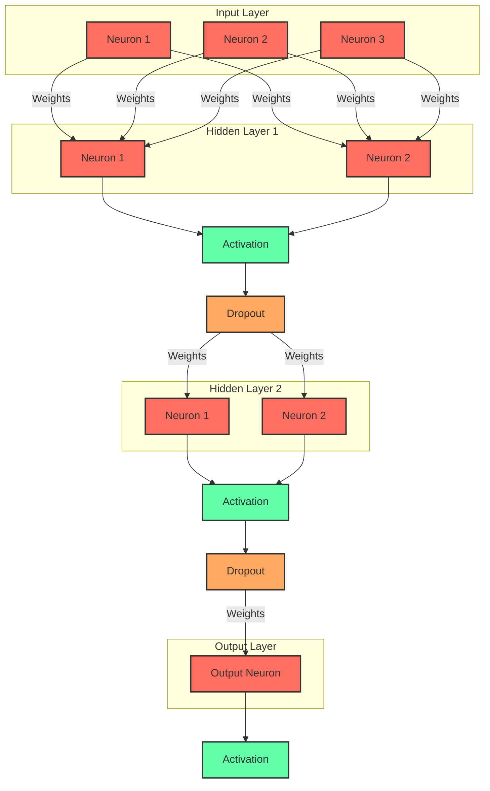


## 13. Gradient vanishing

13.1 When gradient vanishing occurs in a neural network, the gradient values become extremely small, approaching zero, which leads to almost no updates to the network weights, causing the neural network to stop learning.

13.2 During the process of backpropagation, gradient values undergo rapid changes through consecutive matrix multiplications. If the gradient values become too small, they decrease rapidly through multiple matrix multiplications, approaching zero.

13.3 If the gradient values approach zero, it indicates that the neural network is unlikely to undergo significant changes, leading to learning cessation.

13.4 To illustrate gradient vanishing with a specific computational comparison, we still use the example introduced above and focus on the backpropagation calculation of the second hidden layer.

* The original calculation is:

$$
\frac{\partial \mathbf{L}}{\partial \mathbf{w}^{[3]}}
=
\frac{\partial \mathbf{L}}{\partial \mathbf{a}^{[3]}}
\mathbf{a}^{[2]T}
\\
=-0.3921*\begin{bmatrix} 0 \\ 5.979 \end{bmatrix}^T
=\begin{bmatrix} 0 & -2.3443 \end{bmatrix}
$$

$$
\frac{\partial \mathbf{L}}{\partial \mathbf{b}^{[3]}}
=\frac{\partial \mathbf{L}}{\partial \mathbf{a}^{[3]}}
\frac{\partial \mathbf{a}^{[3]}}{\partial \mathbf{b}^{[3]}}
=-(\mathbf{y}-\mathbf{a}^{[3]})
=-0.3921
$$

$$
\mathbf{w}^{[3][new]}
=\mathbf{w}^{[3]}-\alpha \frac{\partial \mathbf{L}}{\partial \mathbf{w}^{[3]}}
=\begin{bmatrix} 0.1, 0.1 \end{bmatrix}-0.1\begin{bmatrix} 0, -2.3443 \end{bmatrix}
=\begin{bmatrix} 0.1, 0.3344 \end{bmatrix}


\\
\mathbf{b}^{[3][new]}
=\mathbf{b}^{[3]}-\alpha \frac{\partial \mathbf{L}}{\partial \mathbf{b}^{[3]}}
=0.01-0.1*(-0.3921)=0.04921
$$

$$
\mathbf{w}^{[3][old]}=\begin{bmatrix} 0.1, 0.1 \end{bmatrix}
,
\mathbf{b}^{[3][old]}=0.01
\\
\\
\mathbf{w}^{[3][new]}=\begin{bmatrix} 0.1, 0.3344 \end{bmatrix}
,
\mathbf{b}^{[3][new]}=0.0491
$$

* By comparing the original weights and biases with those after gradient optimization, we can observe significant changes in the specific values.

* Let's modify some of these values to demonstrate gradient vanishing. Assume $\frac{\partial \mathbf{L}}{\partial \mathbf{a}^{[3]}}=-0.001$ and $\alpha=0.0001$.

$$
\frac{\partial \mathbf{L}}{\partial \mathbf{w}^{[3]}}
=
\frac{\partial \mathbf{L}}{\partial \mathbf{a}^{[3]}}
\mathbf{a}^{[2]T}
\\
=-0.0001*\begin{bmatrix} 0 \\ 5.979 \end{bmatrix}^T
=\begin{bmatrix} 0 & -0.000579 \end{bmatrix}
$$

$$
\frac{\partial \mathbf{L}}{\partial \mathbf{b}^{[3]}}
=\frac{\partial \mathbf{L}}{\partial \mathbf{a}^{[3]}}
\frac{\partial \mathbf{a}^{[3]}}{\partial \mathbf{b}^{[3]}}
=-(\mathbf{y}-\mathbf{a}^{[3]})
=-0.3921
$$

$$
\mathbf{w}^{[3][new]}
=\mathbf{w}^{[3]}-\alpha \frac{\partial \mathbf{L}}{\partial \mathbf{w}^{[3]}}
=\begin{bmatrix} 0.1, 0.1 \end{bmatrix}-0.0001\begin{bmatrix} 0, -0.000579 \end{bmatrix}
=\begin{bmatrix} 0.1, 0.1+0.0001*0.000579 \end{bmatrix}

\\
\mathbf{b}^{[3][new]}
=\mathbf{b}^{[3]}-\alpha \frac{\partial \mathbf{L}}{\partial \mathbf{b}^{[3]}}
=0.01-0.0001*(-0.3921)=0.01+0.0001*0.3921
$$

$$
\mathbf{w}^{[3][old]}=\begin{bmatrix} 0.1, 0.1 \end{bmatrix}
,
\mathbf{b}^{[3][old]}=0.01
\\
\\
\mathbf{w}^{[3][new]}=\begin{bmatrix} 0.1, 0.1000000579 \end{bmatrix}
,
\mathbf{b}^{[3][new]}=0.010003921
$$

* It can be observed that the changes in values before and after updating are very small, almost stagnant.
* As the number of layers in the network increases, the changes will tend to approach zero indefinitely, which is the problem of gradient vanishing.

13.5 Let's illustrate gradient vanishing through images:

* The left image displays the output values of each layer. It can be observed that after significant changes initially, the subsequent outputs remain almost unchanged due to the small changes in weights and biases. This indicates that the neural network is no longer able to learn effectively.
* The right image illustrates the magnitude of gradients in each layer of the network. It can be seen that as the number of layers increases, the gradients rapidly decrease. Gradients influence the updating of weights and biases, and overly small gradients have little effect on weight updates. This phenomenon is known as gradient vanishing.

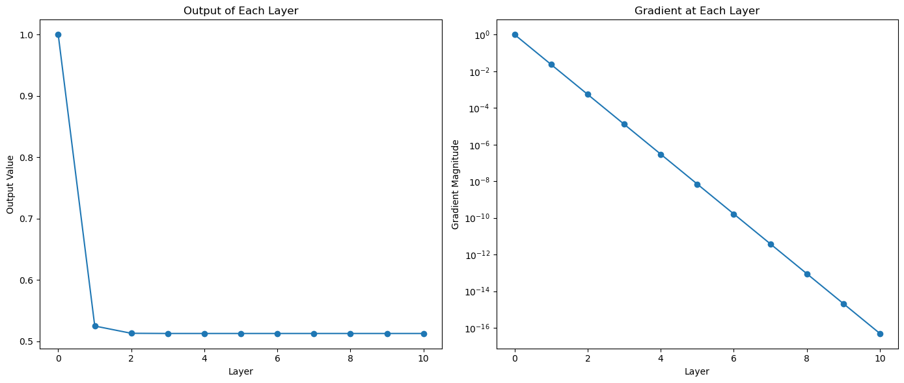


## 14. Gradient explosion

14.1 Gradient explosion refers to the situation where the calculated gradient values become too large, leading to instability in updating the network weights and biases.

14.2 To illustrate gradient explosion more vividly, we will use images instead of mathematical calculations.

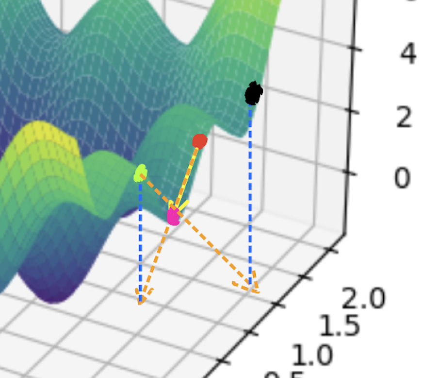

* We use the loss surface mentioned earlier for demonstration.
* Let's assume the red dot represents the initial point.
* The calculated gradient is optimized along the bright yellow line, which may lead to a local optimum.
* However, if the gradient is too large, meaning the optimization step is too long, like the orange dashed line in the figure, it may overshoot the spatial position of the optimum, requiring mapping to another point on the loss plane.
* In the figure, the light green dot represents the spatial point after one weight update.
* If we want to perform gradient optimization with a similar step size, the second update would result in the output represented by the black dot.
* It can be observed that in this process, the entire network optimization process is chaotic and unstable.

14.3 **This abstract method can help in understanding gradient explosion, but it's not accurate. It's just a convenient way for individuals to comprehend the instability caused by gradient explosion.**

14.4 Let's use a specific calculation to illustrate gradient explosion. We still choose the example mentioned earlier and focus on the backward propagation calculation for the second hidden layer:

* The original calculation is as follows:

$$
\frac{\partial \mathbf{L}}{\partial \mathbf{w}^{[3]}}
=
\frac{\partial \mathbf{L}}{\partial \mathbf{a}^{[3]}}
\mathbf{a}^{[2]T}
\\
=-0.3921*\begin{bmatrix} 0 \\ 5.979 \end{bmatrix}^T
=\begin{bmatrix} 0 & -2.3443 \end{bmatrix}
$$

$$
\mathbf{w}^{[3][new]}
=\mathbf{w}^{[3]}-\alpha \frac{\partial \mathbf{L}}{\partial \mathbf{w}^{[3]}}
=\begin{bmatrix} 0.1, 0.1 \end{bmatrix}-0.1\begin{bmatrix} 0, -2.3443 \end{bmatrix}
=\begin{bmatrix} 0.1, 0.3344 \end{bmatrix}
$$

$$
\mathbf{w}^{[3][old]}=\begin{bmatrix} 0.1, 0.1 \end{bmatrix}
\\
\\
\mathbf{w}^{[3][new]}=\begin{bmatrix} 0.1, 0.3344 \end{bmatrix}
$$

* To simulate gradient explosion, let's assume $\mathbf{w}^{[3]}=\begin{bmatrix} 10, 10 \end{bmatrix},\mathbf{a}^{[2]T}=\begin{bmatrix} 10\\ 10 \end{bmatrix}$.

$$
\frac{\partial \mathbf{L}}{\partial \mathbf{w}^{[3]}}
=
\frac{\partial \mathbf{L}}{\partial \mathbf{a}^{[3]}}
\mathbf{a}^{[2]T}
\\
=
-0.3921*\begin{bmatrix} 10\\ 10 \end{bmatrix}
=\begin{bmatrix} -3.921\\ -3.921 \end{bmatrix}
$$

$$
\mathbf{w}^{[3][new]}
=\mathbf{w}^{[3]}-\alpha \frac{\partial \mathbf{L}}{\partial \mathbf{w}^{[3]}}
=\begin{bmatrix} 10, 10 \end{bmatrix}-0.1\begin{bmatrix} -3.921, -3.921 \end{bmatrix}
=\begin{bmatrix} 10.3921, 10.3921 \end{bmatrix}
\\
\\
\mathbf{w}^{[3][old]}=\begin{bmatrix} 10, 10 \end{bmatrix}
$$

* It can be observed that the updated weights have significantly increased compared to the initial values. Although an increase of around 0.4 may seem small here, in a multi-layer neural network, such values are already very large, especially after multiple gradient optimizations and matrix multiplications, causing the values to grow exponentially.


**The content of this article is intended for personal learning and organization. While there may be some errors, it serves as a helpful guide to understanding concepts related to MLP and machine learning. If you have any questions or need further clarification on any topic, feel free to ask!**


Author: YiDing

Contact:dydifferent@gmail.com
