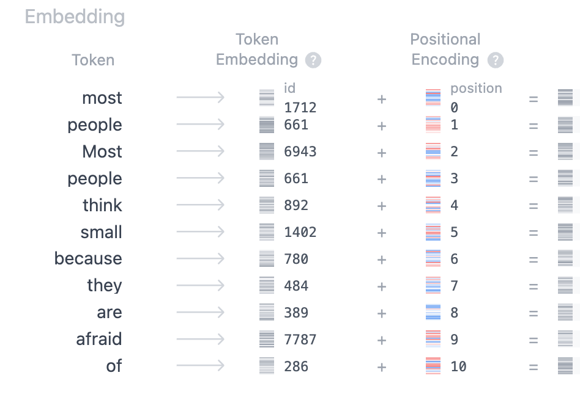

# Transformers

Transformer 是现在最重要的模型，也是LLM现如今能大获成功的基石。在这里会介绍transformer里面所有的components 和 concepts。 这篇笔记主要围绕paper：[Attention is all you need](https://arxiv.org/pdf/1706.03762) 展开。其余的很多重要的变体，如 Swin transformer在这里不作介绍。

在transformer之前，基于RNN开发出的各种模型，都是需要把前序的状态信息传递到下一个state。这种inherently sequential 阻碍了并行化。

The transformer rely entirely on an attention mechanism to draw global dependencies between input and output. 


## Encoder-decoder structure


##  Input Embedding

用文本数据举例，如果我们想要把一句话作为input给transformer模型，我们首先需要进行一些embedding processing。


模型是不能够理解文本信息的，只能够接受metrices 和numbers。我们就需要先将文本信息转换成模型可以理解的形式。


### Token embedding

**Token Embedding** 是将输入的文本 token 转换为固定维度的vector的过程。这个数值向量是模型能理解的格式，用于表示文本 token 的语义和语法信息。


在 Token Embedding 的上下文中，**Vocabulary** 是一个由模型能够识别的 **所有 token 的集合**。它定义了模型在分词（tokenization）过程中能够处理的 token 范围，每个 token 都对应一个唯一的 **token ID**。


接下来将输入文本的 token 映射到一个固定维度的连续向量空间的过程。将 **token 转换为 vector** 将离散的语言符号映射到连续数值空间，以便深度学习模型能够处理这些数据。

Token 转换为 vector 通过一个 **Embedding Matrix** 实现。嵌入矩阵是一个可训练的参数，它的初始化和训练决定了 token 与向量之间的关系。

Embedding Matrix的大小为 [vocab_size, embedding_dim]：

* vocab_size 是词表的大小（Vocabulary Size），即模型支持的 token 的数量。

* embedding_dim 是嵌入向量的维度（Embedding Dimension），如 768。

* 嵌入矩阵的每一行代表词表中一个 token 的嵌入向量。

e.g.， 假设词表大小为 30,522，嵌入维度为 768

```code
Embedding Matrix (Shape: [30522, 768])
[
    [0.1, 0.2, ..., -0.3],  # ID 0 (可能是 [PAD])
    [0.5, -0.1, ..., 0.8],  # ID 1
    ...
    [0.7, 0.9, ..., 0.1],   # ID 10234 (token 'Transform')
    ...
]
```

Token ID 通过查表获取其embedding vector。例如：

* Token ID 10234 对应的嵌入向量是 [0.7, 0.9, ..., 0.1]。


Embedding Matrix 在模型预训练开始时通常是随机初始化的，每个 token 的向量都是随机生成的。

通过模型训练，Embedding Matrix 会被不断更新，使每个 token 的向量逐渐学习到它的语义和上下文信息。

通过训练，embedding vector 会捕捉到 token 的语义关系.

**语义相似的 token（如 dog 和 cat）会在向量空间中更接近**.

词表中可能包含特殊 token，如：

* [PAD]：填充用，通常初始化为零向量。

* [CLS]：句子级任务的起始符号。

* [SEP]：句子的分隔符。

* [UNK]：未知词的标记。

这些 token 的向量同样通过嵌入矩阵查找，但它们的含义是预定义的，训练中也可能会进一步优化。


**在 embedding vector里面的每一个参数，可以看作是对应token的一个feature**，一个模型输入的embedding vector长度是固定的。


### Positional encoding

Transformer 依赖于 Self-Attention 机制。而self-Attention mechanism 不包含时序信息。

如果不加入位置信息，模型无法区分 A B C 和 C B A 这样的顺序不同但 token 相同的序列。

为了让transformer能够处理时序数据，我们需要把时序信息用某一种形式加入到数据中。

**Positional Encoding** 用于在 Transformer 模型中为每个 token 提供位置信息。帮助模型捕捉序列中 token 的顺序关系。因为 Transformer 模型本身没有循环（RNN）或卷积（CNN）结构，无法像这些模型那样隐式地建模序列顺序，因此需要通过 Positional Encoding 显式加入位置信息。

这里需要知道的是 **Positional Encoding** 是一个形状为 [sequence_length, embedding_dim] 的矩阵，其中每一行表示某个位置的编码向量。也就是说，每一个 embedding vector都会有一个对应的 Positional vector。**将两者相加，形成输入向量**。

$$Input\ Vector = Token\ Embedding + Positional\ Encoding$$

对于 **每个输入序列中的相同位置**，其 **Positional Encoding（位置编码）** 是一样的，与具体的输入 token 无关。也就是说，**Positional Encoding 只与位置有关，而不与输入内容相关**



所以总体上输入的变化流程是：


## Self attention (Q K V)

Self-attention takes relationships among words in the sentence. 或者是在上下文环境里面。（比如，bank这个词是指的银行或者岸边，根据他在上下文中和其他词汇的关系，就可以确定。）


## Multi-head attention

在CNN模型中，模型结构允许多通道并行（比如输入的是一张图片，那个它是可以被分成多层的，RGB，每一个进入一个通道，对应的是一个kernel 的一层进行计算。），大幅提升了训练效率。Multi-head attention 机制因此而受到启发。

因为是self-attention,  在这里的（encoder里面）**Q，K，V其实内容是相同的**。 都是在经过input embedding 和positional embedding 之后获取的matrix (11,768) (seq_len, d_model)。

这里的（11，768）可以理解为：这段输入内容的token长度为11（请注意，这里面的token包含了special token比如[sep]. 我们这里没有考虑batch training，所以是单条的输入内容。如果考虑batch training，那么我们就会注意到，在一个batch里面的内容长度可能不同，这会导致模型接受的输入格式不同，所以我们会添加[padding]这样的特殊字符来确保每一份输入的格式相同。），然后每个token的长度为768 （这个取决于选择使用的vocabulary，这里选择的vocabulary对应每一个tokenID的embedding长度为768）。


### 1. linear projection

Q, K, V首先进入一个linear层。 这个linear layer和CNN里面的dense layer类似：包含多个nodes，然后input （Q, K, V）需要和每一个node进行**fully connect**。 


* 这里的输入Q的维度是（seq-length，d_model（指代每个token对应的vocabulary里面的对应长度））。
* linear里面这里指定的是（node_parameters,node_num),所以这里的node num是768。

* node并不是hyperparameter，可以自己定义。在transformer论文中，设定d_model=768， head_num=6, 那么我们可以简单设定node数量为768/6=128

$$
Q = X W_Q, \quad K = X W_K, \quad V = X W_V
$$


### 2. Dot-product matrix multiply


$$
\begin{array}{c|ccccccccccc}
 & \text{token}_0 & \text{token}_1 & \text{token}_2 & \text{token}_3 & \text{token}_4 & \text{token}_5 & \text{token}_6 & \text{token}_7 & \text{token}_8 & \text{token}_9 & \text{token}_{10} \\ \hline
\text{token}_0  & 93.86 & 3.69 & 2.88 & 4.13 & 2.28 & 2.85 & 2.57 & 1.90 & 1.91 & 0.58 & 0.08 \\
\text{token}_1  & 1.67 & 57.18 & 3.74 & 1.33 & 0.48 & 4.55 & 3.01 & 0.47 & 0.99 & 0.94 & 0.38 \\
\text{token}_2  & 1.61 & 1.01 & 71.59 & 3.04 & 2.97 & 1.33 & 3.33 & 2.14 & 4.93 & 0.10 & 3.40 \\
\text{token}_3  & 3.29 & 1.51 & 1.24 & 70.48 & 1.10 & 4.20 & 0.44 & 1.31 & 2.24 & 0.76 & 1.52 \\
\text{token}_4  & 2.78 & 4.76 & 4.31 & 4.03 & 53.21 & 1.49 & 2.73 & 0.06 & 0.03 & 0.23 & 2.63 \\
\text{token}_5  & 0.64 & 2.91 & 2.20 & 0.49 & 1.25 & 79.16 & 0.46 & 1.59 & 2.15 & 4.95 & 3.10 \\
\text{token}_6  & 4.29 & 1.70 & 2.89 & 3.98 & 3.93 & 0.23 & 85.81 & 0.44 & 4.13 & 0.03 & 0.66 \\
\text{token}_7  & 3.73 & 4.32 & 3.32 & 0.78 & 1.87 & 4.97 & 3.38 & 71.05 & 2.00 & 3.91 & 1.58 \\
\text{token}_8  & 0.87 & 4.21 & 4.54 & 4.92 & 3.98 & 2.77 & 4.74 & 0.53 & 74.73 & 0.06 & 3.39 \\
\text{token}_9  & 1.35 & 1.32 & 0.88 & 4.62 & 1.39 & 0.31 & 1.83 & 1.20 & 1.83 & 57.12 & 4.38 \\
\text{token}_{10}  & 4.76 & 4.79 & 1.84 & 2.64 & 2.42 & 3.62 & 0.98 & 1.85 & 0.58 & 2.75 & 81.06
\end{array}
$$

* 这一步能够计算出在Q和V之间各个token的相关程度。
* 对角线上的数值总是在一行或者一列中最大，因为对角线上对应的两个token完全相同。
* $QK^T$


### 3. Scale

$$
\begin{bmatrix}
28.30 & 1.11 & 0.87 & 1.24 & 0.69 & 0.86 & 0.77 & 0.57 & 0.58 & 0.18 & 0.02 \\
0.50 & 17.24 & 1.13 & 0.40 & 0.14 & 1.37 & 0.91 & 0.14 & 0.30 & 0.28 & 0.11 \\
0.49 & 0.31 & 21.59 & 0.92 & 0.90 & 0.40 & 1.00 & 0.64 & 1.49 & 0.03 & 1.03 \\
0.99 & 0.46 & 0.37 & 21.25 & 0.33 & 1.27 & 0.13 & 0.40 & 0.68 & 0.23 & 0.46 \\
0.84 & 1.44 & 1.30 & 1.22 & 16.04 & 0.45 & 0.82 & 0.02 & 0.01 & 0.07 & 0.79 \\
0.19 & 0.88 & 0.66 & 0.15 & 0.38 & 23.87 & 0.14 & 0.48 & 0.65 & 1.49 & 0.93 \\
1.29 & 0.51 & 0.87 & 1.20 & 1.18 & 0.07 & 25.87 & 0.13 & 1.24 & 0.01 & 0.20 \\
1.12 & 1.30 & 1.00 & 0.23 & 0.56 & 1.50 & 1.02 & 21.42 & 0.60 & 1.18 & 0.48 \\
0.26 & 1.27 & 1.37 & 1.48 & 1.20 & 0.84 & 1.43 & 0.16 & 22.53 & 0.02 & 1.02 \\
0.41 & 0.40 & 0.27 & 1.39 & 0.42 & 0.09 & 0.55 & 0.36 & 0.55 & 17.22 & 1.32 \\
1.43 & 1.44 & 0.56 & 0.80 & 0.73 & 1.09 & 0.29 & 0.56 & 0.18 & 0.83 & 24.44
\end{bmatrix}
$$

* 在计算得到attention filter 之后我们需要进行scaling。
  * 如果没有scaling，Softmax 会产生极端的梯度，导致训练不稳定。

* $\frac{QK^T}{\sqrt{d_k}}$
* $d_k$ 表示Q或者V的维度，这里是11.

### 4. Softmax

$$
\begin{bmatrix}
0.0901 & 0.0932 & 0.0913 & 0.0884 & 0.0875 & 0.0899 & 0.0910 & 0.0908 & 0.0887 & 0.0891 & 0.0900 \\
0.0898 & 0.0911 & 0.0904 & 0.0886 & 0.0869 & 0.0905 & 0.0912 & 0.0913 & 0.0889 & 0.0895 & 0.0916 \\
0.0903 & 0.0920 & 0.0896 & 0.0887 & 0.0881 & 0.0893 & 0.0919 & 0.0910 & 0.0892 & 0.0906 & 0.0903 \\
0.0897 & 0.0922 & 0.0902 & 0.0873 & 0.0885 & 0.0910 & 0.0898 & 0.0902 & 0.0894 & 0.0907 & 0.0910 \\
0.0900 & 0.0915 & 0.0901 & 0.0878 & 0.0872 & 0.0902 & 0.0911 & 0.0909 & 0.0890 & 0.0903 & 0.0899 \\
0.0905 & 0.0913 & 0.0897 & 0.0885 & 0.0886 & 0.0901 & 0.0910 & 0.0912 & 0.0894 & 0.0899 & 0.0908 \\
0.0894 & 0.0921 & 0.0911 & 0.0876 & 0.0878 & 0.0895 & 0.0916 & 0.0906 & 0.0897 & 0.0913 & 0.0901 \\
0.0899 & 0.0917 & 0.0909 & 0.0879 & 0.0874 & 0.0903 & 0.0912 & 0.0908 & 0.0891 & 0.0910 & 0.0908 \\
0.0902 & 0.0923 & 0.0905 & 0.0881 & 0.0867 & 0.0901 & 0.0913 & 0.0911 & 0.0896 & 0.0897 & 0.0904 \\
0.0896 & 0.0919 & 0.0899 & 0.0883 & 0.0875 & 0.0908 & 0.0915 & 0.0904 & 0.0888 & 0.0914 & 0.0909 \\
0.0903 & 0.0914 & 0.0900 & 0.0880 & 0.0871 & 0.0902 & 0.0918 & 0.0907 & 0.0893 & 0.0902 & 0.0909
\end{bmatrix}
$$

* 这是根据行计算的sotfmax。所以每一行的数值相加近似于1.
* 每一行或者每一列都代表了这11个token。所以每一个值都表示两个token之间的相关性。
* 这只是dummy data。所以不用将内部数值当真。理论上对角线上对应的两个token相同，所以value总是最大的。
* $\text{softmax} \left( \frac{QK^T}{\sqrt{d_k}} \right)$， **查询 Q 与键 K 之间的相似度**。
* Softmax 计算出的矩阵是 **注意力权重矩阵**，它告诉我们 **Q 需要关注 V 的哪些部分**


### 5. $\text{softmax} \left( \frac{QK^T}{\sqrt{d_k}} \right)V$

$\text{Attention}(Q, K, V) = \text{softmax} \left( \frac{QK^T}{\sqrt{d_k}} \right) V$

* V（Value）包含了 **输入 Token 的原始信息**。
* 通过$\text{softmax} \left( \frac{QK^T}{\sqrt{d_k}} \right)$能够对当前context中不重要信息的筛选，然后focus on重要的部分。
* 再与V相乘，就能够得到当前context下重要的信息。


### 6. Multi-head mechanism

Multi-head 是transformer里面最重要的一部分。

通过上述步骤（1,2,3,4,5）我们已经完成了one head的计算内容。如同CNN模型里面的multil-channel，multi-head也能通过建立多个并行通道进行**不同的特征提取**。

重复上述的步骤在多个head里面计算，我们可以得到多个输出矩阵。

<span style="color:red">进入different head的input是什么样子？</span>

* 我们可以定义自己想要的输入结构：
  * 1. 可以将Q，K，V整体作为input进入different head。
    2. 或者，假如我们的Q的shape是(100,768),head num = 2. 可以选择split Q into 2 parts （100，384）（seq_len, d_k）。each head accept one part. 
    3. 或者在进入最开始的linear layer之前不进行拆分，在linear层计算完之后进行拆分进入不同的head计算。
  * 对于含有大量的token的训练，如果每个head接收的input都是完整的，那么计算量非常大并且训练缓慢。所以将完整的token input拆分到不同的head进行训练更合适。
  * 在self- attention最后有concatenate步骤，会将所有信息进行合并，所以不会在训练中丢失信息。
  * 并且在这里一般不会对token_seq 进行拆分,而是对特征维度（d_model）。因为我们要保证token的完整性来计算context内的依赖关系（long term or short term）.


### 7. concatenate

如同上面的multi-head所说，我们最终会从多个multi-head得到多个输出matrix，我们需要将所有output进行拼接。**一般情况下，拼接是按照d_model进行拼接**，如果d_model没有变化，比如是将完整的input输入到不同的multihead，d_model都是768，那么concat之后还是（100，768），如果是进行的切分然后进行multihead，那么根据d_model维度进行切分，那么concat获得的matrix同样也是（100，768）。 

另外如果是其余的办法，例如将完整的input输入到不同的multihead，然后针对seq_len dimension进行凭借，假设head=3，那么拼接后可能从（100，768）变成了（300，768）。那我们可以通过最后的linear进行变换。


### 8. Linear

* Concat 之后，(100, 768) 只是把 num_heads = 2 的 Attention 结果 **拼接** 起来。**但是！Head 之间的信息还是“独立的”**，没有融合。
* linear layer 允许不同的 Head 计算的 Attention 结果相互组合，形成更好的表示。
* linear layer可以**重新调整特征的分布，让 d_model 的信息更加合理**。
* Transformer 里，所有的层（Embedding、Attention、Feed Forward）输入输出的 d_model 必须一致。 


## Residual connection

就如同ResNet里面提出的一样，加入skip connection能够有效的帮助我们构建更深层的网络并且很大程度降低梯度计算可能带来的影响。

在transformer里面同样如此,$X+\text{SubLayer}(X)$  (X是经过input embdding和positional embedding之后获得的原始输入，$\text{SubLayer}(X)$ 是经过multihead self attention计算出来的中间结果或 Feed Forward Network（FFN） 的计算结果)


## Layer Normalization

layer normalization 和 batch normalization 最主要的区别：

1. batch normalization的时候，我们是对每一个特征计算均值方差，让每一个特征的数据服从某一个分布。
2. layer normalization不是对于每一个特征，而是对于每一个样本（也就是每一个token对应的sequence）计算均值方差，让每一个样本里面的数值服从某一个分布。

为什么要用layer normalization替换batch normalization：

1. 在我们计算self-attention过程中可以发现，计算的词是token和token之间的关系，和batch信息不相关。所以不必要计算其余batch的信息。

2. 比如一句话有11个token，但是整个batch里面最长的一句话有20个token，为了输入的batch维度可处理，我需要将11个token进行padding， 填充到20个token，因为被填充的部分没有实际意义，通常为0，不想因为填充值影响其余token的normalization。

   1. 假设我们有一个 batch，包含 3 句话：

   2. ```
      Sentence 1: ["I", "love", "NLP", "."]
      Sentence 2: ["Transformer", "models", "are", "powerful", "."]
      Sentence 3: ["Deep", "learning", "is", "amazing", "!"]
      ```

   3. 但 **神经网络（如 Transformer）要求 batch 里的所有句子长度相同**，否则无法使用矩阵计算。因此，我们需要将最短的句子补齐到 **最长的句子长度**

   4. ```
      Sentence 1: ["I", "love", "NLP", ".", "<PAD>"]
      Sentence 2: ["Transformer", "models", "are", "powerful", "."]
      Sentence 3: ["Deep", "learning", "is", "amazing", "!"]
      ```

   5. 在 **Batch Normalization（BN）** 中，均值和方差是 **在 batch 维度计算的**. 

   6. **如果 batch_size 里包含了 Padding（0 值），那么计算均值和方差时会受到影响！** **导致 Padding 部分的 0 值被计算进来，影响所有 token 的归一化！**

   7. **Layer Normalization 只对当前 Token 内部进行归一化，不受 Padding 影响**. 在 **Layer Normalization（LN）** 中，均值和方差是在 **单个 token 的 d_model 维度** 上计算的

3. **适用于自回归任务（Autoregressive Tasks）**（batch_size=1 时 BN 失效）


## Position-wise Feed-Forward Networks

在multi-head attention block 结束之后，我们会将outout（11，768）作为FFN的输入。

这是position-wise这样解释：我们将每一个token对应的向量（，768）看作一个position，所以position-wise就是**对每一个单独token进行FFN。**

这个过程是concurrency，并且每个token是**共用** weight and bias。 
$$
\text{FFN}(X) = \text{ReLU}(X W_1 + b_1) W_2 + b_2
$$
如果输入 X 形状是 **(batch_size, seq_len, d_model)**，FFN 计算：

* **对 seq_len 个 Token 进行独立的 MLP 计算**
* **共享相同的 W_1, W_2 权重**

* 如果 **FFN 的输入形状是 (128, 11, 768)**，则 **FFN 的输出形状也是 (128, 11, 768)**。


## Decoder

经过多个encoder block的计算之后，我们可以得到最终输出。之后我们要进入decoder。

在decoder里面，matrix Q需要先经过masked multi-head attention block的计算得到。

而 matrix K and V则是来自encoder的输出，2 replicas 作为K和V进入decoder里面的cross-attention block。Cross-attention 的计算步骤和encoder相同。

## Masked multi-head attention

这个block和之前的multi-head attention 相似。不同的是这里会加入casual mask，防止看见未来的token。

例如，如果我的输入是`["Deep", "learning", "is", "amazing", "!"]` 经过embedding的过程里会加入一些special token，来加入一些定位和标记，例如：`[<start>,"Deep", "learning", "is", "amazing", "!",<end>].`

* 第一次输入时，casual mask会只显示第一个token，也就是`<start>`, 然后经过embedding，复制成Q, K, V. 
* 经过和encoder里面的self-attention block相同的计算步骤计算 linear layer，并对Q&K计算dot product，进行scaling。
* scaling完成后引入casual mask。Masking 未发生的token。首先会生成一个downward triangle 矩阵：

```
[
 [ 0, -∞, -∞, ..., -∞, -∞],
 [ 0,  0, -∞, ..., -∞, -∞],
 [ 0,  0,  0, ..., -∞, -∞],
 ...
 [ 0,  0,  0, ..., 0, -∞],
 [ 0,  0,  0, ..., 0,  0]
]

(token_seq, d_model)
(7, 768)
```

* 通过$\text{Softmax}(\frac{QK^T}{\sqrt{d_k}}+\text{Mask})$ 我们会得到一个下三角矩阵：

```
[[1.00, 0.00, ..., 0.00, 0.00],
 [0.50, 0.50, ..., 0.00, 0.00],
 [0.33, 0.33, ..., 0.34, 0.00],
 ...
 [0.33, 0.33, ..., 0.34, 0.00]，
 [0.25, 0.25, ..., 0.25, 0.25]]
 
 (7, 768)
```

* 这样的话就mask了未来的token：
  * 例如第一行，代表我们只有一个初始token的情况
  * 第二行代表我们预测了一个token，现在有两个token的情况
  * 这里的例子是在训练过程中的，所以decoder的输入矩阵有对应的seq_len。也意味着在训练过程中，decoder是可以并行计算，也就是说同时将所有position的token都进行预测。
  * 在训练过程中，我们计算的每一个token，所用的所有token都是ground truth。也就是说：
    * 例如，我们第一个token是一个special token，是`<start>`, 那么经过decoder，我们预测到的第二个token假设是`I`, 但是真实的token是`Deep`.
    * 我们会暂时存储这个预测的token。但是在训练过程中预测第三个token的时候，第二个token会被unmasked，也就是说第三个token依赖的前面的token是`<start>,Deep`. 然后进行这个token的预测。
    * 这也是为什么在训练过程中这个过程是可以并行的原因。
* Masked multihead attention block之后的步骤和encoder里面的self-attention block相同。最后经过residual connection和 layer normalization，最终得到一个（7，768）的注意力矩阵。

$$
\text{Attention}(Q, K, V) = \text{Softmax} \left( \frac{QK^T}{\sqrt{d_k}} + \text{Mask} \right) V
$$


## Cross-attention

Decoder在完成masked multihead attention之后会再次进入一个和encoder 类似的block。

不同的是，这个block接收的Q matrix来自masked multihead attention。K&V来自encoder的output（H_encoder）


## Final projection matrix ($W_o$)

在decoder最后一个block（计算完成FFN，add&norm）之后，我们还有最有一步操作：将最终输出通过一个 **线性投影到词汇表大小**。

* 假设我们使用的vocabulary的大小为（768，vocab_size）
* 我们经过decoder得到的输出大小是（7，768）。
* 我们进行投影$Logits=X_{decoder last layer}W_{vocab}+b_{vocab}$ 得到$W_o$,形状为（7，vocab_size）。
* 那么每一行就能对应每一个token对应下一个token的概率。
  * 例如：在这个矩阵的第一行对应了得到第一个token`<start>`之后，根据上下文环境，在所有vocabulary包含的token里面，每一个token可能是下一个token的概率。
  * 在这个矩阵的第二行对应了在有前两个tokens`<start>,Deep`之后，第三个token的概率。
  * 这里同样解释了为什么在训练中预测token是并行计算的原因。每一个位置的token的计算通过masking，互不影响。
* 最后，通过softmax转换成概率，获取概率最大的token作为预测结果。


## Support Information


### Token

在自然语言处理（NLP）中，"token"（令牌）是处理文本时的基本单位。token的内容可以根据不同的分词策略而有所不同。这里是一些常见的例子：

1. 单词级别的分词（Word-level Tokenization）:
   - 在这种方法中，每个令牌通常是一个完整的单词。例如，句子 "I love apples" 会被分为令牌 "I", "love", "apples"。
   - 这是最直观的分词方法，但它可能会导致词汇量非常大，特别是在处理包含大量不同单词的大型文本数据集时。
2. 子词级别的分词（Subword-level Tokenization）:
   - 子词分词会将单词进一步分解成更小的单元。这些单元可能是词根、词缀或单词内的其他组合。
   - 例如，"unbelievable" 可能被分解为 "un", "believ", "able"。
   - 这种方法在处理未知词或稀有词时更有效，因为它可以利用已知子单元来理解和构建新单词。
3. 字符级别的分词（Character-level Tokenization）:
   - 在字符级别分词中，每个令牌是一个字符。例如，单词 "cat" 会被分为 "c", "a", "t"。
   - 这种方法的词汇量最小，但可能需要更长的序列来表示文本。
4. 字节级别的分词（Byte-level Tokenization）:
   - 字节级分词将文本分解为字节（即8位的数据单元）。这种方法对于处理多种语言和特殊字符非常有效。

分词器在创建令牌时，通常还会添加一些特殊令牌，如用于表示句子开始和结束的令牌、填充令牌、未知令牌等。

此外，分词器通常会将令牌转换为数字ID，以便于模型处理。例如，在一个词汇量为10,000的分词器中，每个令牌都会被分配一个从0到9999的唯一ID。这种转换使得模型能够以数值形式处理文本数据。

总之，令牌的具体内容取决于所采用的分词策略，它们可以是单词、子词、字符甚至是字节。


### vocabulary

1. Vocabulary 包含模型支持的所有 token，例如：

   •	单词（word-level tokens）：["apple", "banana", "cat"]

   •	子词（subword tokens，常见于 BERT/GPT-2）：["app", "le", "ban", "ana"]

   •	字符（character-level tokens）：["a", "p", "l", "e"]

2. **每个 token 都有唯一的 ID**

   Vocabulary 中的每个 token 都映射到一个唯一的整数 ID。例如：

​	•	"apple" -> 123

​	•	"banana" -> 456

​	•	"cat" -> 789

3. **特殊 token**

   Vocabulary 通常包含一些特殊 token，例如：

​	•	[PAD]：用于填充序列

​	•	[UNK]：表示未登录词（OOV）

​	•	[CLS]：用于分类任务

​	•	[SEP]：分隔符，用于区分文本段落


### Positional encoding choices


$PE(pos, 2i) = \sin(pos / 10000^{2i/d_{model}})$

$PE(pos, 2i+1) = \cos(pos / 10000^{2i/d_{model}})$


其中：

* $pos$ 是 token 在序列中的位置。
* $i$ 是当前嵌入维度的索引。
* $d_{model}$ 是嵌入向量的维度（如 512 或 768）。


