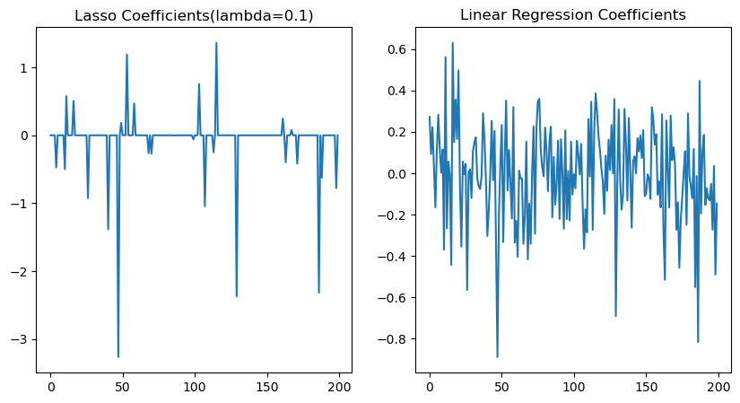
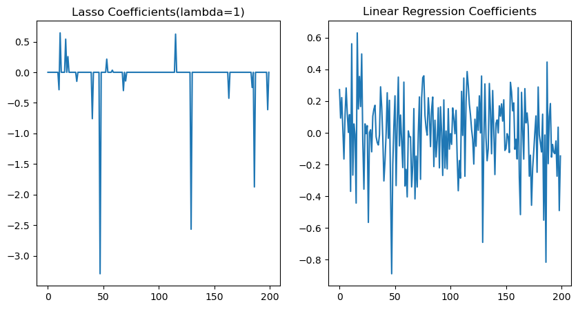
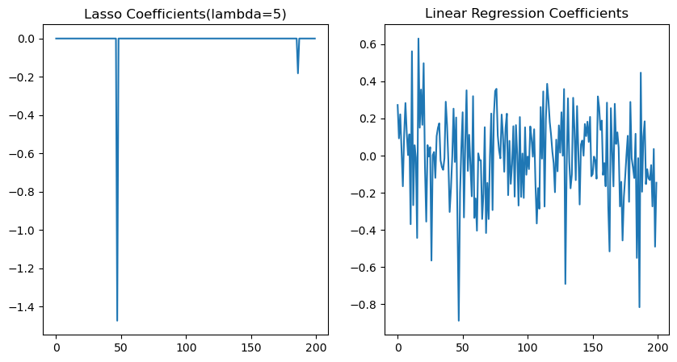

# L1 (lasson regularisation)

**What is Regularisation**:

Regularisation is a technique used to reduce overfitting in models.

Overfitting occurs when a model performs exceptionally well on the given training data but performs poorly on new, unseen data.

- Overfitting may occur because the model excessively learns the details and noise in the training data.
- An overfitted model often achieves high training accuracy, but its ability to generalise is poor.

**Generalisation** refers to a model's capacity to handle unseen data. A model with good generalisation ability performs similarly on the training set and on the test set or in real-world applications. This means that the model can effectively adapt to new situations.

To train a model, a loss function is used to compute the difference between the model's predictions and the actual values. Optimising the model involves minimising the value of the loss function.

Regularisation is achieved by adding an extra term to the loss function, known as the regularisation term.

In simple terms, **any method that reduces generalisation error rather than merely minimising training error can be considered a regularisation method**.

### L1 Lasso Regularisation

The Lasso regularisation method adds a regularisation term to the loss function **that is dependent on the magnitude of the model parameters**.

The value of the L1 regularisation term is the **sum of the absolute values of the model weights**.

Suppose the loss function used in a model is Mean Squared Error (MSE), then the loss function with L1 regularisation is typically expressed as:

$$
L(w)=MSE+\lambda \sum^{n}_{j=1}|w_{j}|
\\
L(w)\;is \;the \;loss \;function \;that \;includes \;L1 \;regularisation.
\\
MSE \;is \;the \;original \;loss \;function, \;representing \;the \;true \;loss \;of \;the \;model \;without \;the \;regularisation \;term.
\\
\lambda \;is \;the \;regularisation \;strength \;parameter, \;which \;determines \;the \;contribution \;of \;regularisation \;term \;to \;the \;total \;loss.
\\
\sum^{n}_{j=1}|w_{j}|\;is \;the \;sum \;of \;the \;absolute \;values \;of \;all \;model \;weights.
\\
w_{i} \;represents \;the \;i-th \;weight \;of \;the \;model.
$$

Let's now examine how optimisation is carried out after incorporating the L1 regularisation term, using gradient descent as the demonstration method:
$$
L=\frac{1}{2n}\sum^{n}_{i=1}(y_{i}-X_{i}W)^{2}+\lambda \sum^{n}_{j=1}|w_{j}|
\\
W：\;the \;weight \;or \;coefficient \;vector \;of \;the \;model, \;shaped \;as \;p*1 \;typically, \;where \;p \;is \;the \;number \;of \;features.
\\
w_{i}: \;the \;i-th \;element \;in \;the \;weight \;vector \;W.
\\
X_{i}：\;The \;i-th \;row \;of \;data, \;shaped \;as \;1*p.
$$

To perform the partial derivative of the loss function including the regularisation term with respect to $w_i$​, first differentiate the Mean Squared Error (MSE) component:
$$
\frac{\partial MSE}{\partial w_{j}}=\frac {\partial \frac{1}{2n}\sum^{n}_{i=1}(y_{i}-X_{i}W)^{2}}{\partial w_{j}}=-\frac{1}{n}\sum^{n}_{i=1}X_{ij}(y_{i}-X_{i}W)
\\
X_{ij}：\;represents \;the \;values \;of \;the \;j-th \;feature \;for \;the \;i-th \;sample.
$$

Next, differentiate the regularisation term. The derivative of $w_j$​ is a **sub-gradient**, because it is non-differentiable at points where the absolute value is 0:
$$
\frac{\partial \lambda \sum^{n}_{j=1}|w_{j}|}{\partial w_{j}}
\\
\Rightarrow 
\\
\frac{\partial \lambda |w_{j}|}{\partial w_{j}}=
\begin{cases}
-\lambda & \text{if } \beta_j < 0 \\
\lambda & \text{if } \beta_j > 0 \\
\text[-\lambda,\lambda] & \text{if } \beta_j = 0
\end{cases}
\\
\Rightarrow 
\\
\lambda \, sign(W)
\\
sign:\;the\;sign\;function
$$

Therefore, the derivative of the loss function with the regularisation term is actually a combination of the derivative of the squared error part and the **sub-gradient** of the regularisation part.

In the actual gradient descent algorithm, we usually first compute and minimise the update for the weights based on the MSE part, and then use a **soft thresholding** approach to handle the L1 regularisation part.

Suppose we have a linear model with two features, and two data points are provided. Each feature has two corresponding weights:

Two data points:

| X1   |  X2  |    Y |
| :--- | :--: | ---: |
| 1    |  2   |    5 |
| 3    |  4   |    6 |

Assuming the initial weights are set to:
$$
w_{1}=w_{2}=0.5
$$
Learning rate is:
$$
learning\_rate=\alpha=0.1
$$
Regularisation parameter:
$$
\lambda=1
$$
First compute the MSE gradient for each individual weight:
$$
\frac{\partial MSE}{\partial w_{1}}=\frac{\partial （- \frac{1}{2}*(1*(5-1*0.5)+1*(5-2*0.5))+(3*(6-3*0.5)+3*(4*0.5))）}{\partial w_{1}}=-\frac{11}{2}
$$

$$
\frac{\partial MSE}{\partial w_{2}}=\frac{\partial （- \frac{1}{2}*(2*(5-1*0.5)+2*(5-2*0.5))+(4*(6-3*0.5)+4*(4*0.5))）}{\partial w_{2}}=-\frac{17}{2}
$$

Update the weights before adding the regularisation sub-gradient after obtaining the MSE gradient:
$$
w_{1}^{new}=w_{1}- \alpha \frac{\partial MSE}{\partial w_{1}}=0.5-0.1*(-\frac{11}{2})=1.05
\\
w_{2}^{new}=w_{2}- \alpha \frac{\partial MSE}{\partial w_{2}}=0.5-0.1*(-\frac{17}{2})=1.35
$$
Use the updated weights to perform the **soft thresholding** operation for the regularisation term:
$$
w_{j}^{new}=sign(w_{j}^{old})*max(0,|w_{j}^{old}|-\alpha * \lambda)
\\
\\
w_{j}^{old}: \;is \;the \;updated \;weights \;from \;the \;original \;loss \;function.
\\
sign(w_{j}^{old}): if \; w_{j}^{old}>0 \; then \; sign(w_{j}^{old})=1 ; 
\\ 
if \; w_{j}^{old}<0 \; then \; sign(w_{j}^{old})=-1;
\\
if \; w_{j}^{old}=0 \; then \; sign(w_{j}^{old})=0
$$

we have already calculated the derivative for the loss function that includes the regularisation term, and compared it with the soft thresholding operation here. You could see that the logic has not been changed. It still involves subtracting the product of the learning rate and the total loss gradient from the initial weights.

However, It is worth noting that an additional ReLU operation is incorporated here. This is to enable the feature selection capability of L1 regularisation.

If the weight decreases to 0 or below after gradient updating and threshold reduction, then is considered insufficient to impact the model's decision-making process. Thus, we should eliminate this feature from the model, setting its coefficient (weight) to 0.
$$
w_{1}^{new}=sign(w_{1}^{old})*max(0,|w_{1}^{old}|-\alpha * \lambda)=sign(1.05)*max(0,|1.05|-0.1 * 1)=0.95
$$

$$
w_{2}^{new}=sign(w_{2}^{old})*max(0,|w_{2}^{old}|-\alpha * \lambda)=sign(1.35)*max(0,|1.35|-0.1 * 1)=1.25
$$

This are the final updated weights after one iteration.

- A key feature of L1 regularisation is that it **prompts the reduction of some weights to 0**, allowing the model to make predictions with the remaining non-zero weights only.
- This makes L1 regularisation a method of **feature selection**, which can reduce the complexity of the model and enhance its ability to generalise.

When using L1 regularisation in code, we need to manually set the regulasization parameter. Typically, setting a larger regularisation parameter leads to sparser model weights, meaning more coefficients of the model features are set to 0.
several plots are provided for comparison with different lambda values (the X-axis represents each coefficient of the model, and the Y-axis represents the corresponding coefficient values).

Each plot has a left subplot using the L1 regularisation term, and the right subplot shows the coefficients from simple linear regression.

As can be seen, as the regularisation parameter increases, more and more features are discarded. Choosing the appropriate regularisation parameter is crucial.

